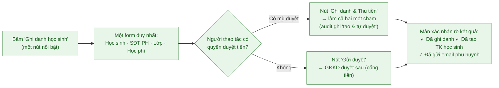

# Tài liệu 2 — Đặc tả thiết kế lại Giao diện (UX/UI Rebuild) — CMC EDU ERP

> Mục đích: làm chuẩn để **xây dựng lại giao diện**. Backend đã đủ chặt (xem TL1); vấn đề
> nằm ở tầng tương tác. Tài liệu này viết theo **ngôn ngữ người dùng và mục tiêu công việc**,
> không mô tả cơ chế hệ thống.
> Đối tượng đọc: đội thiết kế/FE. Nguồn chẩn đoán: hiện vật UX thật trong repo `manhquydev/CMCnew`.

---

## 1. Chẩn đoán gốc: "Giao diện đang giải thích CƠ CHẾ, không phục vụ Ý ĐỊNH"

Lỗi UX nghiêm trọng không phải ở màu mè hay layout — mà ở **mô hình tư duy**: giao diện
phơi bày cấu trúc dữ liệu và luật hệ thống ra cho người dùng vận hành bằng tay. Bằng chứng
cụ thể trong repo:

1. **Bắt người dùng vận hành pipeline thủ công.** Guide Sale ghi thao tác chính là "Chuyển
   giai đoạn O1 → O2 → O3 → O4 → O5". Đây là *mô hình quản lý nội bộ* bị đẩy thành *việc tay*
   của sale. Người dùng nghĩ "tôi ghi danh một học sinh", không nghĩ "tôi chuyển O3 sang O4".

2. **35 mục menu phẳng**, mỗi mục swap toàn màn hình (`shell.tsx`). Không có phân cấp
   nhiệm vụ → người dùng phải tự dựng bản đồ trong đầu. (Đã có kế hoạch gộp 8 module +
   sub-tab nhưng *chưa ship* — xem §5.)

3. **Ngôn ngữ hệ thống lộ ra mặt tiền.** Câu trong guide: "*không thấy nút = vai trò không
   có quyền, đó là thiết kế không phải lỗi*". Đúng về kỹ thuật, nhưng đây là lời **giải thích
   cho dev**, không phải trải nghiệm cho người dùng. Người dùng không cần biết về "bảng phân
   quyền" — họ cần thấy đúng việc của mình một cách tự nhiên.

4. **Token màu sai nghĩa.** UX audit #6: nút "stage hiện tại" trong CRM dùng token DANGER
   (`cmcRed` — cùng màu lỗi/"rejected"). Giám đốc liếc pipeline **đọc "bạn đang ở đây" thành
   một cảnh báo**. Màu là ngôn ngữ; ở đây nó nói sai.

5. **Tự động hoá bị ẩn → người dùng đi tìm bước ma.** Duyệt phiếu tự sinh tài khoản HS/PH
   (QĐ 0033), nhưng giao diện không tuyên bố kết quả đủ rõ, nên người dùng đi tìm một "bước
   tạo tài khoản" không tồn tại → cảm giác rườm rà.

**Kết luận:** giữ nguyên mọi bất biến backend (TL1), **viết lại tầng tương tác quanh mục
tiêu người dùng**.

---

## 2. Năm nguyên tắc thiết kế lại

1. **Task-first, không entity-first.** Bắt đầu từ "tôi muốn làm gì" (ghi danh học sinh),
   không từ "màn hình Opportunity". Pipeline O1–O5 chạy ngầm/tự động, chỉ hiện khi người
   dùng *thật sự cần* quản lý phễu.
2. **Kết quả phải hiển thị.** Sau mỗi hành động, nói rõ điều gì đã xảy ra ("Đã ghi danh +
   tạo tài khoản học sinh + gửi email phụ huynh"). Không để tự động hoá vô hình.
3. **Progressive disclosure.** Happy-path một màn; tuỳ chọn nâng cao (đổi giá, ghi chú, chia
   giai đoạn) ẩn dưới "Nâng cao".
4. **Một cửa cho một việc.** Một điểm vào duy nhất cho "ghi danh", một cho "thu tiền" — bỏ
   cảnh người dùng phân vân "đi đường opportunity hay đường finance".
5. **Nói bằng ngôn ngữ người dùng.** "Ghi danh", "Học sinh mới", "Đã đóng học phí" — không
   "O5_ENROLLED", "receiptApprove", "provisioning". Ẩn nút = ẩn im lặng, không giải thích quyền.

---

## 3. Persona thực tế & Jobs-to-be-done

Bám đúng 5 vai trò thật + thực tế đội-nhiều-mũ:

| Persona | Đội mũ thực tế | Việc cần làm (job) — theo ngôn ngữ của họ |
|---|---|---|
| **Sale** | thường kiêm thu tiền | "Ghi danh một học sinh mới và thu học phí — nhanh, ít click" |
| **Giáo viên** | — | "Điểm danh, chấm bài, nhận xét lớp hôm nay ở một chỗ" |
| **GĐ Kinh doanh** | kiêm duyệt tiền | "Duyệt phiếu, xem doanh thu & 'won' tháng này, xử ngoại lệ" |
| **GĐ Đào tạo** | kiêm quản lý GV | "Duyệt ca/nghỉ, theo dõi lớp & chất lượng dạy" |
| **IT** | — | "Cấu hình, cấp tài khoản, xử lý sự cố hệ thống" |

Mỗi persona chỉ nên thấy **1–3 việc lõi** ngay màn đầu, phần còn lại lùi về sau.

---

## 4. Luồng chính thiết kế lại — "Ghi danh nhanh"

Đây là luồng gây "rườm rà" nhất. So sánh trước/sau:

**HIỆN TẠI (entity-first, nhiều khâu, dev-facing):**

```mermaid
flowchart LR
    A["Vào menu CRM"] --> B["Tạo Opportunity"]
    B --> C["Chuyển O1→O2→O3→O4<br/>(4 lần đổi stage tay)"]
    C --> D["Sang màn Opportunity-detail"]
    D --> E["Bấm 'Tạo phiếu thu' (nháp)"]
    E --> F["Sang menu Tài chính"]
    F --> G["Tìm phiếu → Duyệt"]
    G --> H["Đi tìm 'tạo tài khoản'<br/>(bước KHÔNG tồn tại)"]
    classDef bad fill:#FDECEA,stroke:#C62828,color:#B71C1C;
    class A,B,C,D,E,F,G,H bad;
```

**THIẾT KẾ LẠI (task-first, một màn, kết quả hiển thị):**

**Điều KHÔNG đổi (giữ bất biến backend):** phễu O1–O5, auto-advance, cổng tiền, provisioning
vẫn chạy y hệt — chỉ **gộp lại sau một hành động** và **chạy ngầm**. Với người đội-nhiều-mũ,
"Ghi danh & Thu tiền" gọi tạo-nháp rồi duyệt liên tiếp trong cùng phiên, audit vẫn ghi đủ
(TL1 mục 3). Đây là chỗ giảm rườm rà lớn nhất.

> Gợi ý mở rộng: một **"maturity toggle"** ở cấu hình — đội nhỏ bật "cho tự duyệt một chạm";
> khi tuyển kế toán thật thì tắt, ép tách vai. Không cần viết lại, chỉ là cấu hình + nhãn audit.

---

## 5. Kiến trúc thông tin (IA): 35 mục phẳng → **5 nhóm chức năng** (ADR-C, TL16)

Nguồn IA duy nhất là **ADR-C (TL16)**: 5 nhóm **đặt tên theo chức năng** (không theo vai trò), mỗi
nhóm có sub-tab ngang, **hiển thị lọc theo role** qua `can()`. TL05/TL06 trỏ về cùng bảng này.

| Nhóm (chức năng) | Sub-tab | Vai trò thấy |
|---|---|---|
| **Giảng dạy** | Lịch dạy · Điểm danh · Báo cáo điểm danh · Chấm bài · Nhận xét · Học bạ | giao_vien, GĐĐT |
| **Lớp & Học sinh** | Lớp học · Khóa học · Học sinh · Phụ huynh · Duyệt cấp độ | GĐĐT, sale (xem hạn chế) |
| **Kinh doanh** | CRM · Chăm sóc KH · Phiếu thu (nháp) | sale, GĐKD |
| **Tài chính & Điều hành** | Duyệt phiếu · Doanh thu · Đối soát · Lương & Chấm công | GĐKD, GĐĐT (theo miền) |
| **Quản trị** | Cơ sở · Người dùng · Cấu hình (IP/ca) | super_admin |

**Ràng buộc:** membership + gate đọc từ `buildNavGroups`/`can()`, không khai báo lại (một nguồn sự
thật). Sub-tab **đồng bộ URL** (back/forward) — phần việc mới thật sự (TL06). Mỗi vai trò có **trang
đích persona** riêng. (5 role deferred không hiện nhóm nào lúc này — ADR-D.)

---

## 6. Cách viết đặc tả màn hình: từ dev-facing → user-facing

Đây là mẫu để đội build đổi *toàn bộ* văn phong đặc tả. Cùng một màn "duyệt phiếu thu":

**❌ Dev-facing (kiểu hiện tại):**
> "Nút Approve gọi `receiptApprove`, trả discriminated union, nếu `status==='warning'` show
> modal confirm duplicate, khi success set opp `stage=O5_ENROLLED`, provision ParentAccount…"

**✅ User-facing (kiểu cần có):**
> **Màn: Duyệt học phí**
> - Người dùng thấy: tên học sinh, phụ huynh, số tiền, lớp — gọn trong một thẻ.
> - Hành động chính: nút **"Duyệt & Kích hoạt"**.
> - Nếu trùng SĐT phụ huynh: hỏi nhẹ *"Số này đã có hồ sơ — vẫn tạo mới?"* (không chặn).
> - Sau khi duyệt, hiện rõ: *"Đã kích hoạt: học sinh vào lớp, tài khoản đã tạo, email đã gửi."*
> - (Cơ chế O5/provisioning chạy ngầm — người dùng không cần biết.)

Nguyên tắc: đặc tả mô tả **người dùng thấy gì, muốn gì, nhận kết quả gì** — cơ chế để trong
ngoặc hoặc để riêng cho TL backend.

---

## 7. Bảng lỗi UX ưu tiên (cho đội build xử theo thứ tự)

| Ưu tiên | Lỗi | Chữa | Nguồn |
|---|---|---|---|
| P0 | Luồng ghi danh quá nhiều khâu, entity-first | Gộp "Ghi danh nhanh" một màn (§4) | phân tích |
| P0 | Tự động hoá ẩn → tìm bước ma | Màn xác nhận nêu rõ kết quả (§2, §6) | QĐ 0033 |
| P0 | Đặc tả/nhãn nói ngôn ngữ dev | Viết lại theo §6, bỏ thuật ngữ O4/approve | guide + §1 |
| P1 | 35 mục phẳng | Hoàn tất 8 module + sub-tab đồng bộ URL (§5) | IA plan |
| P1 | Token DANGER cho "stage hiện tại" | Đổi sang brand blue "bạn ở đây" | UX audit #6 |
| P2 | Hai cửa tạo phiếu thu gây phân vân | Một cửa, lookup SĐT tự gắn opp | QĐ 0037 |
| P2 | Pipeline O1–O5 phơi ra mặt tiền | Ẩn/tự động, chỉ hiện khi quản lý phễu | guide + §2 |

---

## 8. Ranh giới với backend

Tất cả thay đổi ở đây là **tầng tương tác**. Không đụng bất biến TL1: phễu, cổng tiền,
provisioning, RLS, sổ hoàn tiền vẫn nguyên. "Ghi danh nhanh" và "Duyệt & Kích hoạt" chỉ
là **cách trình bày và gộp bước** cho các API đã có — nếu cần API gộp mới, đó là *tiện ích
mỏng* gọi lại các call hiện hữu, không phải viết lại nghiệp vụ.

> Tham chiếu chéo: bất biến & checklist backend ở `01-thiet-ke-he-thong-va-ra-soat-backend.md`;
> luồng liên-vai-trò chi tiết ở TL17 (`17-lien-ket-vai-tro-va-luong.md`).
