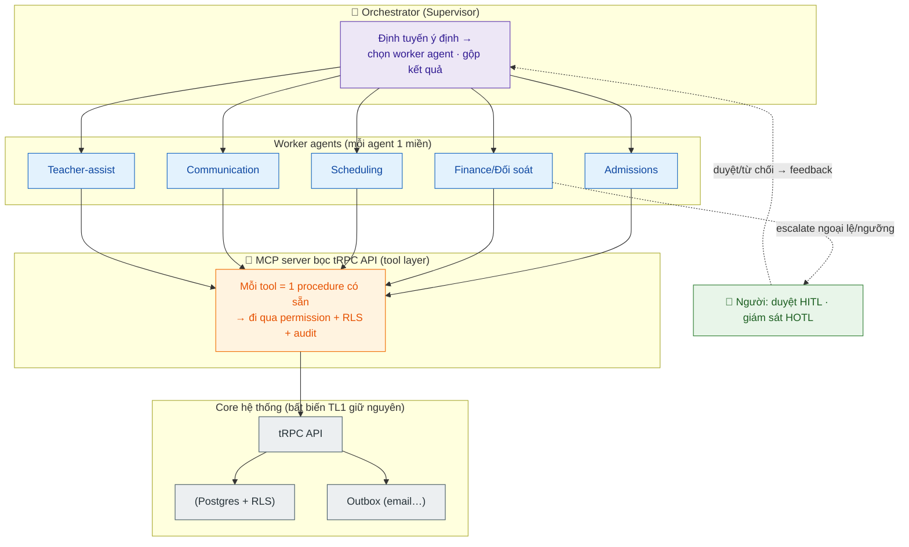

# Tài liệu 4 — Chiến lược Vận hành Tự động & Tích hợp AI Agent (CMC EDU)

> Mục tiêu: đột phá vận hành — con người chỉ hiện diện ở phần *thực sự cần người*, phần còn lại
> chạy workflow tự động, có AI agent tham gia. Tài liệu này thiết kế cụ thể cho hệ thống hiện có,
> nối thẳng vào các bất biến (TL1) và điểm đứt gãy (TL3).
> Đối chiếu thực hành 2026 về agentic operations (nguồn dẫn trong phần chat kèm tài liệu).

---

## 1. Nguyên tắc nền: "Controlled autonomy", không phải "full autonomy"

Sai lầm phổ biến là nhắm *tự động hoá toàn phần rồi chèn người khắp nơi cho an toàn* — kết quả
là "human-as-bottleneck": tốn chi phí người, mất tốc độ máy, lại tạo cảm giác an toàn giả. Cũng sai
lầm ngược lại: bỏ người hoàn toàn ở khâu rủi ro.

Mô hình đúng cho một **doanh nghiệp giáo dục trẻ em**: agent gánh *tốc độ* (đọc, soạn, định tuyến,
kích hành động), con người gánh *phán đoán* — và được đặt **chiến lược ở nơi tạo giá trị agent
không thể**: quyết định tiền lớn, đánh giá/an toàn trẻ, quan hệ với phụ huynh khi căng thẳng.

---

## 2. Ba chế độ giám sát — cùng tồn tại trong một workflow

Một quy trình không chỉ thuộc một chế độ; các khâu khác nhau thuộc các chế độ khác nhau:

| Chế độ | Ý nghĩa | Dùng cho khâu |
|---|---|---|
| **Ngoài vòng (auto)** | Agent/hệ thống tự chạy, người không chạm | Việc xác định, thuận-nghịch, rủi ro thấp |
| **Trong vòng (HITL)** | Agent đề xuất, **người duyệt** trước khi thực thi | Khâu rủi ro cao, tiền lớn, pháp lý, đạo đức, trẻ em |
| **Trên vòng (HOTL)** | Agent tự chạy, người **giám sát bất thường** ở tầng trên | Đối soát, phát hiện gian lận/bất thường, báo cáo |

Cơ chế chuyển giữa các chế độ: **định tuyến theo độ tin cậy + ngưỡng**. Ca thường → auto; ca
độ-tin-cậy-thấp / vượt ngưỡng / chạm ranh giới chính sách → agent *dừng, đóng gói ngữ cảnh, chuyển
người*. Đây là chỗ agent tạo giá trị: xử hết ca thường, chỉ đẩy lên người phần ngoại lệ.

---

## 3. Phân loại workflow CMC EDU theo 3 chế độ

Áp lên các luồng đã map (TL17 (luồng)):

| Workflow | Auto (ngoài vòng) | HITL (trong vòng) | HOTL (trên vòng) |
|---|---|---|---|
| **Tuyển sinh** | Thu lead, làm giàu, tạo opp O1, nhắc lịch hẹn | Tư vấn/chốt (quan hệ) · duyệt tiền > ngưỡng | Giám sát tỉ lệ chuyển đổi bất thường |
| **Thu học phí → tài khoản** | Sinh phiếu nháp, provisioning, gửi email | Duyệt phiếu > ngưỡng (cổng tiền) | **Đối soát phiếu tự-duyệt** (xem §5.2) |
| **Chấm công → lương** | Tính phạt, gộp payslip, nhắc chốt | Miễn/giảm phạt (override giám đốc) | Phát hiện payslip lệch bất thường |
| **Xếp lịch/lớp** | Sinh buổi học theo khung lịch tuần, nhắc GV | Xếp GV vào lớp nhạy cảm | Giám sát tải lớp/GV |
| **Đánh giá học sinh** | Soạn *nháp* nhận xét (agent đã có) | **GV chốt nhận xét** (an toàn/đúng về trẻ) | — |
| **CSKH/phụ huynh** | Trả lời FAQ, nhắc lịch, gửi kết quả | Xử PH bức xúc / khiếu nại | Giám sát chất lượng hội thoại |
| **Hoàn tiền** | Ghi nhận, tính cap | Duyệt hoàn > ngưỡng | Giám sát tần suất hoàn bất thường |

**Đọc bảng:** cột auto càng rộng = càng ít người; nhưng cột HITL **cố ý giữ** ở tiền lớn và mọi
thứ chạm trẻ em. Đây là "phần thực sự cần người" bạn muốn.

---

## 4. Kiến trúc an toàn: Agent là **principal hạng nhất** dưới cùng RBAC/SoD/audit

Đây là quyết định kiến trúc cốt lõi — và là điều khiến việc này *an toàn*:

> **Không cho agent một đường tắt.** Agent hành động qua **đúng tRPC API** mà người dùng dùng,
> chịu **đúng permission gate, RLS, và audit** (TL1). Agent chỉ là một *principal* mới với role
> key riêng (`ai_agent_*`) và quyền được cấp hẹp.

Lợi ích: (1) mọi hành động agent **đã bị kiểm soát sẵn** bởi hạ tầng phân quyền hiện có — không
mở mặt tấn công mới; (2) agent **idempotent consumer** khớp outbox pattern đã dùng (TL3) — chạy
lại an toàn khi trùng; (3) mô hình **Orchestrator-Worker + MCP** đúng thứ bạn đã học ở AI20K.

---

## 5. Danh mục agent đề xuất (bám tài sản & khe hở đã có)

### 5.1. Admissions Agent — khép "đầu phễu" đang hở
Giải quyết trực tiếp gap F (TL3, "nặng đuôi nhẹ đầu"). Auto: nhận web-lead → làm giàu (chuẩn hoá
SĐT, tra trùng qua `opportunityLookup`) → tạo opp O1 → nhắc hẹn. HITL: sale chốt (quan hệ). Đây là
mảnh còn thiếu để tự động hoá *đầu-đến-cuối*.

### 5.2. Finance / Reconciliation Agent — **chính là compensating control cho SoD**
Đây là mắt xích đẹp nhất: rủi ro "đội-nhiều-mũ + tự-duyệt" (TL3, P=24) được bù bằng một agent
**HOTL**. Thực hành 2026: agentic AI hợp cho giám sát giao dịch & phát hiện bất thường trong khi
người giám sát ở tầng trên. Agent tự đối soát phiếu↔thanh toán, gắn cờ:
phiếu "tạo & tự duyệt" vượt ngưỡng, hoàn tiền bất thường, lệch net/commission → đẩy giám đốc review.
Không thay cổng tiền; nó là **lớp detective control** mà tổ chức nhỏ vốn thiếu.

### 5.3. Scheduling / Ops Agent
Auto: sinh buổi học theo khung lịch tuần (không có buổi bù — gỡ 2026-08-12), phát hiện xung đột phòng/GV, nhắc điểm danh. HITL: xếp GV vào ca
nhạy cảm.

### 5.4. Communication Agent (email + Zalo)
Auto: nhắc lịch, gửi kết quả học tập, trả FAQ. Nối được với hướng **GoClaw/Zalo** bạn từng đánh giá.
HITL: PH bức xúc/khiếu nại → chuyển người. HOTL: giám sát chất lượng hội thoại.

### 5.5. Teacher-assist Agent — *đã có*, đưa vào khung
Agent sinh nhận xét (ReAct + Self-Refine, Gemini) bạn đã xây chính là **auto-draft**; ranh giới
đúng: **GV luôn chốt** — vì đây là phán đoán về một đứa trẻ, phải là người (xem §6).

### 5.6. Orchestrator/Supervisor
Định tuyến ý định tới worker, gộp kết quả, giám sát chi phí/bất thường ở tầng trên.

---

## 6. Ranh giới con-người-bắt-buộc (không tự động hoá)

Với doanh nghiệp giáo dục trẻ 3–11 tuổi, một số việc **phải là người** — đây không phải hạn chế
công nghệ mà là thiết kế:

- **Thẩm quyền tiền lớn:** duyệt phiếu/hoàn tiền vượt ngưỡng — người ký (nguyên tắc SoD: agent
  khởi tạo/ghi, người *authorize* khoản trọng yếu).
- **Đánh giá & an toàn trẻ (safeguarding):** nhận xét học sinh, xử lý tình huống liên quan trẻ,
  dữ liệu nhạy cảm của trẻ — agent chỉ soạn nháp, **người chốt**.
- **Quan hệ căng thẳng:** phụ huynh khiếu nại, xử lý sự cố lớp — cần sự đồng cảm & trách nhiệm của người.
- **Quyết định nhân sự nhạy cảm:** kỷ luật, lương ngoại lệ.

---

## 7. Guardrails & tuân thủ

- **Agent chịu chung audit trail** như người — mọi hành động truy vết được (ai/agent nào, khi nào,
  làm gì). Đây cũng là yêu cầu giám sát mà các khung như EU AI Act/NIST AI RMF nhấn mạnh: phân loại
  rủi ro, minh bạch, người giám sát, nhật ký.
- **Định tuyến theo độ tin cậy + ngưỡng:** cao → auto; thấp/vượt ngưỡng → escalate kèm ngữ cảnh
  (ví dụ hoàn tiền vượt hạn mức tự động → đẩy tài chính review kèm ghi chú).
- **Chống "automation complacency":** người duyệt dễ *quá tin* rồi ngừng chất vấn khi hệ thống có
  vẻ ổn. Đối phó: agent phải nêu *lý do & mức tin cậy*, xoay ca review, đo tỉ lệ override để phát
  hiện người đang "duyệt cho có".
- **Idempotency:** agent là consumer idempotent (khớp outbox TL3) — chạy lại không nhân đôi hệ quả.
- **Feedback loop thật:** tín hiệu duyệt/từ chối phải *quay lại điều chỉnh hành vi agent*, nếu
  không thì chỉ là hàng đợi review tốn kém.

---

## 8. Lộ trình crawl → walk → run

Thực tế: chỉ ~5% hệ GenAI doanh nghiệp lên được production, 95% chết ở khâu đánh giá — nên **đi
từng nấc, đo được, mới mở rộng**:

- **Crawl (auto tất định trước):** hoàn tất workflow tự động *không-AI* còn thiếu — sinh buổi học,
  nhắc lịch, web-lead inbox, đối soát cơ bản. Đây là nền; nhiều "tự động hoá" không cần LLM.
- **Walk (AI auto-draft, người chốt):** bật Admissions draft, Teacher-assist (đã có), Communication
  FAQ — tất cả ở chế độ *đề xuất → người duyệt*. Đo độ chính xác, tỉ lệ chấp nhận.
- **Run (HOTL + controlled autonomy):** bật Reconciliation agent (HOTL), nâng ca độ-tin-cậy-cao
  của Communication lên auto-send theo ngưỡng. Mở rộng theo số liệu, không theo cảm hứng.

**KPI vận hành để chứng minh "đột phá":** % ca xử không cần người, thời gian lead→ghi danh, thời
gian duyệt phiếu, tỉ lệ override (chất lượng agent), số bất thường agent bắt được trước người.

---

## 9. Rủi ro trung thực

- **Đừng để "bỏ người" thành khẩu hiệu.** Ở giáo dục trẻ em, phần người-bắt-buộc (§6) là *giá trị
  lõi*, không phải chi phí cần cắt. Đột phá nằm ở việc *dồn* người vào đó, không phải xoá.
- **AI ở luồng tiền & dữ liệu trẻ = rủi ro cao** → luôn HITL/HOTL, không bao giờ auto vượt ngưỡng.
- **Nợ nền tảng chặn AI:** backup, phân quyền client (TL3) phải xong trước khi cho agent hành động
  rộng — agent khuếch đại cả điểm mạnh lẫn điểm yếu hạ tầng.

> Tham chiếu chéo: bất biến/permission ở TL1; điểm đứt gãy & SoD ở TL3; luồng ở TL17 (luồng).
