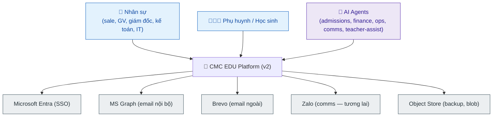
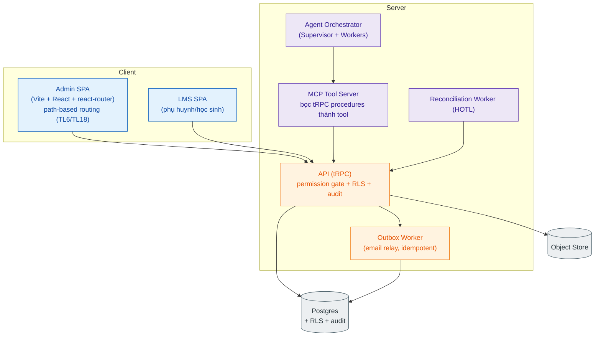
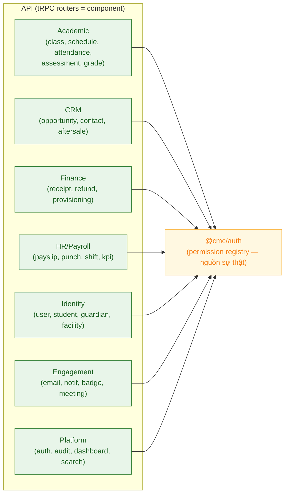

# Tài liệu 09 — Kiến trúc C4 (v2, có tầng AI Agent)

> Bức tranh kiến trúc chuẩn **C4** (Context → Container → Component) cho bản viết lại v2. Đặt sẵn
> tầng agent + MCP từ đầu (AI-native), nhưng giữ nguyên các bất biến v1 (TL1).
> Bám ADR `0001` (stack) + TL4 (agent) + TL05 (miền năng lực).

---

## 1. C4 — Mức 1: Context (ai dùng, hệ nối gì)

## 2. C4 — Mức 2: Container (các khối triển khai)

**Điểm mấu chốt:** agent KHÔNG có đường tắt tới DB — chúng đi qua **MCP → tRPC API**, chịu đúng
permission/RLS/audit như người (TL4 §4). Đây là điều giữ hệ an toàn khi thêm AI.

## 3. C4 — Mức 3: Component (bên trong API, theo miền)

## 4. Quyết định kiến trúc chốt cho v2

| # | Quyết định | Lý do |
|---|---|---|
| K1 | Monorepo: `apps/admin`, `apps/lms`, `apps/api`, `packages/*` | Giữ mô hình v1 đã hiệu quả |
| K2 | tRPC là hợp đồng FE↔BE duy nhất | Type-safe end-to-end; là "API contract" cho test |
| K3 | Permission registry tập trung (`@cmc/auth`) | Route + agent + UI dùng chung `can()` — chống drift (nợ TL3) |
| K4 | RLS `facilityId` ở tầng DB | Cô lập cơ sở không phụ thuộc app-code |
| K5 | **MCP Tool Server** bọc tRPC | Agent dùng đúng procedure có gate — không mở mặt tấn công |
| K6 | Outbox cho mọi side-effect (email, event) | Đảm bảo gửi ít nhất một lần; consumer idempotent |
| K7 | **Provisioning tách khỏi transaction tiền** (idempotent) | Trả nợ TL3 §A: lỗi provisioning không rollback tiền |
| K8 | Object store cho blob + backup off-box | Trả nợ TL3 §I (bền vững) |
| K9 | Cột `oversightMode` + audit sẵn cho agent | AI-native từ đầu, bật tự chủ dần |

## 5. Luồng dữ liệu tiêu biểu (ghi danh)

`Sale (Admin SPA)` → `crm.opportunity` → nút "Tạo phiếu thu từ cơ hội" →
`finance.receipts/new?opportunityId=` → `finance.receiptApprove` (cổng tiền) →
[transaction tiền: đăng tiền + auto-O5] → [bước idempotent: provisioning student/parent] →
`Outbox` → email PH. Reconciliation worker (HOTL) đọc audit, gắn cờ bất thường → URL sâu tới người.

## 6. Không gồm (out of scope kiến trúc)

- Harness AI-dev của bạn (`HARNESS_*`, ClaudeKit) — công cụ phát triển, không phải runtime sản phẩm.
- Callio/Zalo là tích hợp tương lai, đặt sau interface, chưa phải lõi.

> Liên kết: TL05 (miền) · TL4 (agent chi tiết) · TL6 (routing) · TL10 (data model) · TL1 (bất biến).
