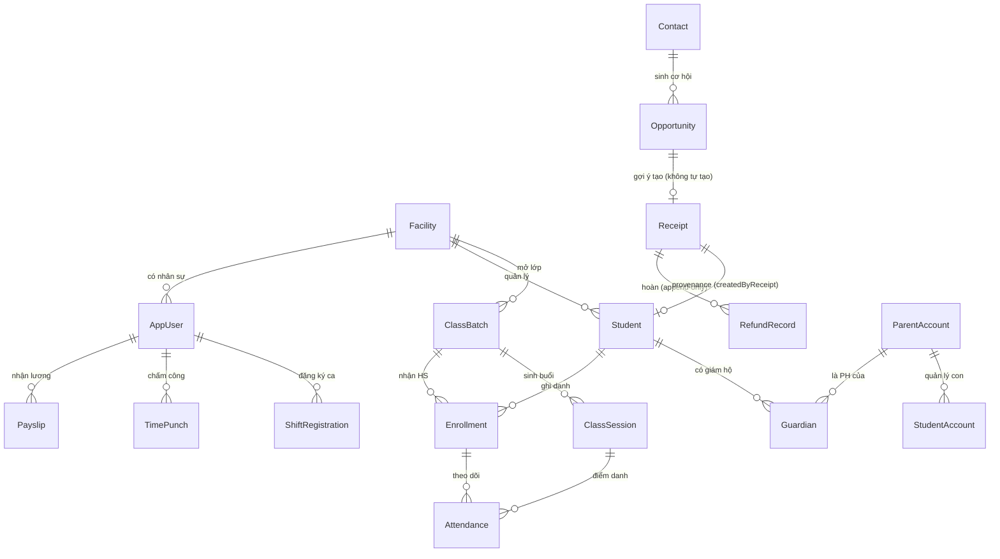

# Tài liệu 10 — Data Model v2 (ERD + Bất biến dữ liệu)

> Xương sống dữ liệu — mọi tính năng bám vào. Rút từ 60+ model thật trong `schema.prisma`, tổ chức
> lại theo cụm, ghi rõ **bất biến** phải giữ và **thay đổi v2**. Đây là nguồn cho ERD & data dictionary.

---

## 1. ERD lõi — cụm Định danh, CRM, Tài chính, Học tập

## 2. Từ điển thực thể (Data dictionary — cụm chính)

### Định danh
| Model | Vai trò | Khoá/Quan hệ then chốt |
|---|---|---|
| `Facility` · `FacilityNetwork` | Cơ sở · dải IP/WiFi chấm công | gốc RLS |
| `AppUser` · `EmploymentProfile` · `UserFacility` | Nhân sự · hồ sơ · gán cơ sở | `managerId` (duyệt ca) |
| `Student` | Hồ sơ HS | `facilityId`, **`createdByReceiptId`** (provenance) |
| `ParentAccount` · `StudentAccount` · `Guardian` | Login PH (email+OTP) · tài khoản con (phone+password) · quan hệ giám hộ | `phone` unique; `email` required (PH login); `GuardianRelation`; `LmsSubject.kind` |

> **product-decision 2026-07-07**: Mô hình định danh LMS thay đổi theo 2-tier. Trước đây: `ParentAccount` login bằng SĐT+OTP; không có cơ chế password riêng cho con. Hiện tại: (a) **Phụ huynh** đăng nhập bằng `email` + OTP qua email (`kind='parent'`); `ParentAccount.email` là trường bắt buộc cho luồng auth. (b) **Học sinh** đăng nhập bằng SĐT phụ huynh (`84xxx`) + mật khẩu (`kind='student'`); mật khẩu mặc định `Cmc2026@` không được ghi vào docs/code dưới dạng plain-text — chỉ lưu dạng `passwordHash` (PBKDF2-SHA256). `LmsSubject` có discriminator `kind: 'parent' | 'student'` để tách session. Tham chiếu: UI implementation plan phase 01a/01b. **BLOCKED-ON-COMMS**: email OTP chưa giao được ra ngoài (ConsoleEmailTransport stub) cho đến khi cung cấp Brevo/Graph credentials — xem TL18.

> **product-decision 2026-07-07**: Không có `studentCode`. HS được định danh bằng `fullName + SĐT phụ huynh`. Mã dạng `HS-0182` trong wireframe chỉ là tham chiếu hình ảnh, không ánh xạ sang cột dữ liệu thực. `StudentAccount` KHÔNG có `studentCode`.

### CRM & Tài chính
| Model | Vai trò | Ghi chú |
|---|---|---|
| `Contact` · `Opportunity` · `OpportunityAssignment` | Lead · cơ hội O1–O5 · phân công | `OpportunityStage`, `LostReason` |
| `Receipt` · `ReceiptCodeCounter` | Phiếu thu · bộ đếm mã | `ReceiptStatus`, `ReceiptKind`, `netAmount` (đóng băng) |
| `RefundRecord` · `Voucher` | Hoàn tiền append-only · chứng từ | cap ≤ netAmount |
| `AfterSaleCase` · `CallMetric` | Ca sau bán · số liệu gọi (Callio) | KPI sale |

### Học tập
| Model | Vai trò |
|---|---|
| `Course` · `CoursePrice` · `CurriculumUnit` · `AcademicTerm` | Khoá · giá · đơn vị CT · học kỳ |
| `ClassBatch` · `ScheduleSlot` · `ClassSession` · `Room` | Lớp · khung lịch · buổi học · phòng |
| `Enrollment` | Ghi danh — **`EnrollmentStatus` 2 bước** (xem §3) |
| `Attendance` · `ManualAttendanceTicket` · `SessionEvidence` · `SessionEvidencePhoto` | Điểm danh · phiếu thủ công · bằng chứng buổi · ảnh lớp |
| `QualitativeAssessment` · `SessionStudentComment` · `Grade` · `FinalGrade` · `GradingTemplate` | Nhận xét · điểm |
| `Exercise` · `Submission` · `Certificate` · `LevelProgress` | Bài tập · nộp · chứng chỉ · lên cấp |

### Nhân sự – Lương – Ca – Gắn kết
| Model | Vai trò |
|---|---|
| `Payslip` · `SalaryRate` · `CompensationPolicy` · `KpiScore` · `TimePunch` | Lương · mức · chính sách · KPI · chấm công |
| `ShiftTemplate` · `ShiftGroup` · `ShiftRegistration` · `ShiftRegistrationEntry` | Ca · nhóm ca · đăng ký · dòng đăng ký |
| `Badge` · `StudentBadge` · `Reward` · `Gift` · `StarTransaction` · `Notification` · `EmailOutbox` · `ParentMeeting` | Huy hiệu · quà · sao · thông báo · outbox · họp PH |
| `RecordEvent` · `RecordFollower` · `Audit`(log) | Chatter · follower · kiểm toán |

## 3. Thay đổi v2 (khác v1 — chốt theo quyết định gần đây)

| # | Thay đổi | Nguồn |
|---|---|---|
| V1 | Ghi danh 2 bước dùng enum **sẵn có**: `reserved` (chưa phí) → `active` khi phiếu duyệt; **lái bởi Receipt** (`active ⇔ Receipt approved`), KHÔNG thêm `pending_payment` | ADR-A (TL16) |
| V2 | Session **tự sinh** trong transaction tạo `ClassBatch` (nút thủ công = re-generate) | quyết định 2026-07-05 |
| V3 | Bỏ đường tạo `Student` thủ công khỏi UI ghi danh (break-glass tách trang quản trị riêng) | quyết định 2026-07-05 |
| V4 | **Provisioning tách khỏi transaction tiền** (bước idempotent theo `phone`) | TL3 §A |
| V5 | Thêm `oversightMode` + trường cờ escalate trên các thực thể agent chạm (receipt, opportunity) | TL4 |
| V6 | Mã hoá cột PII (`nationalId`, `bankAccount`) | trả nợ QĐ 0026 |
| V7 | `AI Agent` như principal: bảng `AgentPrincipal` + role `ai_agent_*` + audit actor | TL4 §4 |

## 4. Bất biến dữ liệu phải giữ (từ TL1)

- `Student.createdByReceiptId` bắt buộc có khi student sinh qua provisioning — **không student mồ côi**.
- `Receipt.netAmount` bất biến sau duyệt; `SUM(RefundRecord.amount) ≤ netAmount` (khoá `FOR UPDATE`).
- `ParentAccount.phone` unique toàn hệ (find-or-create; xử `unique_violation` bằng SAVEPOINT/ON CONFLICT).
- `StudentAccount` chứa: `passwordHash` (PBKDF2-SHA256, không plain-text), `mustChangePassword` (true khi dùng default), `loginAttempts`, `loginLockedUntil`. Các trường này **KHÔNG** nằm trên `ParentAccount`.
- `ParentAccount.email` bắt buộc khi tài khoản dùng cho auth email+OTP.
- `Opportunity.stage=O5` ⇔ có phiếu đã duyệt auto-advance; cancel ⇒ revert O4 + clear `closedAt`.
- Mọi bảng nghiệp vụ có `facilityId` (RLS); bảng curriculum/exercise global (không RLS — QĐ 0021/0022).
- Sổ tiền append-only: sửa = thêm dòng.

## 5. Quy ước & migration

- **Kiểu khoá:** uuid cho định danh; mã đọc được (class/receipt/employee code) qua `*CodeCounter`.
- **Thời gian:** lưu UTC, bucket/hiển thị theo ICT (UTC+7) — nhất là biên tháng lương (QĐ 0025).
- **Migration v1→v2:** backfill `EnrollmentStatus=active` cho enrollment cũ (không phá điểm danh
  đang chạy); backfill `createdByReceiptId` nếu import; đặt default `oversightMode` cho bản ghi cũ.
- **Seed:** curriculum UCREA/Bright I.G. theo `seed-curriculum` đã có.

> Liên kết: TL07 (glossary) · TL09 (C4) · TL1 (bất biến) · TL05 (miền) · TL6 (routing map theo model).
