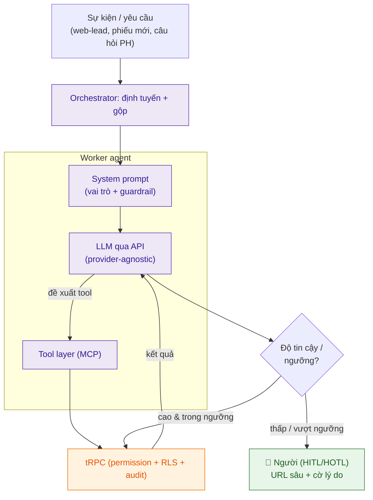

# Tài liệu 13 — Đặc tả Kỹ thuật Tích hợp AI Agent (LLM qua API)

> TL4 nói *chiến lược* (đâu auto/HITL/HOTL). Tài liệu này nói **kỹ thuật**: agent gọi LLM qua API
> thế nào, prompt ra sao, gọi tool ra sao, kiểm soát chi phí/độ tin cậy/an toàn (đặc biệt dữ liệu
> trẻ em) ra sao, đánh giá thế nào. Đây là tài liệu dev bám để code agent mà không phải hỏi lại.

---

## 1. Nguyên tắc kiến trúc (nhắc từ TL4/TL9)

Agent = **system prompt (vai trò + guardrail) + bộ tool (MCP = tRPC procedure) + oversight mode**.
Orchestrator (Supervisor) định tuyến ý định → worker agent. Agent hành động qua **MCP → tRPC**,
chịu đúng permission/RLS/audit; không chạm DB trực tiếp.

## 2. Lựa chọn LLM & phân tầng model

- **Provider-agnostic:** một abstraction `LLMClient` (interface chung) để đổi provider (Claude /
  OpenAI / model nội bộ) không phải viết lại agent. Cấu hình model theo env, không hardcode.
- **Phân tầng theo việc (tiết kiệm chi phí):**
  - *Model nhỏ/nhanh* → phân loại, định tuyến, trích xuất có cấu trúc (classify lead, tag).
  - *Model mạnh* → suy luận nhiều bước, soạn nội dung (nhận xét nháp, phản hồi PH phức tạp).
- **Structured output:** khi cần dữ liệu để code xử tiếp (định tuyến, điểm tin cậy) → ép LLM trả
  **JSON đúng schema** (không văn xuôi); parse an toàn, có retry nếu JSON hỏng.

## 3. Kiến trúc prompt

Mỗi agent có prompt gồm các tầng:
1. **System:** vai trò (vd "trợ lý tuyển sinh CMC"), **guardrail cứng** (không vượt cổng tiền, không
   quyết về trẻ, chỉ dùng dữ liệu được cấp), định dạng đầu ra.
2. **Context:** dữ liệu liên quan lấy qua tool (không nhồi cả DB) — chỉ đủ để làm việc.
3. **Few-shot** (khi cần): ví dụ tốt/xấu, danh sách "câu nghe máy móc cần tránh" (như agent nhận
   xét bạn đã làm).
4. **Task:** yêu cầu cụ thể + schema đầu ra.

Persona & negative-constraint list giữ ở **một nơi/agent** (versioned), không rải trong code.

## 4. Gọi tool (tool-calling qua MCP)

- Tool = procedure tRPC (input zod = tool schema). LLM **đề xuất** tool + tham số → runtime **thực
  thi qua tRPC** (đúng gate) → trả kết quả về LLM.
- LLM **không tự thực thi** gì; mọi tác động đi qua tool có kiểm soát.
- Mutation tiền/định danh: agent chỉ được gọi các tool *đề xuất/nháp* (vd `receiptCreate` nháp),
  **không** `receiptApprove` tự động vượt ngưỡng (TL4 §6).

## 5. ⚠️ Quản lý context & Che dữ liệu trẻ em (bắt buộc)

Ràng buộc dữ liệu trẻ (TL8 §7) áp thẳng vào tầng LLM:
- **Tối thiểu hoá:** chỉ đưa vào context dữ liệu *cần cho tác vụ*; không nhồi hồ sơ đầy đủ của trẻ.
- **Che PII trước khi gửi ra LLM ngoài:** tên đầy đủ trẻ, SĐT, CCCD, địa chỉ, **ảnh trẻ** → không
  gửi tới LLM bên ngoài trừ khi thật cần & có kiểm soát; ưu tiên token hoá/ẩn danh, hoặc model
  nội bộ cho dữ liệu nhạy cảm.
- **Không gửi ảnh lớp/ảnh trẻ** tới LLM ngoài để "phân tích" nếu không có đồng thuận & mục đích rõ.
- **Ghi log điều gì được gửi** (audit) để soát rò rỉ.

## 6. Chi phí, tốc độ, độ tin cậy

| Vấn đề | Cách xử |
|---|---|
| Chi phí | Phân tầng model (§2), cache kết quả lặp, batch, đặt **token budget** mỗi tác vụ |
| Rate limit | Backoff luỹ thừa; hàng đợi; không spam retry |
| Timeout / LLM lỗi | Đặt timeout; **fallback**: xếp hàng chờ / chuyển người, KHÔNG treo workflow |
| Circuit breaker | Lỗi dai dẳng → ngắt, chuyển toàn bộ sang người tạm thời |
| Idempotency | Agent là consumer idempotent (TL8 §2) — retry không nhân đôi hệ quả |

## 7. Độ tin cậy & Escalation (nối HITL — TL4)

- LLM trả kèm **confidence** (hoặc runtime tự chấm). Cao & trong ngưỡng → auto (theo mode). Thấp /
  vượt ngưỡng → **escalate**.
- Escalate = agent đóng gói ngữ cảnh + **URL sâu tới bản ghi + cờ lý do** (TL6 §6) → người mở thẳng.
- Ghi lại quyết định người (duyệt/sửa/từ chối) làm **feedback** để cải thiện agent (nếu không, chỉ
  là hàng đợi review tốn kém).

## 8. Guardrail an toàn ở tầng LLM

- **Chống prompt injection:** nội dung ngoài (tin nhắn lead, email PH, ghi chú) là **DỮ LIỆU, không
  phải lệnh**. Tách rõ trong prompt; không để nội dung ngoài điều khiển hành vi/tool của agent.
- **Validate đầu ra:** parse JSON có schema; từ chối/định tuyến-người nếu output không hợp lệ.
- **Ranh giới cứng:** không tự quyết tiền lớn / về trẻ / an toàn (TL4 §6); các tool đó không nằm
  trong bộ tool tự-chủ của agent.
- **Audit mọi lượt:** prompt version, model, tool gọi, kết quả, ai/agent — truy vết được.

## 9. Đánh giá (Eval) — điều kiện để bật tự chủ

Trước khi cho một agent auto (rời draft/HITL), phải qua eval:
- **Golden dataset** gán nhãn tay (như dataset Python bạn dùng cho SecuSense).
- Chỉ số: độ chính xác/độ phù hợp, **tỉ lệ hallucination**, **tỉ lệ người override** (thấp = agent
  tốt), chi phí/tác vụ.
- **Regression:** đổi prompt/model phải chạy lại eval, không để tụt thầm.
- Ngưỡng bật auto đặt theo số liệu, không theo cảm hứng (crawl-walk-run — TL4 §8).

## 10. Danh mục agent v2 (bám TL4/TL5) & tầng model gợi ý

| Agent | Việc | Tool chính | Model | Mode đầu |
|---|---|---|---|---|
| Admissions | thu/làm giàu lead, tạo O1 | `crm.*`, `opportunityLookup` | nhỏ (classify) + mạnh (soạn) | draft/HITL |
| Reconciliation | đối soát, gắn cờ bất thường | `finance.*` (đọc), `audit.*` | nhỏ | **HOTL** |
| Ops/Scheduling | sinh/nhắc lịch, phát hiện xung đột | `schedule.*`, `classBatch.*` | nhỏ | auto (nghịch được) |
| Communication | nhắc, FAQ, gửi kết quả | `notification.*`, `email.*` | nhỏ+mạnh | draft→auto theo ngưỡng |
| Teacher-assist | soạn nháp nhận xét | `assessment.*` (draft) | mạnh | **draft → GV chốt** |

> Liên kết: TL4 (chiến lược/oversight) · TL9 (C4/MCP) · TL11 (API = tool) · TL8 §7 (dữ liệu trẻ) ·
> TL6 (URL escalate).
