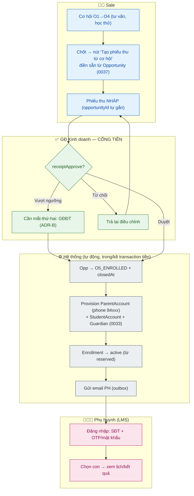
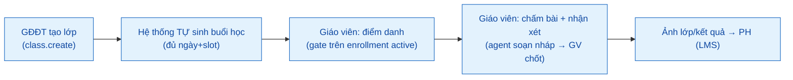
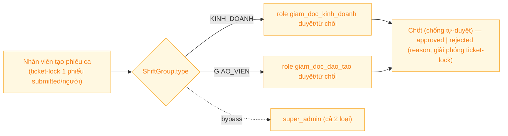

# Tài liệu 17 — Liên kết Vai trò & Luồng nghiệp vụ (mô hình 4 vai trò v2)

> Bản viết lại theo mô hình vai trò v2 (ADR-D) và các bất biến đã chuẩn hoá. Thay thế bản cũ
> (viết trước khi đọc sâu repo — còn role "Học vụ/Admin" và luồng tạo tài khoản tay, nay đã bỏ).
> Vai trò v2: **GĐKD (quản lý sale) · GĐĐT (quản lý giáo viên) · Sale · Giáo viên · IT**; LMS =
> phụ huynh/học sinh. Nguồn vai trò: TL14. Quyết định: TL16.

---

## 1. Bản đồ vai trò v2 (gọn)

| Vai trò | App | Việc lõi (phần con người thật sự cần) | Quản lý bởi |
|---|---|---|---|
| **Sale** | ERP | Tư vấn, chốt, tạo phiếu thu **nháp** | GĐKD |
| **Giáo viên** | ERP | Dạy, điểm danh, chấm bài, **nhận xét học sinh** | GĐĐT |
| **GĐ Kinh doanh** | ERP | **Duyệt cổng tiền**, xem doanh thu, xử ngoại lệ KD | — (gốc) |
| **GĐ Đào tạo** | ERP | Duyệt lịch/ca, tạo lớp, mắt-thứ-hai duyệt tiền vượt ngưỡng | — (gốc) |
| **IT (super_admin)** | ERP | Cấu hình cơ sở/IP/ca, người dùng | — |
| **Phụ huynh / Học sinh** | LMS | Xem lịch, kết quả, bài tập | — |

`cskh`, `ctv_mkt`, `ke_toan`, `hr`: tạm gác (ADR-D). Từ amendment 2026-07-08 (commit `57ee539`),
việc gác được **enforce bằng code**: 0 quyền trong registry, `user.updateRoles` reject, UI không
hiển thị, invariant test khoá — không chỉ là quy ước tài liệu. "Quản lý" = quan hệ `managerId`,
không phải role.

---

## 2. Luồng lõi 1 — Tuyển sinh → Sinh tài khoản (provisioning TỰ ĐỘNG)

Sale → GĐKD (cổng tiền) → **hệ thống tự sinh tài khoản** → phụ huynh. Nguồn: QĐ 0024, 0033, 0037.
Con người chỉ **xem & duyệt**, không đi tạo tài khoản tay.

**Điểm mấu chốt:** không có role "Học vụ" tạo tài khoản tay — provisioning **tự động** khi GĐKD duyệt
phiếu (con người chỉ duyệt). `reserved`→`active` do Receipt lái (ADR-A).

---

## 3. Luồng lõi 2 — Vận hành lớp (Giáo viên là trung tâm)

Con người cần: **giáo viên dạy, điểm danh, nhận xét**. Máy lo: sinh buổi học, gửi kết quả. AI: soạn
nháp nhận xét (GV chốt — dữ liệu trẻ, TL08 §7).

---

## 4. Luồng lõi 3 — Duyệt ca (gate theo ROLE + group-type, không phải managerId)

Gate = role của caller khớp `ShiftGroup.type` (không phải `managerId` chain — HR remediation
sửa lại, xem docs/20 §2 + docs/22 ADR 0044 cho công thức lương bậc/KPI liên quan).

---

## 5. Ma trận tương tác vai trò (tóm tắt bàn giao)

| Từ | Bàn giao | Tới | Qua cổng |
|---|---|---|---|
| Sale | Phiếu thu nháp (gắn opp) | GĐKD | `receiptApprove` |
| GĐKD | Kích hoạt provisioning (tự động) | Hệ thống → PH | `receiptApprove` |
| GĐĐT | Tạo lớp → auto sinh buổi | Giáo viên | `class.create` |
| Giáo viên | Điểm danh/nhận xét | PH (LMS) | `attendance/assessment` |
| Nhân viên | Phiếu ca | GĐKD/GĐĐT (role khớp group-type) | `shift.approve`/`shift.reject` |

> Liên kết: TL14 (vai trò) · TL16 (ADR) · TL01 (bất biến) · TL04/13 (agent) · TL06 (URL escalate).

---

## 6. Trải nghiệm LMS theo vai trò (PH/HS — gap-closure 260710-0005)

PO chốt 2026-07-10: "đừng quá quan trọng hệ thống với PH/HS những cái mang tính nội bộ" — PH/HS chỉ
thấy dữ liệu học tập của chính con mình, KHÔNG bao giờ thấy tiền/phiếu thu/dữ liệu nội bộ ERP.

| | PH thấy | HS làm | KHÔNG bao giờ thấy |
|---|---|---|---|
| **Bài tập & điểm** | Danh sách bài con đã nộp + điểm GV chấm + sao thưởng (`submission.listForChild`) | Làm bài, nộp, xem điểm/sao của chính mình | Bài của HS khác, `gradedById`, annotation layer của GV |
| **Điểm danh** | Trạng thái từng buổi: có mặt / **"Nghỉ học"** / **"Đi muộn"** (`attendance.listForChild`) | — (HS không có view điểm danh riêng) | Điểm danh của bạn học cùng buổi (filter theo `studentId`, không theo buổi) |
| **Nhận xét & ảnh** | Nhận xét GV từng buổi đã xác nhận + ảnh lớp học (khi đã bật đồng ý ảnh); buổi `absent` không hiện khối ảnh | — | `internalNote` (nội bộ, không bao giờ serialize ra LMS) |
| **Report card** | Điểm tổng kết + tỷ lệ chuyên cần theo kỳ | Xem điểm của mình qua `student/home` | — |
| **Mật khẩu** | Quản lý mật khẩu của con (`resetChildPassword`) — quyết định chính thức, xem ADR-E(a) TL16 | Đổi mật khẩu lần đầu khi bắt buộc; không tự đặt lại được khi quên (PH làm hộ) | — |
| **Tiền/nội bộ** | — | — | Phiếu thu, trạng thái duyệt tiền, mọi bảng ERP nội bộ (reconciliation, payroll, CRM…) |

**Cổng đăng nhập PH:** SĐT+OTP hoặc **Email+OTP** (`lmsAuth.requestOtpEmail` → `EmailOutbox` → Brevo,
xem ADR-E(b) TL16 — trước gap-closure này, email OTP không được gửi, chỉ SĐT OTP hoạt động).

**Bất biến truy cập:** mọi read PH/HS đi qua `getApprovedChildren` + `auditChildDataAccess`
(`guardian/approved-children.ts`) — nguồn boundary DUY NHẤT, không có gate nào khác. Endpoint mới
(`submission.listForChild`, `attendance.listForChild`) parent-only (`requireLmsParent`) — HS có view
riêng của mình, không cần (và không được) dùng `listForChild` của người khác.

> Liên kết: TL16 ADR-E (mật khẩu parent-mediated + OTP payload) · §2 luồng provisioning (nguồn OTP) ·
> `docs/uat-checklist-go-live.md` KB1 (kịch bản UAT thực tế theo bảng trên).
