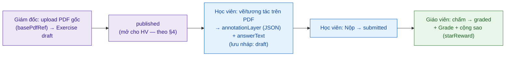

# Tài liệu 19 — Quy tắc Nghiệp vụ chi tiết (Business Rules & Domain Logic)

> Gom các quy tắc nghiệp vụ cụ thể từ **code + decisions** — phần trước đây chỉ nằm rải trong
> codebase (đã làm rõ qua các lần phát triển của bạn) hoặc trong `docs/decisions`, chưa có một tài
> liệu chuẩn. Đây là tầng "luật chi tiết" dev/agent bám để build đúng hành vi.
> Nguồn: `apps/api/src/**`, `schema.prisma`, `docs/decisions/*` (2026-07-05).

---

## 1. Hệ thống chương trình học (Curriculum)

- **Program (enum):** `UCREA`, `BRIGHT_IG`, `BLACK_HOLE`.
- **Cấu trúc cấp độ × tháng** (theo seed framework): UCREA = 3 cấp × 12 tháng; Bright I.G. = 6 cấp ×
  4 tháng; Black Hole theo charter chương trình.
- **CurriculumUnit:** đơn vị bài học, `UnitType` = `LESSON` | `REVIEW`. Bảng **global (không RLS)**
  — chương trình dùng chung toàn hệ (QĐ 0021).
- **Exercise gắn CurriculumUnit:** mỗi unit có bài tập theo `type`; ràng buộc **unique
  `[curriculumUnitId, type]`** (một unit có tối đa một bài mỗi loại).
- **Chứng chỉ cấp tay** (QĐ 0008): không auto theo level-up; LMS là nền làm bài tập.

## 2. Quy tắc mã tự sinh (Code generation)

| Mã | Định dạng | Nguồn | Ví dụ |
|---|---|---|---|
| **Mã lớp** (ClassBatch) | `{facility.code}-{program}-{year}-{seq}` (QĐ 0036); year từ `startDate` | `nextBatchCode()` | `HN-UCREA-2026-001` |
| **Mã nhân viên** | `CMC` + seq 4 chữ số (bộ đếm global 1-hàng, atomic) | `nextEmployeeCode()` | `CMC0001` |
| **Mã tài khoản HS (login credential)** | = **SĐT phụ huynh** chuẩn hoá `84xxxxxxxxx` (dùng khi học sinh login) | `normalizeLoginPhone()` | `84912345678` |
| **Mã phiếu thu** | `SO` + seq 5 chữ số (`SO00183`) — KHÔNG có dấu gạch ngang, KHÔNG prefix `PT-` | `nextReceiptCode()` trong `@cmc/domain-finance` | `SO00183` |
| **OTP đăng nhập PH** | 6 chữ số ngẫu nhiên, gửi qua email | `randomInt(0,1e6).padStart(6)` | `048213` |

> **product-decision 2026-07-07**: Mã phiếu thu đổi từ `PT-000001` (prefix PT-, pad 6, có gạch ngang) sang `SO00183` (prefix SO, pad 5, không có gạch ngang). `packages/domain-finance/src/receipt-code.ts` là nguồn sự thật; mọi doc/code dùng format cũ `PT-` là sai. Tham chiếu: UI implementation plan phase 01a.

**Quy tắc chung:** mọi mã dùng **bộ đếm atomic** (`INSERT … ON CONFLICT DO UPDATE … RETURNING`)
để không trùng khi tạo đồng thời. Mã nhân viên/phiếu là **global**; mã lớp **theo facility+program+year**.

> **product-decision 2026-07-07**: Auth LMS đổi sang **2-tier** — đảo QĐ 0033 (phone+OTP đơn tài khoản). Chi tiết:
>
> **Phụ huynh** (`LmsSubject.kind = 'parent'`): đăng nhập bằng `email` + OTP 6 số gửi qua email. `ParentAccount.email` là bắt buộc. Sau xác thực → *profile picker* nếu ≥2 con.
>
> **Học sinh** (`LmsSubject.kind = 'student'`): đăng nhập bằng SĐT phụ huynh (`84xxx`) + mật khẩu. Mật khẩu mặc định được set lúc provisioning; `StudentAccount.mustChangePassword = true` khi dùng default → buộc đổi lần đăng nhập đầu. Các trường trên `StudentAccount`: `passwordHash` (PBKDF2-SHA256), `mustChangePassword`, `loginAttempts`, `loginLockedUntil`. Các trường này **không** nằm trên `ParentAccount`.
>
> **Không có `studentCode`**: HS được định danh bằng `fullName + SĐT PH`; không có cột mã học sinh.
>
> **BLOCKED-ON-COMMS**: Email OTP phụ huynh dùng `ConsoleEmailTransport` stub — chưa giao được email thật ra ngoài. Luồng này **không hoạt động production** cho đến khi Brevo/Graph credentials được cấu hình (xem TL18). Dev/staging: xem OTP trong server log.

## 2b. Quy tắc phê duyệt phiếu thu (Over-threshold role-elevation)

> **product-decision 2026-07-07 — ADR-B**: Phiếu thu cần xét duyệt độc lập 1 người, **không phải 2 chữ ký (co-approval)**. Điều kiện duyệt phiếu (`canApprove = true`) đồng thời phải thoả **cả 3**:
>
> 1. **notSelf**: người duyệt ≠ người tạo phiếu.
> 2. **secondEyeOk**: nếu `netAmount > 20.000.000 VND` → người duyệt phải mang role `giam_doc_dao_tao` hoặc `super_admin` (SECOND_EYE_ROLES). Ngưỡng 20M là default — chưa có quyết định chốt số cụ thể (xem `APPROVAL_SECOND_EYE_THRESHOLD` trong `apps/api/src/finance/router.ts`).
> 3. **permission**: người duyệt có quyền `can(subject, 'finance', 'receiptApprove')`.
>
> Nguồn: `apps/api/src/finance/router.ts` — `APPROVAL_SECOND_EYE_THRESHOLD = 20_000_000`, `SECOND_EYE_ROLES = ['giam_doc_dao_tao', 'super_admin']`, field `canApprove` được tính server-side và trả về trong `ReceiptDto`.

## 3. Luồng làm bài trên PDF (Exercise ↔ Submission)

Đây là nghiệp vụ lõi của LMS học viên. Mô hình dữ liệu thật:

**Exercise** (bài tập do giám đốc/người tạo cung cấp):
- `basePdfRef` — **PDF gốc** giám đốc **upload** qua giao diện upload → hiển thị cho học viên.
- `type`: `homework` | `test_entrance` | `test_periodic`; `maxScore` (mặc định 10); `starReward`
  (mặc định 10 sao).
- `status`: `draft` → **`published`** → `closed`. **`published` = mở cho học viên** (§4).

**Submission** (bài làm của học viên, 1 bản/`[exerciseId, studentId]`):
- Học viên làm **trên chính file PDF**: nét vẽ/tương tác lưu ở **`annotationLayer` (JSON)** chồng
  lên PDF gốc; kèm `answerText` (nếu có). `version` tăng theo lần lưu.
- `status`: `draft` (đang làm, lưu nháp) → **`submitted`** (nộp) → **`graded`** (GV chấm).
- `submittedAt` đóng dấu khi nộp.
- **Nộp bài là hành động một chiều, KHÔNG idempotent:** `submit` chỉ chấp nhận khi
  `submission.status === 'draft'`; gọi lại lần 2 trên bài đã `submitted`/`graded` → lỗi `BAD_REQUEST`
  ("Only a draft submission can be submitted.") — bài không tự sửa được nữa qua `saveDraft` một khi đã
  nộp (cùng thông điệp chặn ở cả hai endpoint) (`submission/router.ts`).

**Luồng đầy đủ:**

**Ghi chú kỹ thuật (nợ TL3):** PDF gốc + submission blob hiện local-disk; v2 chuyển object store
+ backup off-box. Annotation lưu dạng JSON (layer) — không sửa PDF gốc, giữ được bản gốc để chấm.

## 4. Cổng thời gian: "Bài tập mở lúc nào" (`lib/exercise-open.ts`)

Bài tập KHÔNG mở ngay khi `published`; mở theo **tiến độ dạy thực tế**:

- **Điều kiện nền:** Exercise `status = published` **và** học viên không ở lifecycle bị chặn
  (`BLOCKED_LMS_LIFECYCLE`).
- **Tier A — mở cả lớp:** một `curriculumUnit` mở cho **toàn batch** khi **buổi học (không phải buổi
  bù) dạy unit đó đã KẾT THÚC** — kết thúc tính theo giờ ICT (`sessionEndUtc`, UTC+7). Tức là học
  xong bài mới mở bài tập bài đó.
- **Tier B — mở riêng học viên (buổi bù):** buổi **bù** (`isMakeup`) mà một học viên **có mặt/đi muộn**
  → mở unit đó **chỉ cho học viên ấy**, KHÔNG mở cả lớp (buổi bù dạy cho một HS vắng không được mở
  cho toàn batch).

→ Quy tắc: "học tới đâu, mở bài tới đó", công bằng cho cả buổi học chính và buổi bù.

## 5. Cổng thời gian: "Giáo viên điểm danh lúc nào" (`attendance.ts`)

- **Buổi học phải tồn tại** (`ClassSession`) và **không bị huỷ** (`SessionStatus`:
  `planned`/`confirmed`/`cancelled`/`done` — buổi `cancelled` **không được điểm danh**, vì sẽ làm sai tỉ lệ
  chuyên cần dùng cho `computeFinalGrade`; `done` là trạng thái cuối do session-done engine tự gán
  (ADR 0042/0043), xem docs/10 V11).
- **Enrollment phải khớp lớp** với session (`enrollment.classBatchId === session.classBatchId`) —
  cặp lệch bị chặn trước khi ghi.
- **Học viên phải `active`** (đã đóng phí — ADR-A) và lifecycle hợp lệ.
- `facilityId` **suy từ session server-side**, không tin client (chống rò chéo cơ sở).
- Điểm danh bucket theo **tháng ICT** của thời điểm kết thúc buổi (biên tháng chuẩn UTC+7).
- Ngoài WiFi cơ sở → vẫn ghi nhận + **phiếu chấm công theo ngày** cần GĐ track duyệt (khác điểm danh
  HS; ADR 0043 — xem TL20 §1).

## 6. Sao thưởng & điểm

- Bài nộp `graded` → ghi `Grade`/`FinalGrade` (thang `maxScore`, mặc định 10) + **cộng sao**
  (`starReward`, mặc định 10) qua `StarTransaction` → dùng đổi quà (`Reward`/`Gift`).
- **Cộng sao đúng một lần dù chấm lại (regrade idempotent):** `grade` (bao gồm chấm lại một bài đã
  `graded`) chỉ tạo `StarTransaction` (`homework_completed`) **đúng một lần** trên mỗi `Submission` —
  kiểm tra idempotent ngay trong cùng transaction chấm điểm, có unique index chặn ở DB làm lưới an
  toàn thứ hai; chấm lại không cộng sao trùng (`submission/router.ts`).
- Nhận xét định tính (`QualitativeAssessment`/`SessionStudentComment`) — agent soạn nháp, **GV chốt**
  (dữ liệu trẻ, TL08 §7).
- **Chốt nhận xét (`confirm`) là hành động cuối cùng (terminal):** chỉ bản `status = draft` mới confirm
  được; gọi lại trên bản đã `confirmed` → lỗi `BAD_REQUEST` ("Assessment is already confirmed; only
  drafts can be confirmed.") — không có "chốt lại", không sửa nhận xét đã chốt qua endpoint này. Khi
  2 GV cùng bấm chốt đồng thời, chỉ **một người thắng**: ghi bằng `updateMany WHERE status = 'draft'`
  nguyên tử; người đến sau nhận `count === 0` → lỗi "Assessment was modified concurrently; please
  retry." (không ghi đè bản đã chốt) (`assessment/router.ts`).

## 6b. Bằng chứng buổi học & ảnh lớp gửi phụ huynh (SessionEvidence)

Nghiệp vụ "ảnh lớp gửi PH" — giáo viên ghi lại buổi học, gửi về phụ huynh.

- **SessionEvidence** (1 bản/`classSessionId`): `summary` (tóm tắt buổi), **`internalNote`** (ghi chú
  **nội bộ**, KHÔNG gửi PH), + ảnh con (`SessionEvidencePhoto`).
- **Vòng đời (`SessionEvidenceStatus`):** `draft` (GV soạn) → **`published`** (gửi PH, stamp
  `publishedAt`/`publishedById`).
- **Ranh giới dữ liệu trẻ (TL08 §7):** ảnh trẻ chỉ hiển thị cho PH của chính lớp/HS; cần đồng thuận;
  `internalNote` không lộ ra PH. KHÔNG gửi ảnh trẻ tới LLM ngoài để "phân tích" nếu không có kiểm soát.
- **Điểm chặn ảnh nằm ở tầng truy vấn, không chỉ ở đăng nhập:** đăng nhập LMS hợp lệ là điều kiện
  **cần nhưng chưa đủ** — mỗi lượt xem ảnh (`GET /upload/session-photo`) được `canAccessSessionPhoto`
  kiểm tra lại: ảnh phải thuộc `SessionEvidence.status = 'published'`; PH/HS phải là guardian/con
  **được duyệt** của đúng lớp chứa ảnh (`getApprovedChildren` + `Enrollment` cùng facility); và
  **đồng thuận ảnh đang hiệu lực** (`Guardian.photoConsent = true` và `photoConsentRevokedAt IS
  NULL`). Thiếu bất kỳ điều kiện nào → từ chối, fail-closed (trả `false` thay vì throw, để caller trả
  403/404 đồng nhất, tránh lộ thông tin qua khác biệt lỗi) (`session-evidence/photo-access.ts`).

## 6c. Liên kết Phụ huynh – Con (Guardian & GuardianLinkRequest)

- **GuardianRelation:** `father` | `mother` | `guardian`.
- **GuardianLinkRequest** (PH tự yêu cầu liên kết với một HS): vòng đời `pending` → `approved` |
  `rejected` — **nhân viên duyệt** trước khi PH thấy dữ liệu con. Đây là cổng chống PH liên kết nhầm
  HS. Một `ParentAccount` (theo SĐT) có thể là guardian của nhiều con (TL19 §2 profile picker).

## 6d. ❌ Loại khỏi scope v2 (theo quyết định)

- **Certificate (cấp chứng chỉ tay)** và **LevelProgress (duyệt lên cấp)**: **bỏ** khỏi v2 (giữ bảng
  DB, không build UI/nghiệp vụ). **Leaderboard/Badge** cũng loại (TL20 §8). Đổi quà (sao) vẫn giữ.

## 7. Nơi các quy tắc này được ghi (truy vết)

| Quy tắc | Nguồn chuẩn |
|---|---|
| Phê duyệt phiếu thu (canApprove, over-threshold) | **product-decision 2026-07-07** (§2b) + `apps/api/src/finance/router.ts` `APPROVAL_SECOND_EYE_THRESHOLD` |
| Mã lớp | QĐ 0036 + `nextBatchCode()` |
| Mã nhân viên / phiếu / OTP | `services/employee-code.ts`, `receipt-code`, code |
| Login học viên = SĐT PH (student) | ~~QĐ 0033~~ → đảo bởi **product-decision 2026-07-07** (xem §2): auth 2-tier, `kind='parent'` dùng email+OTP, `kind='student'` dùng SĐT PH+password |
| Chương trình / chứng chỉ | QĐ 0008, 0021 + seed-curriculum |
| Bài tập PDF + annotation | `schema.prisma` (Exercise/Submission) |
| Mở bài tập theo buổi học | `lib/exercise-open.ts` (Tier A/B) |
| Cổng điểm danh | `routers/attendance.ts` |
| Nộp bài một chiều + cộng sao idempotent | `submission/router.ts` (§3, §6) |
| Chốt nhận xét terminal + concurrency một-người-thắng | `assessment/router.ts` (§6) |
| Cổng ảnh buổi học ở tầng truy vấn | `session-evidence/photo-access.ts` (§6b) |

> **Khuyến nghị:** các rule ở §4–§5 hiện chỉ sống trong code — nên nâng thành **ADR** để v2 tái mã
> hoá chắc chắn (đúng nguyên tắc "port quyết định, không port code" — TL05 §0).

> Liên kết: TL07 (glossary) · TL10 (data model) · TL08 §7 (dữ liệu trẻ) · TL11 (API exercise/attendance).
