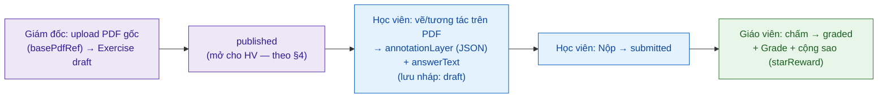

# Tài liệu 19 — Quy tắc Nghiệp vụ chi tiết (Business Rules & Domain Logic)

> Gom các quy tắc nghiệp vụ cụ thể từ **code + decisions** — phần trước đây chỉ nằm rải trong
> codebase (đã làm rõ qua các lần phát triển của bạn) hoặc trong `docs/decisions`, chưa có một tài
> liệu chuẩn. Đây là tầng "luật chi tiết" dev/agent bám để build đúng hành vi.
> Nguồn: `apps/api/src/**`, `schema.prisma`, `docs/decisions/*` (2026-07-05).

---

## 1. Hệ thống chương trình học (Curriculum)

- **Program (enum):** `UCREA`, `BRIGHT_IG`, `BLACK_HOLE`.
- **Cấu trúc cấp độ × tháng** (theo seed framework): UCREA = 3 cấp × 12 tháng; Bright I.G. = 6 cấp ×
  4 tháng; Black Hole theo charter chương trình.
- **CurriculumUnit:** đơn vị bài học, `UnitType` = `LESSON` | `REVIEW`. Bảng **global (không RLS)**
  — chương trình dùng chung toàn hệ (QĐ 0021).
- **Exercise gắn CurriculumUnit:** mỗi unit có bài tập theo `type`; ràng buộc **unique
  `[curriculumUnitId, type]`** (một unit có tối đa một bài mỗi loại).
- **Chứng chỉ cấp tay** (QĐ 0008): không auto theo level-up; LMS là nền làm bài tập.

## 2. Quy tắc mã tự sinh (Code generation)

| Mã | Định dạng | Nguồn | Ví dụ |
|---|---|---|---|
| **Mã lớp** (ClassBatch) | `{facility.code}-{program}-{year}-{seq}` (QĐ 0036); year từ `startDate` | `nextBatchCode()` | `HN-UCREA-2026-001` |
| **Mã nhân viên** | `CMC` + seq 4 chữ số (bộ đếm global 1-hàng, atomic) | `nextEmployeeCode()` | `CMC0001` |
| **Mã tài khoản học viên (login)** | = **SĐT phụ huynh** chuẩn hoá `84xxxxxxxxx` (QĐ 0033) | `normalizeLoginPhone()` | `84912345678` |
| **Mã phiếu thu** | seq từ `receiptCodeCounter` | `nextReceiptCode()` | — |
| **OTP đăng nhập PH** | 6 chữ số ngẫu nhiên | `randomInt(0,1e6).padStart(6)` | `048213` |

**Quy tắc chung:** mọi mã dùng **bộ đếm atomic** (`INSERT … ON CONFLICT DO UPDATE … RETURNING`)
để không trùng khi tạo đồng thời. Mã nhân viên/phiếu là **global**; mã lớp **theo facility+program+year**.

**Tài khoản học viên** (QĐ 0033): 1 credential/SĐT phụ huynh (dùng chung cho mọi con); đăng nhập →
*profile picker* chọn con (1 con vào thẳng, ≥2 con hiện chọn). Mật khẩu mặc định `Cmc2026@` hoặc OTP.

## 3. Luồng làm bài trên PDF (Exercise ↔ Submission)

Đây là nghiệp vụ lõi của LMS học viên. Mô hình dữ liệu thật:

**Exercise** (bài tập do giám đốc/người tạo cung cấp):
- `basePdfRef` — **PDF gốc** giám đốc **upload** qua giao diện upload → hiển thị cho học viên.
- `type`: `homework` | `test_entrance` | `test_periodic`; `maxScore` (mặc định 10); `starReward`
  (mặc định 10 sao).
- `status`: `draft` → **`published`** → `closed`. **`published` = mở cho học viên** (§4).

**Submission** (bài làm của học viên, 1 bản/`[exerciseId, studentId]`):
- Học viên làm **trên chính file PDF**: nét vẽ/tương tác lưu ở **`annotationLayer` (JSON)** chồng
  lên PDF gốc; kèm `answerText` (nếu có). `version` tăng theo lần lưu.
- `status`: `draft` (đang làm, lưu nháp) → **`submitted`** (nộp) → **`graded`** (GV chấm).
- `submittedAt` đóng dấu khi nộp.

**Luồng đầy đủ:**

**Ghi chú kỹ thuật (nợ TL3):** PDF gốc + submission blob hiện local-disk; v2 chuyển object store
+ backup off-box. Annotation lưu dạng JSON (layer) — không sửa PDF gốc, giữ được bản gốc để chấm.

## 4. Cổng thời gian: "Bài tập mở lúc nào" (`lib/exercise-open.ts`)

Bài tập KHÔNG mở ngay khi `published`; mở theo **tiến độ dạy thực tế**:

- **Điều kiện nền:** Exercise `status = published` **và** học viên không ở lifecycle bị chặn
  (`BLOCKED_LMS_LIFECYCLE`).
- **Tier A — mở cả lớp:** một `curriculumUnit` mở cho **toàn batch** khi **buổi học (không phải buổi
  bù) dạy unit đó đã KẾT THÚC** — kết thúc tính theo giờ ICT (`sessionEndUtc`, UTC+7). Tức là học
  xong bài mới mở bài tập bài đó.
- **Tier B — mở riêng học viên (buổi bù):** buổi **bù** (`isMakeup`) mà một học viên **có mặt/đi muộn**
  → mở unit đó **chỉ cho học viên ấy**, KHÔNG mở cả lớp (buổi bù dạy cho một HS vắng không được mở
  cho toàn batch).

→ Quy tắc: "học tới đâu, mở bài tới đó", công bằng cho cả buổi học chính và buổi bù.

## 5. Cổng thời gian: "Giáo viên điểm danh lúc nào" (`attendance.ts`)

- **Buổi học phải tồn tại** (`ClassSession`) và **không bị huỷ** (`SessionStatus`:
  `planned`/`confirmed`/`cancelled` — buổi `cancelled` **không được điểm danh**, vì sẽ làm sai tỉ lệ
  chuyên cần dùng cho `computeFinalGrade`).
- **Enrollment phải khớp lớp** với session (`enrollment.classBatchId === session.classBatchId`) —
  cặp lệch bị chặn trước khi ghi.
- **Học viên phải `active`** (đã đóng phí — ADR-A) và lifecycle hợp lệ.
- `facilityId` **suy từ session server-side**, không tin client (chống rò chéo cơ sở).
- Điểm danh bucket theo **tháng ICT** của thời điểm kết thúc buổi (biên tháng chuẩn UTC+7).
- Ngoài WiFi/giờ → **phiếu chấm công thủ công theo ngày** (khác điểm danh HS; QĐ 0034).

## 6. Sao thưởng & điểm

- Bài nộp `graded` → ghi `Grade`/`FinalGrade` (thang `maxScore`, mặc định 10) + **cộng sao**
  (`starReward`, mặc định 10) qua `StarTransaction` → dùng đổi quà (`Reward`/`Gift`).
- Nhận xét định tính (`QualitativeAssessment`/`SessionStudentComment`) — agent soạn nháp, **GV chốt**
  (dữ liệu trẻ, TL08 §7).

## 6b. Bằng chứng buổi học & ảnh lớp gửi phụ huynh (SessionEvidence)

Nghiệp vụ "ảnh lớp gửi PH" — giáo viên ghi lại buổi học, gửi về phụ huynh.

- **SessionEvidence** (1 bản/`classSessionId`): `summary` (tóm tắt buổi), **`internalNote`** (ghi chú
  **nội bộ**, KHÔNG gửi PH), + ảnh con (`SessionEvidencePhoto`).
- **Vòng đời (`SessionEvidenceStatus`):** `draft` (GV soạn) → **`published`** (gửi PH, stamp
  `publishedAt`/`publishedById`).
- **Ranh giới dữ liệu trẻ (TL08 §7):** ảnh trẻ chỉ hiển thị cho PH của chính lớp/HS; cần đồng thuận;
  `internalNote` không lộ ra PH. KHÔNG gửi ảnh trẻ tới LLM ngoài để "phân tích" nếu không có kiểm soát.

## 6c. Liên kết Phụ huynh – Con (Guardian & GuardianLinkRequest)

- **GuardianRelation:** `father` | `mother` | `guardian`.
- **GuardianLinkRequest** (PH tự yêu cầu liên kết với một HS): vòng đời `pending` → `approved` |
  `rejected` — **nhân viên duyệt** trước khi PH thấy dữ liệu con. Đây là cổng chống PH liên kết nhầm
  HS. Một `ParentAccount` (theo SĐT) có thể là guardian của nhiều con (TL19 §2 profile picker).

## 6d. ❌ Loại khỏi scope v2 (theo quyết định)

- **Certificate (cấp chứng chỉ tay)** và **LevelProgress (duyệt lên cấp)**: **bỏ** khỏi v2 (giữ bảng
  DB, không build UI/nghiệp vụ). **Leaderboard/Badge** cũng loại (TL20 §8). Đổi quà (sao) vẫn giữ.

## 7. Nơi các quy tắc này được ghi (truy vết)

| Quy tắc | Nguồn chuẩn |
|---|---|
| Mã lớp | QĐ 0036 + `nextBatchCode()` |
| Mã nhân viên / phiếu / OTP | `services/employee-code.ts`, `receipt-code`, code |
| Login học viên = SĐT PH | QĐ 0033 |
| Chương trình / chứng chỉ | QĐ 0008, 0021 + seed-curriculum |
| Bài tập PDF + annotation | `schema.prisma` (Exercise/Submission) |
| Mở bài tập theo buổi học | `lib/exercise-open.ts` (Tier A/B) |
| Cổng điểm danh | `routers/attendance.ts` |

> **Khuyến nghị:** các rule ở §4–§5 hiện chỉ sống trong code — nên nâng thành **ADR** để v2 tái mã
> hoá chắc chắn (đúng nguyên tắc "port quyết định, không port code" — TL05 §0).

> Liên kết: TL07 (glossary) · TL10 (data model) · TL08 §7 (dữ liệu trẻ) · TL11 (API exercise/attendance).
