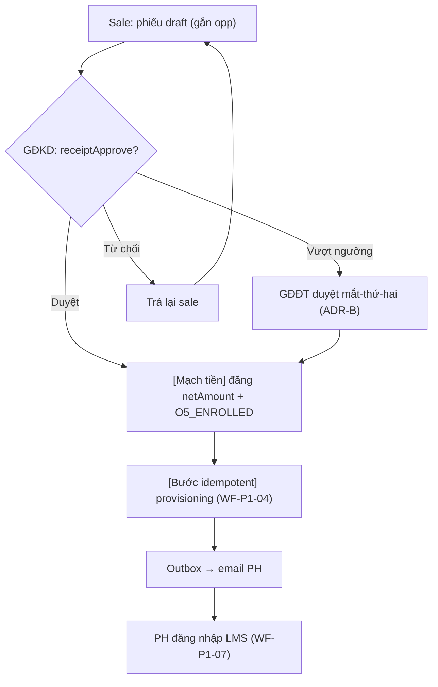
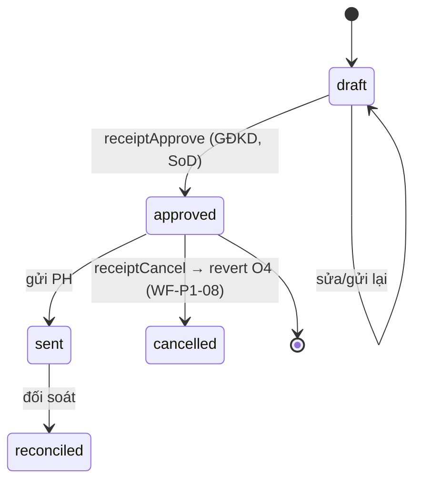

# Tài liệu 23 — Chuẩn bị G2: Template Workflow Spec + Kế hoạch cụm P1

> Sẵn sàng cho G2. Định nghĩa **khuôn Workflow Spec** (mọi luồng viết theo khuôn này) + **kế hoạch
> cụm P1 (Định danh & Ghi danh)** với bản đồ rule/ADR mỗi luồng kéo vào, + **một workflow mẫu điền
> đầy** để đội build thấy chuẩn "chi tiết đến mức code được". Bám các ADR đã chốt (TL16, TL22).

---

## 1. Khuôn Workflow Spec (mỗi luồng phải có đủ)

```
WF-<cụm>-<số> — <Tên luồng>
1. Meta: cụm · ưu tiên · oversight (auto/HITL/HOTL)
2. Actors: vai trò người + agent liên quan
3. Trigger & Preconditions: cái gì kích hoạt; điều kiện trước
4. Swimlane (mermaid): ai làm gì, bàn giao ở đâu
5. State machine (mermaid stateDiagram): trạng thái & chuyển hợp lệ
6. Happy path: các bước đánh số
7. Exceptions & Edge cases: lỗi/race/rollback/ngoại lệ (bắt buộc — đây là phần hay sót)
8. Business rules & ADR: rule + số ADR/QĐ luồng dựa vào
9. API procedures: procedure tRPC + quyền
10. UI / URL: màn + URL (TL06)
11. Traceability row: Vai trò→WF→Story→API→UI→Test→ADR
12. Acceptance: tiêu chí "xong" đo được
```

**Nguyên tắc (documentation skill):** viết cho người build (dev/agent); show-don't-tell (sơ đồ + ví
dụ); mỗi luồng tự đủ; trỏ về nguồn (ADR/rule) thay vì chép lại.

---

## 2. Cụm P1 — Định danh & Ghi danh (xương sống)

**Phạm vi:** từ lead → chốt → cổng tiền → sinh tài khoản → học viên vào lớp. Đây là cụm mọi thứ khác
phụ thuộc. **Vai trò active:** sale, GĐKD, (GĐĐT mắt-thứ-hai), phụ huynh/học viên.

**Danh mục workflow P1 + rule/ADR mỗi luồng gom:**

| WF | Tên | Oversight | Rule/ADR kéo vào |
|---|---|---|---|
| **WF-P1-01** | CRM: lead → O1…O5 (sale đẩy stage) | HITL | OpportunityStage O1–O5 · LostReason · QĐ 0037 |
| **WF-P1-02** | Tạo phiếu thu từ cơ hội (điền sẵn) | auto (điền) + HITL | QĐ 0037 · TL19 §2 (mã phiếu) |
| **WF-P1-03** | **Cổng tiền: duyệt phiếu → auto-O5 + provisioning** | HITL (GĐKD) | **ADR-B · ADR 0041 · QĐ 0024/0028** |
| **WF-P1-04** | Provisioning atomic/idempotent (student/parent/enroll/account) | auto | **ADR 0041 · QĐ 0033** |
| **WF-P1-05** | Enrollment `reserved`→`active` (lái bởi Receipt) | auto | **ADR-A** |
| **WF-P1-06** | Guardian link (PH yêu cầu ↔ nhân viên duyệt) | HITL | GuardianLinkRequest pending→approved (TL19 §6c) |
| **WF-P1-07** | Đăng nhập LMS phụ huynh (SĐT + OTP, profile picker) | auto | QĐ 0031/0033 · TL19 §2 |
| **WF-P1-08** | Huỷ phiếu / hoàn tiền → revert O4 + rollback provisioning | HITL | QĐ 0024/0028 · bất biến I3 (TL01) |
| **WF-P1-09** | Reconciliation agent gắn cờ phiếu bất thường | **HOTL** | ADR-B · TL13 |

---

## 3. Workflow mẫu (điền đầy) — WF-P1-03: Cổng tiền → Provisioning

### 1. Meta
Cụm P1 · Ưu tiên **P0** · Oversight **HITL** (GĐKD duyệt; vượt ngưỡng → GĐĐT mắt-thứ-hai).

### 2. Actors
Sale (tạo nháp), **GĐKD** (duyệt), GĐĐT (mắt-thứ-hai khi vượt ngưỡng), Hệ thống (provisioning),
Reconciliation agent (HOTL giám sát), Phụ huynh (nhận email).

### 3. Trigger & Preconditions
Trigger: GĐKD bấm "Duyệt" trên phiếu `draft`. Precondition: phiếu gắn `opportunityId` (từ WF-P1-02),
người duyệt ≠ người tạo (SoD — ADR-B), HS/PH data hợp lệ.

### 4. Swimlane


### 5. State machine (phiếu thu)


### 6. Happy path
1. GĐKD mở `/finance/receipts/{id}` (cờ `receipt_pending_approval` đẩy từ StaffNotifEvent).
2. Kiểm tra → bấm "Duyệt & Kích hoạt".
3. Mạch tiền (atomic): đóng băng `netAmount`, opp → `O5_ENROLLED` + `closedAt`.
4. Bước idempotent (WF-P1-04): tạo Student/ParentAccount/Enrollment(`active`)/StudentAccount.
5. Outbox gửi email PH; ResultPanel hiện: ✓ Đã duyệt ✓ Đã tạo TK ✓ Đã gửi email.

### 7. Exceptions & Edge cases (phần dễ sót)
- **Người duyệt = người tạo** (đội-nhiều-mũ): vẫn cho nhưng audit ghi "tạo & tự duyệt" + Reconciliation
  agent gắn cờ (ADR-B).
- **Vượt ngưỡng tiền:** chặn tới khi có GĐĐT mắt-thứ-hai.
- **Race SĐT PH trùng** (2 con đăng ký đồng thời): SAVEPOINT/ON CONFLICT (ADR 0041) — không vỡ mạch tiền.
- **Provisioning lỗi:** KHÔNG rollback tiền (đã tách idempotent — ADR 0041); retry provisioning.
- **Email lỗi:** outbox `failed` → retry; không ảnh hưởng tiền/định danh.
- **Huỷ sau duyệt:** WF-P1-08 revert O4 + rollback provisioning (bất biến I3).

### 8. Business rules & ADR
ADR-A (enrollment), ADR-B (cổng tiền/SoD/ngưỡng), ADR 0041 (provisioning atomic/idempotent),
QĐ 0024 (auto-O5), 0028 (netAmount đóng băng), 0037 (opp↔receipt).

### 9. API procedures
`finance.receiptApprove` (quyền `finance.receiptApprove` — GĐKD/GĐĐT); nội bộ gọi provisioning +
`emailOutbox`. Lỗi: `FORBIDDEN` (SoD/ngưỡng), `CONFLICT` (race), `BAD_REQUEST` (state sai).

### 10. UI / URL
`/finance/receipts/{id}` (chi tiết + nút duyệt); cờ escalate `?flag=self-approved-over-threshold`
(TL06 §6). ResultPanel (TL12 §4).

### 11. Traceability row
`GĐKD → WF-P1-03 → "Duyệt phiếu kích hoạt học viên" → finance.receiptApprove → /finance/receipts/:id
→ test/finance/approve.spec → ADR-B, 0041, QĐ0024`.

### 12. Acceptance
- Sale không gọi được `receiptApprove` (FORBIDDEN).
- Duyệt → tồn tại Student(`createdByReceiptId`) + ParentAccount + Enrollment(`active`) + email queued.
- Provisioning lỗi không rollback netAmount (test inject lỗi).
- Audit ghi đủ ai-tạo/ai-duyệt kể cả trùng người.

---

## 4. Việc còn lại của G2 (sau scaffold này)

Viết đầy WF-P1-01,02,04,05,06,07,08,09 theo khuôn §1 (mẫu §3 là chuẩn). Mỗi WF điền hàng Traceability
→ nạp dần Ma trận Truy vết (G3). Xong P1 → chuyển P2 (Vận hành lớp: schedule/attendance/exercise —
kéo ADR 0038), P3 (HR/ca/lương — ADR 0039/0040), P4 (đổi quà/họp PH/after-sale).

> Liên kết: TL22 (ADR 0038–0041) · TL16 (ADR A–D) · TL17 (luồng tổng) · TL19/20 (rule) · TL00 (traceability) · TL11 (API) · TL06 (URL).
