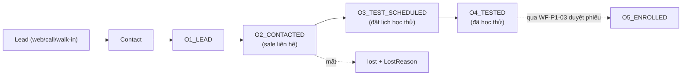
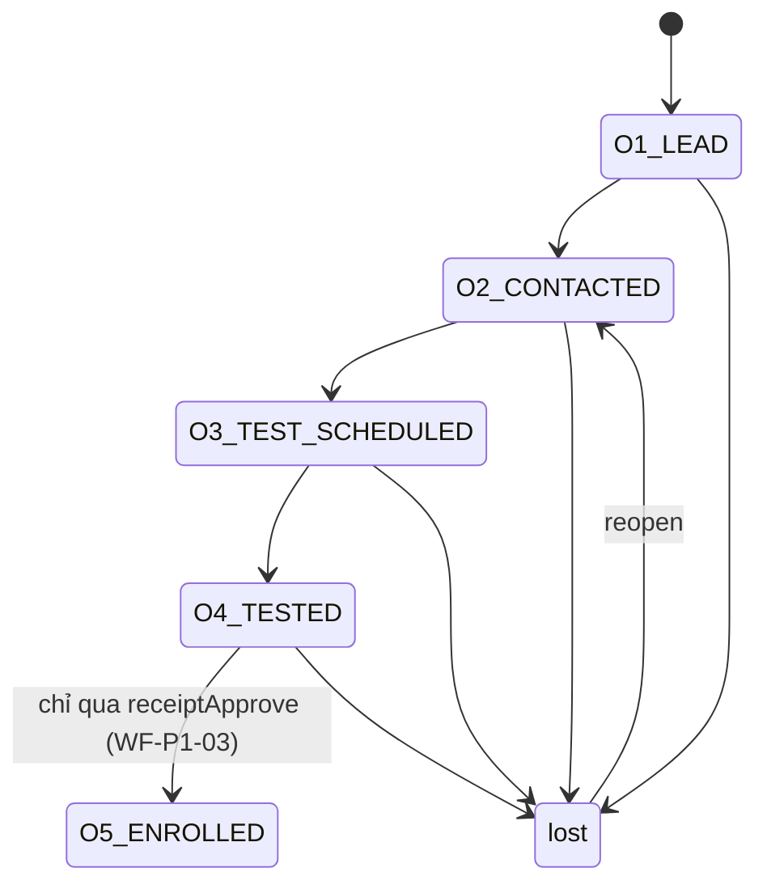
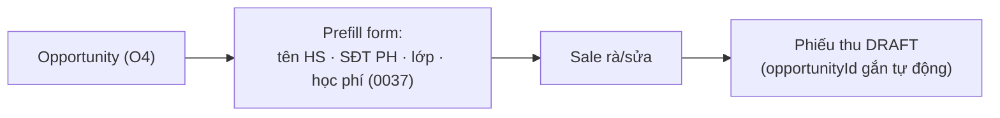
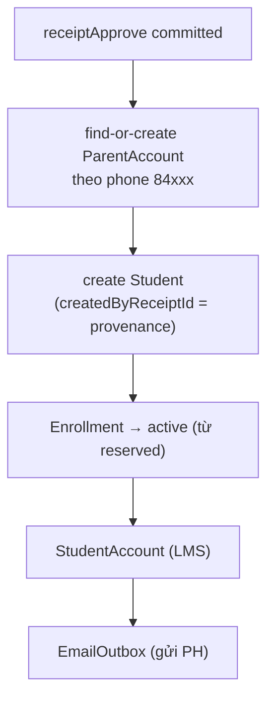
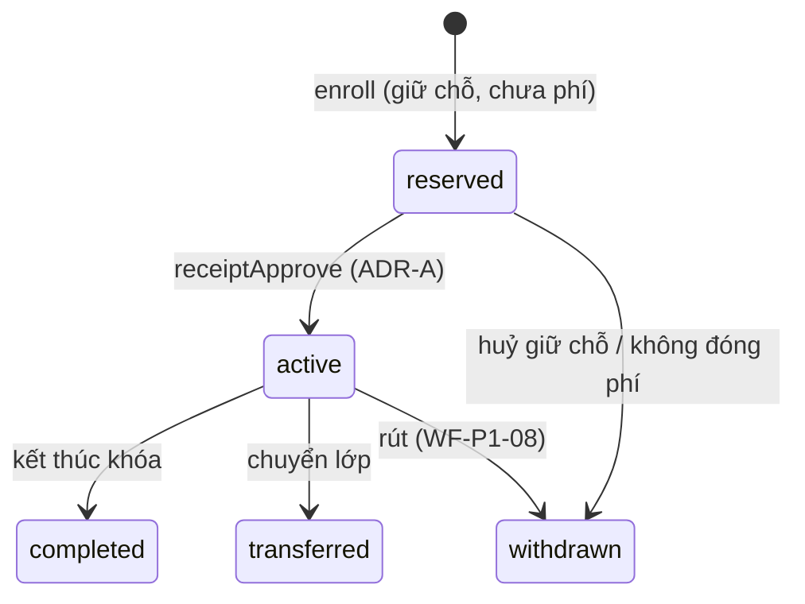
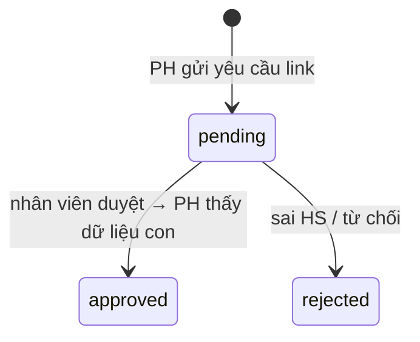
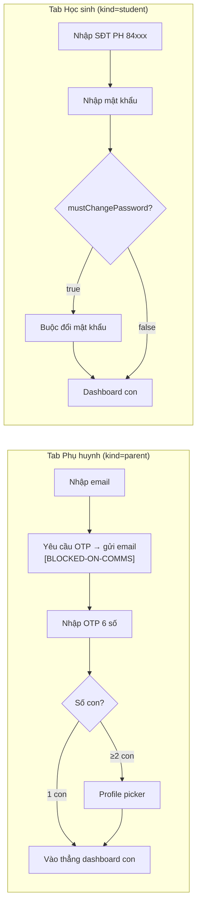
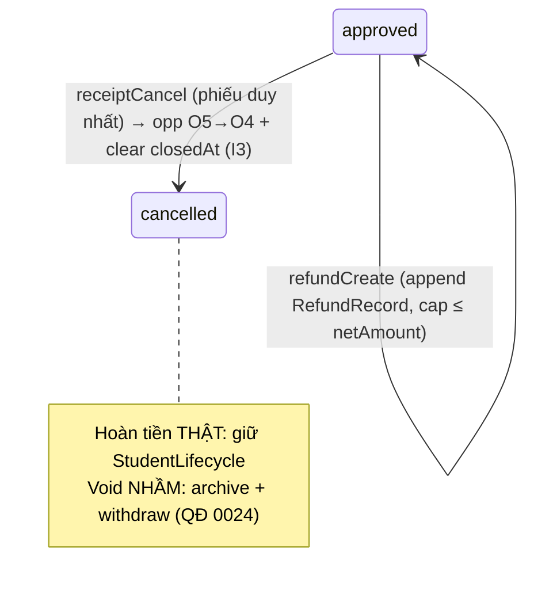

# Tài liệu 24 — Workflow Spec cụm P1 (WF-P1-01, 02, 04, 05, 06, 07, 08, 09)

> 8 luồng còn lại của cụm P1 (WF-P1-03 đã có ở TL23 §3). Viết theo đúng khuôn 12 mục. Mỗi luồng tự đủ
> để code; hàng Traceability nạp dần Ma trận Truy vết (G3). Bám ADR A–D (TL16), 0038–0041 (TL22), rule
> TL19/20.

---

## WF-P1-01 — CRM: Lead → O1…O5 (sale đẩy giai đoạn)

**Meta:** P1 · P0 · **HITL** (sale phán đoán). **Actors:** sale, ctv_mkt (lead — deferred), Admissions
agent (nháp O1), GĐKD (giám sát). **Trigger:** lead mới (web/gọi/đến trực tiếp) hoặc sale đẩy stage.
**Precondition:** có/ tạo `Contact`.

**Swimlane**


**State machine**


**Happy path:** 1) tạo Contact/Opportunity O1. 2) sale liên hệ → O2. 3) đặt học thử → O3
(TestAppointment). 4) học thử xong → O4. 5) O5 **không set tay** — đến từ duyệt phiếu (WF-P1-03).

**Exceptions & edge:** trùng lead → `crm.opportunityLookup(phone)` dedup trước khi tạo. Mất →
`LostReason` bắt buộc. **Cấm set O5 thủ công** (chỉ auto từ receipt). Reopen lost → O2 + clear closedAt.

**Rules/ADR:** OpportunityStage O1–O5 · LostReason · QĐ 0037. **API:** `crm.opportunityCreate/advance/
markLost/lookup` (quyền `crm.*` — sale, GĐKD). **UI/URL:** `/crm/opportunities?view=kanban&stage=O3` →
`/crm/opportunities/:id`.

**Traceability:** `sale → WF-P1-01 → "Quản lý phễu tuyển sinh" → crm.opportunityAdvance →
/crm/opportunities/:id → test/crm/stage.spec → QĐ0037`.
**Acceptance:** không set được O5 tay; lost cần reason; lookup chặn trùng; O5 chỉ tồn tại khi có phiếu duyệt.

---

## WF-P1-02 — Tạo phiếu thu từ cơ hội (điền sẵn — QĐ 0037)

**Meta:** P1 · P0 · auto (điền) + **HITL** (sale rà). **Actors:** sale, hệ thống (prefill). **Trigger:**
sale bấm "Tạo phiếu từ cơ hội" trên opp (thường **O4_TESTED**). **Precondition:** opp tồn tại.

**Swimlane**


**State machine:** tạo `Receipt(draft)` (đời sống đầy đủ ở WF-P1-03 §5).

**Happy path:** 1) mở opp O4 → "Tạo phiếu từ cơ hội". 2) form điền sẵn từ opp. 3) sale chọn lớp + học
phí. 4) lưu → phiếu `draft` gắn `opportunityId` + mã phiếu (TL19 §2).

**Exceptions & edge:** **SĐT PH trùng** → `receiptCreate` trả **discriminated union** `{status:'warning'}`
(0037) → FE phải narrow, hỏi xác nhận trước khi tạo. Thiếu lớp/học phí → `BAD_REQUEST`. Opp chưa O4 →
cảnh báo (cho phép nhưng ghi chú).

**Rules/ADR:** QĐ 0037 · mã phiếu (TL19 §2). **API:** `finance.receiptCreate` (quyền
`finance.receiptCreate` — sale) → `{status:'success'|'warning', receipt}`. **UI/URL:**
`/finance/receipts/new?opportunityId=`.

**Traceability:** `sale → WF-P1-02 → "Tạo phiếu học phí từ cơ hội" → finance.receiptCreate →
/finance/receipts/new → test/finance/create-from-opp.spec → QĐ0037`.
**Acceptance:** form điền đúng từ opp; `warning` (SĐT trùng) phải narrow trước khi tạo; phiếu có `opportunityId`.

---

## WF-P1-04 — Provisioning atomic / idempotent

**Meta:** P1 · P0 · **auto** (hệ thống, idempotent). **Actors:** hệ thống (do WF-P1-03 kích hoạt).
**Trigger:** mạch tiền `receiptApprove` đã commit. **Precondition:** phiếu approved, có `opportunityId`.

**Swimlane**


**Happy path:** find-or-create PH theo SĐT → tạo Student gắn provenance → Enrollment active → StudentAccount
→ outbox email.

**Exceptions & edge (trọng tâm):**
- **Race SĐT trùng** (2 con SĐT-mới đồng thời): **SAVEPOINT / ON CONFLICT DO NOTHING + refetch** — giữ
  transaction sống (ADR 0041).
- **Idempotent replay** (retry outbox/agent): find-or-create theo `phone` → không nhân đôi.
- **Lỗi bước provisioning:** **KHÔNG rollback tiền** (đã tách khỏi mạch tiền — ADR 0041) → retry.

**Rules/ADR:** **ADR 0041** · ~~QĐ 0033~~ (đã đảo bởi product-decision 2026-07-07 → auth 2-tier). Provisioning tạo `ParentAccount` (với `email`) + `StudentAccount` (với `passwordHash` PBKDF2-SHA256, `mustChangePassword=true`) thay vì mô hình phone+OTP đơn tầng cũ. **API:** nội bộ (gọi bởi `receiptApprove`); `idempotencyKey` theo `phone`. **UI/URL:** không có màn riêng — kết quả hiện ở ResultPanel WF-P1-03.

**Traceability:** `hệ thống → WF-P1-04 → "Sinh tài khoản khi thu tiền" → (internal provisioning) →
(ResultPanel) → test/provisioning/idempotent.spec → ADR0041, product-decision-2026-07-07`.
**Acceptance:** không student mồ côi (mọi Student có `createdByReceiptId`); replay không nhân đôi; lỗi
provisioning không rollback `netAmount`.

---

## WF-P1-05 — Enrollment `reserved` → `active` (lái bởi Receipt)

**Meta:** P1 · P0 · auto. **Actors:** hệ thống. **Trigger:** `enrollment.enroll` (tạo `reserved`);
`receiptApprove` (→`active`). **Precondition:** HS + lớp tồn tại.

**State machine**


**Happy path:** enroll → `reserved`; duyệt phiếu → `active` (được điểm danh/đánh giá).

**Exceptions & edge:** ghi danh chưa đóng phí **ở `reserved`** → **không được điểm danh** (cổng attendance,
ADR 0039/TL19 §5) và không tính điểm. Huỷ phiếu → `active`→`withdrawn`/revert (WF-P1-08). `active ⇔ có
Receipt approved` — không sửa status tay.

**Rules/ADR:** **ADR-A** · cổng attendance (TL19 §5). **API:** `enrollment.enroll` (→reserved) ·
`finance.receiptApprove` (→active). **UI/URL:** `/classes/:id/students` · `/students/:id/enrollments`.

**Traceability:** `hệ thống → WF-P1-05 → "Kích hoạt ghi danh khi đóng phí" → enrollment.enroll +
receiptApprove → /students/:id/enrollments → test/enrollment/reserved-active.spec → ADR-A`.
**Acceptance:** `reserved` không điểm danh được; `active` ⇔ phiếu approved; migration cũ backfill `active`.

---

## WF-P1-06 — Guardian link (PH yêu cầu ↔ nhân viên duyệt)

**Meta:** P1 · P1 · **HITL** (nhân viên duyệt). **Actors:** phụ huynh (LMS), nhân viên (duyệt).
**Trigger:** PH yêu cầu liên kết với một HS. **Precondition:** ParentAccount + Student tồn tại.

**State machine**


**Happy path:** PH nhập mã/thông tin HS → tạo `GuardianLinkRequest(pending)` → nhân viên đối chiếu →
`approved` → tạo `Guardian` (relation) → PH thấy dữ liệu con.

**Exceptions & edge:** sai HS → `rejected` (PH không thấy gì). Trùng yêu cầu → chặn. Đã liên kết → no-op.
**Cho tới khi `approved`, PH KHÔNG thấy dữ liệu trẻ** (ranh giới dữ liệu trẻ — TL08 §7).

**Rules/ADR:** GuardianLinkRequestStatus (TL19 §6c) · GuardianRelation. **API:** `guardian.requestLink`
(lmsProcedure) · `guardian.approveLink`/`rejectLink` (nhân viên). **UI/URL:** LMS `/parent/home` (PH gửi yêu cầu) ·
nhân viên `/admin/parents` (hàng đợi duyệt trong modal Dialog).

**Traceability:** `PH/nhân viên → WF-P1-06 → "Liên kết phụ huynh–con" → guardian.requestLink/approveLink
→ /parents/:id → test/guardian/link.spec → TL19§6c`.
**Acceptance:** PH không thấy dữ liệu con khi `pending`; duyệt tạo Guardian; reject được.

---

## WF-P1-07 — Đăng nhập LMS 2-tier (PH: email+OTP · HS: SĐT+password)

> **product-decision 2026-07-07**: WF-P1-07 đảo từ phone+OTP (QĐ0033) sang 2-tier auth. Hành vi cũ: phụ huynh đăng nhập bằng SĐT + OTP. Hành vi mới: 2 luồng song song phân biệt bằng `LmsSubject.kind`. Tham chiếu: UI implementation plan phase 01a/01b.
>
> **BLOCKED-ON-COMMS (stop-condition)**: Luồng phụ huynh (email OTP) dùng `ConsoleEmailTransport` — OTP chỉ ghi vào server log, không gửi ra ngoài. **Luồng PH không hoạt động production** cho đến khi Brevo API key hoặc MS Graph mail credentials được cấp và cấu hình. Luồng học sinh (SĐT+password) không phụ thuộc email transport và có thể kiểm tra độc lập.

**Meta:** P1 · P0 · auto. **Actors:** phụ huynh (`kind='parent'`), học sinh (`kind='student'`). **Trigger:** người dùng truy cập LMS `/login`. **Precondition:** ParentAccount + StudentAccount tồn tại (từ provisioning).

**Swimlane (2 tab song song)**


**State machine (LoginOtp — luồng PH):** `issued` → `verified` | `expired`.
**State machine (StudentAuth — luồng HS):** check `passwordHash` + `loginAttempts` + `loginLockedUntil`.

**Happy path PH:** nhập email → request OTP → OTP gửi email → nhập OTP → (picker nếu ≥2 con) → dashboard.
**Happy path HS:** nhập SĐT PH + mật khẩu → nếu `mustChangePassword=true` → đổi password → dashboard.

**Exceptions & edge:** OTP hết hạn → phát lại. HS ở `BLOCKED_LMS_LIFECYCLE` → **chặn truy cập** (TL19 §4). Chưa có con (link chưa duyệt) → hướng dẫn WF-P1-06. `loginAttempts` vượt ngưỡng → lock account (`loginLockedUntil`). Email/SĐT sai → không lộ tồn tại tài khoản.

**Rules/ADR:** product-decision 2026-07-07 (2-tier auth) · TL19 §2 · TL10 §4 (StudentAccount fields). **API:** `lmsAuth.requestOtpEmail` / `lmsAuth.verifyOtpEmail` (PH) · `lmsAuth.loginStudent` (HS) · `enrollment.mine`. **UI/URL:** LMS `/login` (2 tab) · `/parent/home` (PH child-picker inline) · `/student/home` (HS).

**Traceability:** `PH/HS → WF-P1-07 → "Đăng nhập LMS" → lmsAuth.verifyEmailOtp|studentLogin + enrollment.mine → /select-child → test/lms-auth/login.spec → product-decision-2026-07-07`.
**Acceptance:** 2 tab login rõ ràng; picker khi PH có ≥2 con; mustChangePassword buộc đổi; lifecycle bị chặn không vào được; OTP expired xử đúng; loginAttempts lock đúng; email OTP là BLOCKED-ON-COMMS.

---

## WF-P1-08 — Huỷ phiếu / Hoàn tiền → revert O4 + rollback provisioning

**Meta:** P1 · P0 · **HITL** (GĐKD). **Actors:** GĐKD (huỷ), hệ thống (rollback). **Trigger:**
`receiptCancel` hoặc `refundCreate`. **Precondition:** phiếu `approved`.

**State machine**


**Happy path (hoàn tiền):** tạo `RefundRecord` (append-only) ≤ `netAmount` (khoá `FOR UPDATE`) → cập
nhật số dư. **Happy path (huỷ nhầm):** `receiptCancel` → nếu là phiếu duy nhất auto-advance: opp
`O5→O4` + clear `closedAt`; rollback provisioning (archive/withdraw HS).

**Exceptions & edge:** refund **vượt `netAmount`** → `BAD_REQUEST` (cap). Revert O4 **chỉ khi** đây là
phiếu duy nhất đã đẩy O5 (bất biến **I3**). Hoàn tiền thật ≠ void nhầm: thật giữ HS, nhầm archive+withdraw
(QĐ 0024). Race hoàn đồng thời → `FOR UPDATE`.

**Rules/ADR:** QĐ 0024/0028 · bất biến **I3** (TL01) · ADR-A. **API:** `finance.receiptCancel` ·
`finance.refundCreate` (quyền GĐKD/`finance.*`). **UI/URL:** `/finance/receipts/:id` (huỷ) ·
`/finance/refund` (EmptyState stub — API implemented, UI not yet wired).

**Traceability:** `GĐKD → WF-P1-08 → "Huỷ phiếu / hoàn tiền" → finance.receiptCancel/refundCreate →
/finance/refunds → test/finance/cancel-refund.spec → QĐ0024, I3`.
**Acceptance:** refund ≤ netAmount; huỷ revert O4 + clear closedAt; hoàn-thật giữ HS vs void archive;
sổ hoàn append-only.

---

## WF-P1-09 — Reconciliation agent gắn cờ bất thường (HOTL)

**Meta:** P1 · P1 · **HOTL** (agent trên vòng, người quyết). **Actors:** Reconciliation agent,
GĐĐT/super_admin (review). **Trigger:** đối soát định kỳ hoặc sự kiện `receipt approved`.

**Swimlane**
```mermaid
flowchart LR
    A["Agent đọc audit + receipts (read-only)"] --> B{"Bất thường?<br/>(tự-duyệt vượt ngưỡng,<br/>lệch số, SoD vi phạm)"}
    B -->|Có| F["Gắn cờ + URL sâu:<br/>/finance/receipts/:id?flag=self-approved-over-threshold"]
    B -->|Không| OK["Bỏ qua (log)"]
    F --> H["👤 GĐĐT/super_admin review"]
    H --> D{"Quyết"}
    D -->|Sai (false positive)| DIS["Dismiss (feedback agent)"]
    D -->|Đúng| ESC["Đảo/điều chỉnh + audit"]
```

**Happy path:** agent quét audit+receipts (chỉ đọc) → phát hiện bất thường → gắn cờ + URL sâu → người
review → quyết (dismiss/đảo) → ghi feedback.

**Exceptions & edge:** false positive → dismiss + feedback (giảm nhiễu). LLM/agent lỗi → xếp hàng, không
treo. Agent **không có** quyền `receiptApprove`/ghi tiền (chỉ đọc — TL14 §6). Quyết định người **audit**.

**Rules/ADR:** **ADR-B** (compensating control) · TL13 (agent) · TL06 §6 (URL escalate). **API:** agent
đọc `finance.*` + `audit.*` (read-only qua MCP). **UI/URL:** `/finance/reconciliation?term=` + deep link
`/finance/receipts/:id?flag=`.

**Traceability:** `agent/GĐĐT → WF-P1-09 → "Giám sát bất thường tài chính" → audit.* (read) →
/finance/reconciliation → test/agent/recon.spec → ADR-B, TL13`.
**Acceptance:** agent không ghi/duyệt được; cờ đáp đúng URL sâu; quyết định người được audit; false
positive dismiss được.

---

## Trạng thái cụm P1 & bước tiếp

9/9 workflow P1 đã có spec (WF-P1-03 ở TL23; 8 luồng ở đây). Hàng Traceability của cả 9 sẵn sàng nạp
**Ma trận Truy vết (G3)**. Tiếp theo: **P2 — Vận hành lớp** (schedule/attendance/exercise, kéo **ADR
0038**), rồi **P3 — HR/ca/lương** (ADR 0039/0040), **P4 — đổi quà/họp PH/after-sale**.

> Liên kết: TL23 (khuôn + WF-P1-03) · TL22 (ADR 0038–0041) · TL16 (ADR A–D) · TL19/20 (rule) · TL11 (API) · TL06 (URL) · TL00 (traceability).
