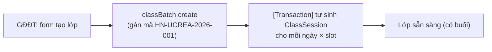
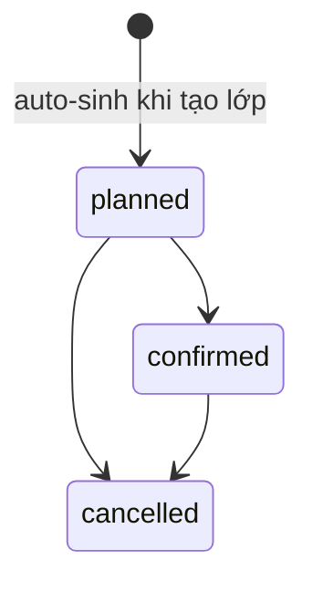
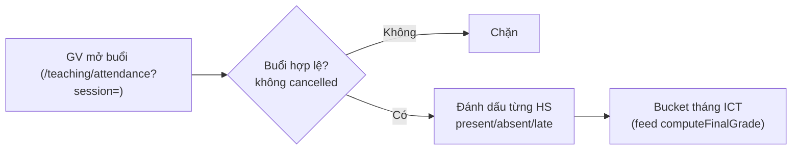
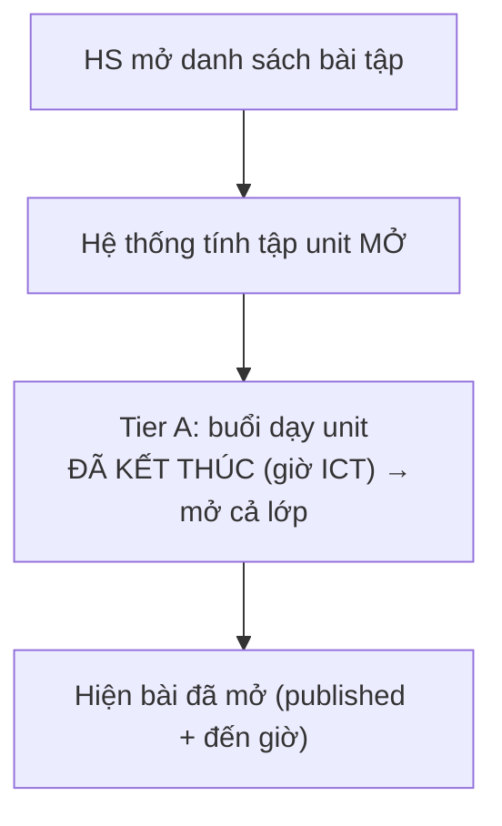
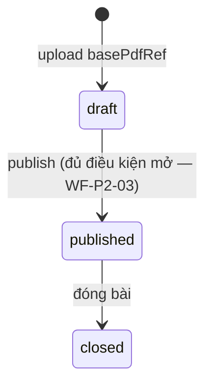
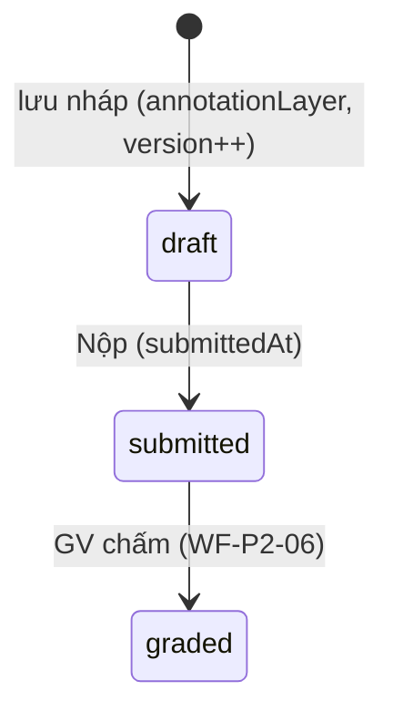
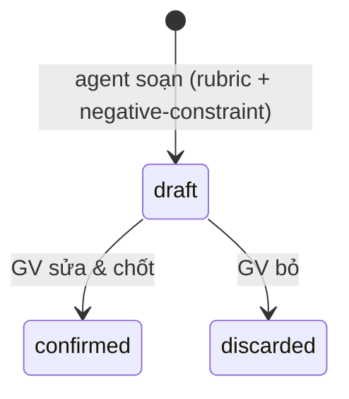
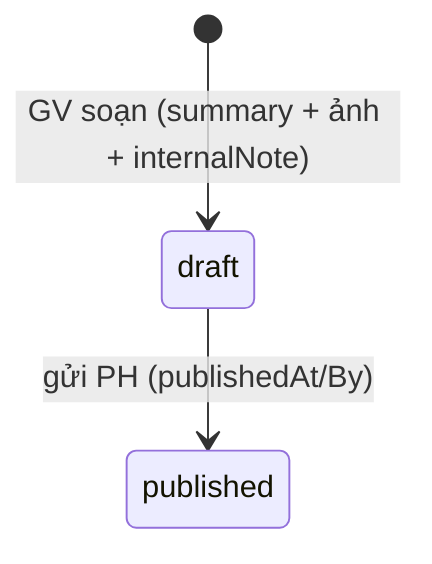

# Tài liệu 26 — Workflow Spec cụm P2 (Vận hành lớp: WF-P2-01…08)

> Cụm P2 — vận hành lớp: tạo lớp/sinh buổi, điểm danh, mở & làm bài tập PDF, chấm bài, nhận xét, ảnh
> lớp gửi PH. Viết theo khuôn 12 mục (TL23). Kéo **ADR 0038** (mở bài tập) + rule TL19/20. Giáo viên là
> trung tâm cụm này. Hàng Traceability append vào TL25.

---

## WF-P2-01 — Tạo lớp → tự sinh buổi học

**Meta:** P2 · P0 · auto (sinh buổi trong transaction). **Actors:** GĐĐT (tạo), hệ thống (sinh buổi).
**Trigger:** GĐĐT tạo `ClassBatch` (course, startDate, endDate, slots). **Precondition:** course/room/slot
định nghĩa.

**Swimlane**

**State machine (ClassSession)**

**Happy path:** 1) GĐĐT nhập lớp. 2) `classBatch.create` gán mã (TL19 §2) + **auto sinh buổi** trong tx.
3) nút "sinh lại" (`schedule.generateSessions`) mở rộng/đổi lịch.

**Exceptions & edge:** trùng phòng/GV (`CONFLICT`). Re-generate **idempotent** (không nhân đôi buổi cũ).
Đổi ngày → chỉ sinh buổi mới, giữ buổi có điểm danh. **Không còn buổi bù** (`classSession.addMakeup` /
`isMakeup` đã gỡ 2026-08-12 — buổi bù chiếm slot restamp, đẩy lệch unit 4 buổi → 5 buổi thực; học bù
thật do cơ sở xếp ngoài hệ thống, hoặc thêm khung lịch tuần).

**Rules/ADR:** QĐ 0036 (mã lớp) · quyết định 2026-07-05 (auto-sinh buổi). **API:** `classBatch.create`
(`class.create` — GĐĐT) · `schedule.generateSessions`. **UI/URL:** `/classes/new` · `/classes/:id/sessions`.

**Traceability:** `GĐĐT → WF-P2-01 → "Tạo lớp tự sinh lịch buổi" → classBatch.create →
/classes/:id/sessions → test/class/generate-sessions.spec → QĐ0036`.
**Acceptance:** buổi auto-sinh đủ ngày×slot; mã đúng format; trùng phòng/GV bị chặn; re-generate không nhân đôi.

---

## WF-P2-02 — Điểm danh (attendance)

**Meta:** P2 · P0 · người (GV). **Actors:** giao_vien. **Trigger:** GV điểm danh một buổi.
**Precondition:** buổi tồn tại & **không `cancelled`**; enrollment **`active`** & cùng batch.

**Swimlane**

**Happy path:** GV mở buổi → đánh dấu từng HS → lưu (facilityId suy từ session server-side).

**Exceptions & edge:** buổi `cancelled` → **không điểm danh** (làm sai tỉ lệ chuyên cần). Cặp
`enrollment.classBatchId ≠ session.classBatchId` → chặn (`BAD_REQUEST`). Enrollment `reserved` (chưa phí)
→ **không điểm danh được** (ADR-A). Điểm danh **không còn nhánh buổi bù / Tier B** (gỡ 2026-08-12;
mở bài chỉ Tier A — WF-P2-03). Bucket theo **tháng ICT**.

**Rules/ADR:** TL19 §5 · **ADR 0038** (attendance feed exercise-open) · computeFinalGrade. **API:**
`attendance.mark`/`markAll` (`attendance.mark` — giao_vien). **UI/URL:** `/teaching/attendance?session=`.

**Traceability:** `giao_vien → WF-P2-02 → "Điểm danh buổi học" → attendance.mark →
/teaching/attendance → test/attendance/gate.spec → TL19§5, ADR0038`.
**Acceptance:** buổi cancelled không điểm danh; mismatch batch chặn; `reserved` không điểm danh; facility
suy từ session.

---

## WF-P2-03 — Bài tập mở theo buổi (ADR 0038)

**Meta:** P2 · P0 · auto. **Actors:** hệ thống (tính tập mở), học viên (thấy). **Trigger:** HS mở LMS
bài tập / buổi kết thúc. **Precondition:** Exercise `published`.

**Swimlane**

> **2026-08-12:** open-tier **chỉ còn Tier A**. Tier B (mở riêng HS dự buổi bù / `isMakeup`) đã gỡ
> cùng toàn bộ đường buổi bù — không implement lại.

**Happy path:** hệ thống lọc: `published` + **Tier A** (buổi dạy unit đã kết thúc theo giờ ICT) +
HS không `BLOCKED_LMS_LIFECYCLE` → hiện bài.

**Exceptions & edge:** unit chưa dạy → **ẩn**. Lifecycle bị chặn → không thấy gì. Buổi `cancelled`
không mở. Giờ tính theo **ICT** (`sessionEndUtc`). (Trước đây có nhánh “buổi bù mở riêng HS” —
đã gỡ 2026-08-12.)

**Rules/ADR:** **ADR 0038** (Tier A còn hiệu lực; Tier B đã gỡ — xem ghi chú 2026-08-12) · TL19 §4.
**API:** `exercise.openForStudent` / LMS list (lmsProcedure).
**UI/URL:** LMS `/student/exercise` (list) · `/student/exercise/:exerciseId` (detail).

**Traceability:** `hệ thống/HS → WF-P2-03 → "Mở bài tập theo tiến độ học" → exercise.openForStudent →
/child/:id/exercises → test/exercise/open-tier.spec → ADR0038`.
**Acceptance:** unit mở chỉ sau khi buổi kết thúc (ICT); lifecycle chặn thấy trống; **không** còn
tiêu chí “buổi bù mở riêng HS” (gỡ 2026-08-12).

---

## WF-P2-04 — Cung cấp bài tập: upload PDF → published

**Meta:** P2 · P1 · HITL (giám đốc/người tạo). **Actors:** GĐĐT / người tạo (`createdById`). **Trigger:**
upload PDF gốc cho một unit. **Precondition:** `curriculumUnit` tồn tại; unique `[curriculumUnitId, type]`.

**State machine (Exercise)**

**Happy path:** giám đốc → **giao diện upload** → `basePdfRef` lưu (field trên `exercise.create`) → Exercise `draft` (type, maxScore,
starReward) → `publish`.

**Exceptions & edge:** trùng `[unit, type]` (unique) → thay/`CONFLICT`. Lưu PDF: object store v2 (nợ TL3).
`published` mới đủ điều kiện mở (kết hợp WF-P2-03). Nội dung PDF chạm dữ liệu trẻ (TL08 §7).

**Rules/ADR:** TL19 §3 · Exercise model · TL08 §7. **API:** `exercise.create/publish`
(`assessment.*`/`exercise.*` — `basePdfRef` là trường input của create, không riêng procedure). **UI/URL:** `/curriculum/:unitId/exercises` + giao diện upload.

**Traceability:** `GĐĐT → WF-P2-04 → "Cung cấp bài tập PDF cho học viên" → exercise.create/publish →
/curriculum/:unitId/exercises → test/exercise/publish.spec → TL19§3`.
**Acceptance:** unique/unit+type; `draft` HS không thấy; `published` mới vào diện mở; PDF lưu object store.

---

## WF-P2-05 — Học viên làm bài PDF (annotation) → nộp

**Meta:** P2 · P0 · auto (HS tự làm). **Actors:** học viên (LMS). **Trigger:** HS mở bài đã mở
(WF-P2-03). **Precondition:** bài mở cho HS.

**State machine (Submission)**

**Happy path:** HS mở PDF gốc → **vẽ/tương tác** → `annotationLayer` (JSON) + `answerText` lưu nháp
(`version` tăng) → **Nộp** → `submitted`.

**Exceptions & edge:** autosave nhiều lần (version tăng). **1 bản/`[exerciseId, studentId]`** (unique).
Sau `submitted` **không sửa** (trừ GV mở lại). Lifecycle chặn → không làm. Annotation **chồng lên** PDF gốc
(không phá bản gốc).

**Rules/ADR:** TL19 §3 · Submission model · TL08 §7. **API:** `submission.saveDraft/submit`
(lmsProcedure). **UI/URL:** LMS `/student/exercise/:exerciseId`.

**Traceability:** `học viên → WF-P2-05 → "Làm bài trên PDF & nộp" → submission.saveDraft/submit →
/child/:id/exercises/:id → test/submission/annotate-submit.spec → TL19§3`.
**Acceptance:** annotation lưu chồng PDF gốc; 1 bản/HS; không sửa sau nộp; version tăng theo lần lưu.

---

## WF-P2-06 — Giáo viên chấm bài → graded + sao

**Meta:** P2 · P0 · người (GV). **Actors:** giao_vien. **Trigger:** GV mở bài `submitted`. **Precondition:**
submission `submitted`.

**Happy path:** GV xem `annotationLayer` chồng PDF → chấm điểm (≤ `maxScore`) → `graded` → cộng sao
(`StarTransaction` `homework_completed` +`starReward`) → ghi `Grade`/`FinalGrade`.

**Exceptions & edge:** không chấm bài `draft`. Chấm lại (regrade) cho phép, **sao cộng một lần**
(idempotent). Điểm > `maxScore` → chặn. Nhiều bài → chấm hàng loạt.

**Rules/ADR:** TL19 §3,§6 · starReward · Grade. **API:** `submission.grade` (`assessment`/`grade` —
giao_vien). **UI/URL:** `/teaching/grading?class=`.

**Traceability:** `giao_vien → WF-P2-06 → "Chấm bài & cộng sao" → submission.grade → /teaching/grading →
test/submission/grade.spec → TL19§6`.
**Acceptance:** chỉ `submitted` chấm được; sao cộng một lần; điểm ≤ maxScore; Grade ghi nhận.

---

## WF-P2-07 — Nhận xét: agent soạn nháp → GV chốt

**Meta:** P2 · P1 · **HITL** (agent nháp, GV chốt). **Actors:** Teacher-assist agent (nháp), giao_vien
(chốt). **Trigger:** GV yêu cầu nháp nhận xét / kỳ đánh giá (`AssessmentPeriod`). **Precondition:** có dữ
liệu buổi/điểm của HS.

**State machine**

**Happy path:** agent soạn nháp (`QualitativeAssessment`/`SessionStudentComment`) từ rubric + danh sách
"câu nghe máy móc cần tránh" → GV sửa/chốt → published cho PH.

**Exceptions & edge:** **agent KHÔNG bao giờ auto-publish** nhận xét trẻ (TL08 §7) — GV bắt buộc chốt.
**Che PII/dữ liệu trẻ trước khi gửi LLM ngoài** (TL13 §5). Confidence thấp → gắn cờ để GV chú ý.

**Rules/ADR:** TL04/13 · **TL08 §7** (dữ liệu trẻ — người chốt) · negative-constraint. **API:**
`assessment.draftComment` (agent qua MCP) · `assessment.confirm` (giao_vien). **UI/URL:**
`/teaching/report-cards/:studentId` (hoặc UI nhận xét buổi).

**Traceability:** `agent/giao_vien → WF-P2-07 → "Soạn nhận xét học sinh (AI nháp, GV chốt)" →
assessment.draftComment/confirm → /teaching/report-cards/:id → test/assessment/draft-confirm.spec →
TL08§7, TL13`.
**Acceptance:** không auto-publish nhận xét trẻ; GV chốt bắt buộc; PII trẻ không gửi LLM ngoài không kiểm soát.

---

## WF-P2-08 — Session-evidence (ảnh lớp) → published gửi PH

**Meta:** P2 · P1 · người (GV) + HITL. **Actors:** giao_vien (soạn), phụ huynh (nhận). **Trigger:** GV ghi
bằng chứng buổi sau giờ. **Precondition:** buổi tồn tại (1 evidence/`classSessionId`).

**State machine (SessionEvidence)**

**Happy path:** GV → `summary` + ảnh (`SessionEvidencePhoto`) + `internalNote` (nội bộ) → `draft` →
`published` → PH thấy trên LMS (summary + ảnh, **không** thấy internalNote).

**Exceptions & edge:** `internalNote` **không bao giờ lộ ra PH**. Ảnh trẻ cần **đồng thuận** + chỉ PH của
lớp/HS thấy (TL08 §7). 1 evidence/buổi (unique `classSessionId`). Không gửi ảnh trẻ tới LLM ngoài để
"phân tích" (TL13 §5).

**Rules/ADR:** TL19 §6b · **TL08 §7** (dữ liệu trẻ). **API:** `sessionEvidence.upsert/publish`
(giao_vien). **UI/URL:** GV `/teaching/...` (evidence) · LMS `/parent/evidence/:studentId` (PH xem).

**Traceability:** `giao_vien → WF-P2-08 → "Gửi ảnh & tóm tắt buổi cho PH" → sessionEvidence.publish →
/child/:id → test/session-evidence/publish.spec → TL19§6b, TL08§7`.
**Acceptance:** internalNote ẩn với PH; 1 evidence/buổi; published stamp publishedBy; ràng buộc dữ liệu trẻ.

---

## Trạng thái cụm P2 & bước tiếp

8/8 workflow P2 có spec. Hàng Traceability append vào **TL25 §2**; kéo **ADR 0038** + rule TL19/20. Giáo
viên nay có story (khép mảng còn thiếu ở P1). Tiếp: **P3 — HR/Ca/Lương** (chấm công IP ADR 0039, ca
sale-vs-GV ADR 0040, lương/KPI), rồi **P4 — Đổi quà/Họp PH/After-sale**.

> Liên kết: TL23 (khuôn) · TL22 (ADR 0038) · TL19/20 (rule) · TL11 (API) · TL06 (URL) · TL25 (traceability) · TL08 §7 (dữ liệu trẻ).
