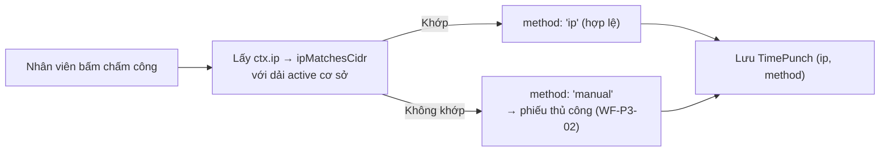
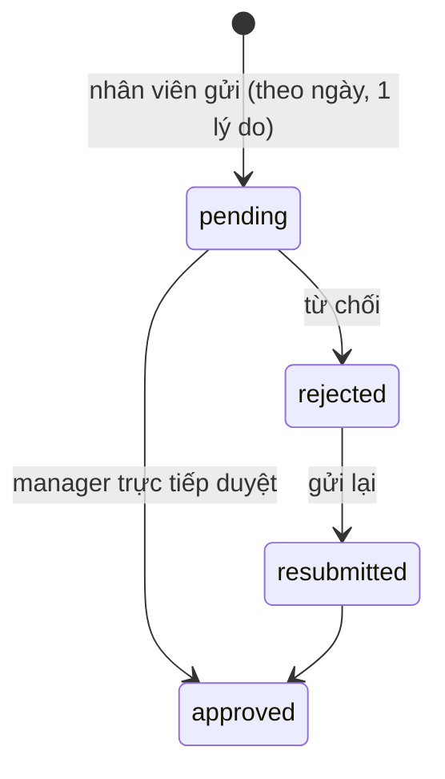
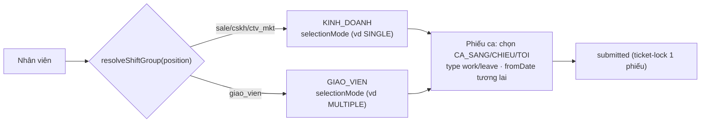
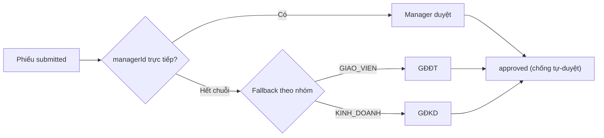
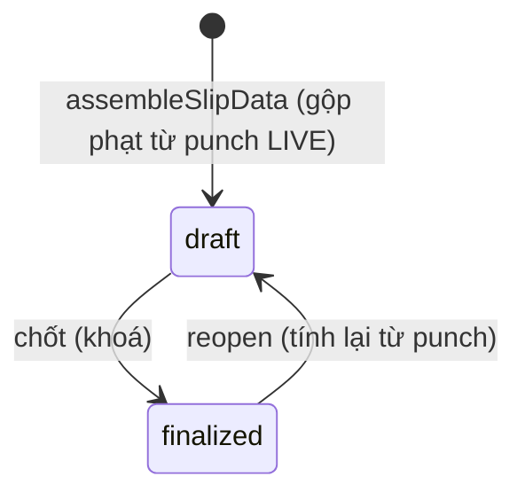

# Tài liệu 27 — Workflow Spec cụm P3 (HR / Ca / Lương: WF-P3-01…06)

> Cụm P3 — nhân sự, ca làm, lương, KPI. Kéo **ADR 0039** (chấm công IP) + **ADR 0040** (ca sale-vs-GV).
> Khuôn 12 mục (TL23), viết gọn vì pattern đã lập. Hàng Traceability append TL25.

---

## WF-P3-01 — Chấm công check-in/out (ADR 0039)

**Meta:** P3 · P0 · người (nhân viên). **Actors:** nhân viên. **Trigger:** bấm chấm công. **Precondition:**
cơ sở có `FacilityNetwork` khai báo.

**Swimlane**

**Happy path:** bấm → khớp IP dải cơ sở → `method: ip` → lưu punch.
**Exceptions & edge:** IP không khớp → `manual` (cần phiếu). **Cooldown** double-punch → `CONFLICT`. IP
giả: phụ thuộc `x-forwarded-for` cấu hình đúng (ADR 0039 caveat).
**Rules/ADR:** **ADR 0039** · TL20 §1. **API:** `checkInOut.punch` (`checkInOut.punch`). **UI/URL:**
`/attendance/check-in-out`.
**Traceability:** `nhân viên → WF-P3-01 → "Chấm công qua WiFi công ty" → checkInOut.punch →
/attendance/check-in-out → test/checkin/ip-match.spec → ADR0039`.
**Acceptance:** IP khớp → `ip`; ngoài dải → `manual`; cooldown chặn double-punch; punch lưu ip+method.

---

## WF-P3-02 — Phiếu chấm công thủ công → manager duyệt (ADR 0039)

**Meta:** P3 · P0 · **HITL** (manager). **Actors:** nhân viên (tạo), manager trực tiếp (duyệt).
**Trigger:** chấm ngoài WiFi → tạo phiếu thủ công theo ngày. **Precondition:** `method: manual`.

**State machine**

**Happy path:** tạo phiếu ngày + lý do → manager trực tiếp duyệt.
**Exceptions & edge:** **không tự duyệt của mình** (`FORBIDDEN`); **chỉ manager trực tiếp** (khác →
`FORBIDDEN`). Notif `manual_punch_pending/resubmitted/rejected` (TL20 §8b).
**Rules/ADR:** **ADR 0039** · QĐ 0034 · TL20 §1. **API:** `manualPunch.create/approve/reject`
(manager). **UI/URL:** `/attendance/check-in-out` (phiếu) · notif.
**Traceability:** `nhân viên/manager → WF-P3-02 → "Duyệt chấm công thủ công" → manualPunch.approve →
/attendance/check-in-out → test/checkin/manual-ticket.spec → ADR0039, QĐ0034`.
**Acceptance:** không tự duyệt; chỉ manager trực tiếp; phiếu theo ngày; resubmit được.

---

## WF-P3-03 — Đăng ký ca (sale vs giáo viên — ADR 0040)

**Meta:** P3 · P0 · **HITL** (duyệt ở WF-P3-04). **Actors:** nhân viên (sale/giáo viên). **Trigger:** đăng
ký ca kỳ tới. **Precondition:** thuộc một `ShiftGroup`.

**Swimlane**

**State machine (`ShiftRegStatus`):** `draft` → `submitted` → `approved` | `cancelled`.
**Happy path:** hệ thống xác nhóm theo vai trò → chọn ca theo `selectionMode` nhóm → gửi (`submitted`).
**Exceptions & edge:** **ticket-lock** — 1 phiếu Nháp/Chờ duyệt tại một thời điểm. `fromDate` phải tương
lai (ICT). sale (SINGLE) chọn 1 ca/ngày; giáo viên (MULTIPLE) chọn nhiều — **đúng điểm khác biệt**.
**Rules/ADR:** **ADR 0040** · QĐ 0035 · TL20 §2. **API:** `shiftRegistration.submit` (`shift.register`).
**UI/URL:** `/attendance/shifts?view=kanban` → `/:id`.
**Traceability:** `nhân viên → WF-P3-03 → "Đăng ký ca làm" → shiftRegistration.submit →
/attendance/shifts → test/shift/register-mode.spec → ADR0040, QĐ0035`.
**Acceptance:** nhóm đúng theo vai trò; sale SINGLE vs GV MULTIPLE; ticket-lock 1 phiếu; fromDate tương lai.

---

## WF-P3-04 — Duyệt ca (managerId + fallback theo nhóm — ADR 0040)

**Meta:** P3 · P0 · **HITL**. **Actors:** manager trực tiếp / GĐĐT / GĐKD. **Trigger:** phiếu ca
`submitted`. **Precondition:** phiếu chờ duyệt.

**Swimlane**

**Happy path:** managerId trực tiếp duyệt; hết chuỗi → fallback nhóm (GV→GĐĐT, KD→GĐKD).
**Exceptions & edge:** `assertAssignedApprover` chống tự-duyệt; validate managerId cùng facility, chống
cặp A↔B (QĐ 0027). Notif `shift_reg_submitted/approved/rejected`.
**Rules/ADR:** **ADR 0040** · QĐ 0027 · TL20 §2. **API:** `shiftRegistration.approve/reject`
(managerId/GĐ). **UI/URL:** `/attendance/shifts/:id`.
**Traceability:** `manager/GĐ → WF-P3-04 → "Duyệt ca" → shiftRegistration.approve → /attendance/shifts/:id
→ test/shift/approve-fallback.spec → ADR0040, QĐ0027`.
**Acceptance:** không tự duyệt; fallback đúng nhóm; managerId cùng facility.

---

## WF-P3-05 — Tính lương (Payslip) + cấu hình mức lương

**Meta:** P3 · P0 · **HITL** (giám đốc/kế toán-deferred → GĐ). **Actors:** GĐ (duyệt), hệ thống (assemble).
**Trigger:** chốt lương tháng. **Precondition:** có `SalaryRate` + punch tháng.

**State machine (`PayslipStatus`)**

**Happy path:** `assembleSlipData` = base + ăn trưa + phụ cấp + KPI (cap `kpiMax`) − **phạt post-tax** →
`finalize` khoá.
**Exceptions & edge:** phạt trừ **sau thuế** (không méo thu nhập chịu thuế); override miễn/giảm là **field
riêng** (không dùng variablePay). `reopen` tính lại từ punch. Bucket **tháng ICT**. `SalaryRate` sửa qua
UI, safe-default (QĐ 0012).
**Rules/ADR:** QĐ 0025/0012 · TL20 §3. **API:** `payroll.assembleSlip/finalize/reopen` ·
`compensation.upsertRate` (GĐ). **UI/URL:** `/hr/payroll?month=` → `/:payslipId` · `/hr/salary-structure`.
**Traceability:** `GĐ → WF-P3-05 → "Chốt lương tháng" → payroll.finalize → /hr/payroll/:id →
test/payroll/penalty-posttax.spec → QĐ0025`.
**Acceptance:** phạt post-tax; self-healing từ punch; override field riêng; reopen tính lại; bucket ICT.

---

## WF-P3-06 — KPI (auto + override cây quyền)

**Meta:** P3 · P1 · **HITL**. **Actors:** hệ thống (auto-score), quản lý (override), GĐ (approve).
**Trigger:** kỳ KPI. **Precondition:** có dữ liệu nguồn (số liệu bán/dạy, Callio khi bật).

**State machine (`KpiStatus`):** `draft` → `submitted` → `confirmed` → `approved`.
**Happy path:** auto-score → submit → cấp trên confirm → GĐ approve → feed lương (cap `kpiMax`).
**Exceptions & edge:** override theo **cây quyền** (chỉ cấp trên override cấp dưới) + **audit** mọi override.
KPI sale lấy `CallMetric` (Callio) khi bật (QĐ 0010).
**Rules/ADR:** QĐ 0011/0010 · TL20 §4. **API:** `kpi.score/submit/confirm/approve`. **UI/URL:**
`/hr/kpi?period=`.
**Traceability:** `hệ thống/GĐ → WF-P3-06 → "Chấm & duyệt KPI" → kpi.approve → /hr/kpi →
test/kpi/override-tree.spec → QĐ0011`.
**Acceptance:** override theo cây quyền; mọi override audit; KPI cap `kpiMax` khi vào lương.

---

## Trạng thái P3

6/6 workflow P3. **ADR 0039 (P3-01,02) + ADR 0040 (P3-03,04)** nay được phủ. Hàng append TL25.

> Liên kết: TL22 (ADR 0039/0040) · TL20 §1–4 (rule) · TL11 (API) · TL06 (URL) · TL25 (traceability).
