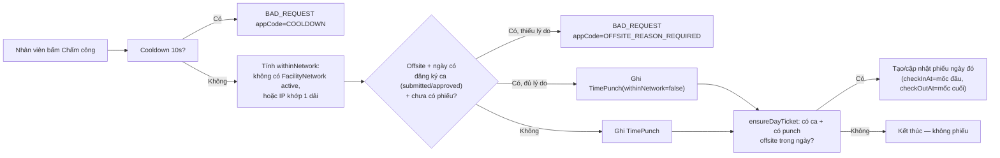
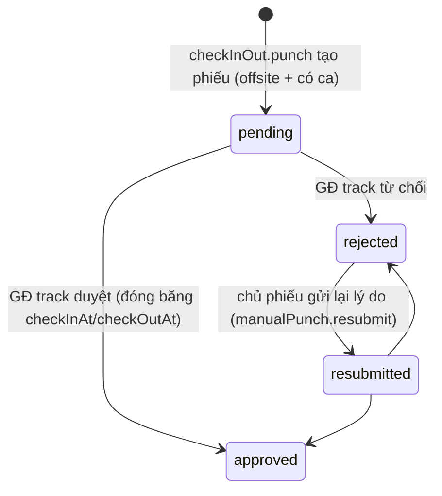
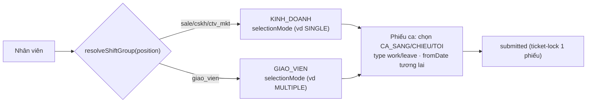
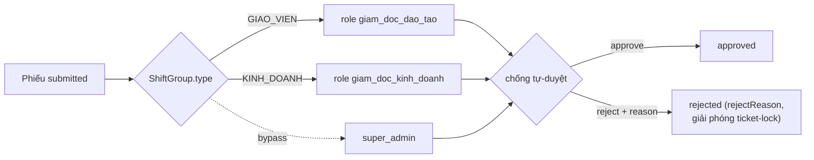
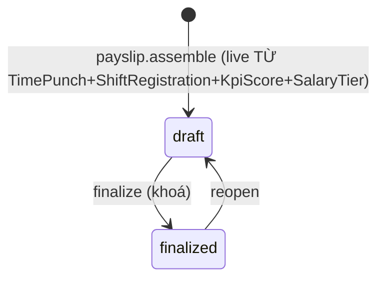

# Tài liệu 27 — Workflow Spec cụm P3 (HR / Ca / Lương: WF-P3-01…06)

> Cụm P3 — nhân sự, ca làm, lương, KPI. Kéo **ADR 0039** (chấm công IP) · **ADR 0040** (ca sale-vs-GV,
> HR remediation: gate ROLE thay managerId) · **ADR 0044** (KPI auto-score + salary-tier + session-done,
> WF-P3-05/06 REWRITE). Khuôn 12 mục (TL23), viết gọn vì pattern đã lập. Hàng Traceability append TL25.

---

## WF-P3-01 — Chấm công cặp vào/ra mỗi ngày (ADR 0043, supersedes ADR 0039)

**Meta:** P3 · P0 · người (nhân viên). **Actors:** nhân viên. **Trigger:** bấm "Chấm công". **Precondition:**
không có — hoạt động cả khi cơ sở chưa khai báo `FacilityNetwork` (chế độ mở).

**Swimlane**

**Happy path:** trong mạng (hoặc cơ sở chưa khai báo dải IP nào) → ghi nhận ngay, không phiếu.
**Exceptions & edge:**
- Offsite + có ca đăng ký + chưa có phiếu ngày đó + thiếu `reason` → `OFFSITE_REASON_REQUIRED`, KHÔNG ghi punch.
- Offsite + không có ca đăng ký nào (kể cả `submitted`) → vẫn ghi punch, KHÔNG tạo phiếu, KHÔNG cần lý do (E2).
- Cooldown 10 giây (không phải 5 phút như ADR 0039) → `COOLDOWN`.
- Phiếu đã rời `pending`/`resubmitted` (đã `approved`/`rejected`) → punch mới cùng ngày vẫn được ghi (lịch sử) nhưng **không** ghi đè `checkInAt`/`checkOutAt` của phiếu (đóng băng, chống gian lận checkin-nhà/checkout-công-ty-sau-duyệt — F1).
**Rules/ADR:** **ADR 0043** (supersedes ADR 0039) · `docs/decisions/0043-attendance-daily-inout-pairing.md`.
**API:** `checkInOut.punch({reason?: string})`. **UI/URL:** `/hr/checkin` (nav-registry thực tế — không phải `/attendance/check-in-out`).
**Traceability:** `nhân viên → WF-P3-01 → "Chấm công" → checkInOut.punch → /hr/checkin →
apps/api/src/checkin/punch-offsite.test.ts → ADR0043`.
**Acceptance:** trong mạng → ghi nhận; offsite lần đầu (có ca) không lý do → OFFSITE_REASON_REQUIRED; có lý
do → ghi + phiếu; offsite không ca → ghi, không phiếu; cooldown 10s; phiếu đã duyệt/từ chối bất biến trước punch sau.

---

## WF-P3-02 — Phiếu chấm công offsite → GĐ theo track duyệt (ADR 0043, supersedes ADR 0039)

**Meta:** P3 · P0 · **HITL** (GĐ theo track). **Actors:** nhân viên (tạo tự động qua WF-P3-01), GĐ Kinh
doanh (phiếu của sale) hoặc GĐ Đào tạo (phiếu của giáo viên), super_admin (mọi phiếu).
**Trigger:** WF-P3-01 tạo phiếu tự động (không còn thủ tục tạo phiếu thủ công riêng — `manualPunch.create`
đã bị xóa, ADR 0043 §10).

**State machine**

**Happy path:** phiếu sinh tự động từ WF-P3-01 → GĐ đúng track duyệt → cặp giờ trên phiếu được dùng để
tính công + muộn/sớm y như punch thật (payroll + KPI dùng chung `resolveDayCredit`).
**Exceptions & edge:**
- **Không tự duyệt phiếu của chính mình** (kể cả kiêm nhiệm 2 role) → `FORBIDDEN`.
- **Track phải khớp**: chủ phiếu là `sale` → chỉ `giam_doc_kinh_doanh` (hoặc `super_admin`) duyệt được;
  `giao_vien` → chỉ `giam_doc_dao_tao`. Chủ phiếu không có track (GĐ/super_admin) → chỉ `super_admin` duyệt.
- **TOCTOU**: 2 GĐ duyệt đồng thời cùng phiếu → 1 thành công, 1 nhận `BAD_REQUEST` (conditional
  `updateMany WHERE status IN (pending,resubmitted)`, không đọc-rồi-ghi).
- **Không còn `manualPunch.create`** (chấm bù ngày tùy ý) — bỏ hẳn theo ADR 0043 §10.
- **Gửi lại**: `manualPunch.resubmit({ticketId, reason})` — chỉ chủ phiếu, chỉ khi `rejected`, cập nhật
  dòng cũ (KHÔNG tạo dòng mới — unique `(appUserId, ticketDate)` từ phase 1 chặn dòng thứ 2).
- Duyệt sau khi payslip kỳ đó đã finalize → vẫn duyệt được, response kèm `warning: PAYSLIP_FINALIZED`
  (không tự tính lại lương — hành vi giữ nguyên từ trước ADR 0043).
**Rules/ADR:** **ADR 0043** (supersedes ADR 0039, thay gate `managerId` → GĐ track). **API:**
`manualPunch.approve/reject/resubmit/list`. **UI/URL:** `/hr/checkin` (tab "Duyệt chấm công", chỉ hiện khi
`canDo('manualPunch','approve')`).
**Traceability:** `GĐ → WF-P3-02 → "Duyệt chấm công offsite" → manualPunch.approve →
/hr/checkin → apps/api/src/checkin/manual-punch-approval-track.test.ts → ADR0043`.
**Acceptance:** track khớp → duyệt/từ chối OK; sai track → FORBIDDEN; tự duyệt → FORBIDDEN; TOCTOU race →
1 thắng 1 BAD_REQUEST; resubmit chỉ chủ phiếu + chỉ từ rejected; không còn đường tạo phiếu thủ công.
**Acceptance:** không tự duyệt; chỉ manager trực tiếp; phiếu theo ngày; resubmit được.

---

## WF-P3-03 — Đăng ký ca (sale vs giáo viên — ADR 0040)

**Meta:** P3 · P0 · **HITL** (duyệt ở WF-P3-04). **Actors:** nhân viên (sale/giáo viên). **Trigger:** đăng
ký ca kỳ tới. **Precondition:** thuộc một `ShiftGroup`.

**Swimlane**

**State machine (`ShiftRegistration.status`):** `draft` → `submitted` → `approved` | `rejected` |
`cancelled` (`rejected` — HR remediation, xem WF-P3-04/07 — giải phóng ticket-lock, nộp lại được).
**Happy path:** hệ thống xác nhóm theo vai trò → chọn ca theo `selectionMode` nhóm → gửi (`submitted`).
**Exceptions & edge:** **ticket-lock** — 1 phiếu `submitted` tại một thời điểm. **Overlap guard**: 1
khoảng `[fromDate,toDate]` active bất kể ShiftGroup. `fromDate` phải tương lai (ICT). sale (SINGLE)
chọn 1 ca/ngày; giáo viên (MULTIPLE) chọn nhiều — **đúng điểm khác biệt**.
**Rules/ADR:** **ADR 0040** · QĐ 0035 · TL20 §2. **API:** `shift.submit` (`shift.submit`).
**UI/URL:** `/hr/shifts`.
**Traceability:** `nhân viên → WF-P3-03 → "Đăng ký ca làm" → shift.submit →
/hr/shifts → apps/api/src/shift/register-approve.test.ts → ADR0040, QĐ0035`.
**Acceptance:** nhóm đúng theo vai trò; sale SINGLE vs GV MULTIPLE; ticket-lock 1 phiếu; overlap guard;
fromDate tương lai.

---

## WF-P3-04 — Duyệt ca (gate theo ROLE + group-type — ADR 0040, HR remediation)

**Meta:** P3 · P0 · **HITL**. **Actors:** GĐKD (nhóm KINH_DOANH) / GĐĐT (nhóm GIAO_VIEN) /
super_admin (cả hai). **Trigger:** phiếu ca `submitted`. **Precondition:** phiếu chờ duyệt.

> **HR remediation sửa lại:** gate KHÔNG còn dựa `managerId` chain/fallback — chuyển sang ROLE khớp
> `ShiftGroup.type` của phiếu (docs/20 §2, docs/22 ADR 0044).

**Swimlane**

**Happy path:** caller có role khớp `ShiftGroup.type` của phiếu → duyệt → `approved`.
**Exceptions & edge:** chống tự-duyệt (caller ≠ chủ phiếu, dù cùng role); role sai nhóm → `FORBIDDEN`;
`reject` bắt buộc `reason` (≥3 ký tự) → `rejectReason`, giải phóng ticket-lock + overlap, chủ phiếu
nộp lại ngay. Notif `shift_reg_submitted/approved/rejected`.
**Rules/ADR:** **ADR 0040** · docs/22 ADR 0044 · docs/20 §2. **API:** `shift.approve`/`shift.reject`
(`shift.approve`) · `shift.pendingForApproval` (inbox) · `shift.myRegistrations` (self, thấy `rejectReason`).
**UI/URL:** `/hr/shifts/:id`.
**Traceability:** `GĐKD/GĐĐT → WF-P3-04 → "Duyệt ca" → shift.approve/reject → /hr/shifts/:id →
apps/api/src/shift/register-approve.test.ts, reject-validate.test.ts, apps/e2e/tests/shift-lifecycle.spec.ts → ADR0040`.
**Acceptance:** không tự duyệt; role phải khớp group-type (trừ super_admin); reject bắt buộc reason;
rejected giải phóng ticket-lock/overlap.

---

## WF-P3-05 — Chốt lương tháng theo bậc lương (SalaryTier, HR remediation — ADR 0044)

**Meta:** P3 · P0 · **HITL** (GĐKD/GĐĐT). **Actors:** GĐKD/GĐĐT (assemble/finalize/reopen, gán tier),
hệ thống (tính live). **Trigger:** chốt lương tháng. **Precondition:** nhân sự đã có `SalaryRate.tierId`
(gán qua `compensation.assignTier`) — thiếu tier → `payslip.assemble` FORBIDDEN, không fallback legacy.

> **HR remediation thay hoàn toàn WF-P3-05 cũ:** `SalaryRate` nhập tay từng người + `/hr/salary-structure`
> + `compensation.upsertRate` đã **BỎ**. Công thức đầy đủ + rationale: docs/20 §3, docs/22 ADR 0044.

**State machine (`PayslipStatus`)**

**Happy path:** GĐKD/GĐĐT tạo `SalaryTier` catalog → `assignTier` cho sale/GV → `payslip.assemble` =
`base(tier) + %côngca × %chỉ-số × đơnGiá(tier) − phạt` (phạt per-ca, ManualAttendanceTicket-approved
ngày miễn hoàn toàn) → `finalize` khoá.
**Exceptions & edge:** phạt là dòng độc lập, không âm `totalNet`; `%chỉ-số` = `KpiScore.value` khi
`confirmed`\|`approved` (0 nếu chưa có); đổi tier giữa kỳ cho phép (audit qua snapshot trên
`KpiScore`, không trên `Payslip`); GĐ/`super_admin` không có phiếu lương. `reopen` mở lại để assemble
tiếp — không tự tính lại.
**Rules/ADR:** **docs/22 ADR 0044** · docs/20 §3. **API:** `payslip.assemble/finalize/reopen/my/
getForUser` · `salaryTier.list/create/update` (`salaryTier.manage`) · `compensation.assignTier`.
**UI/URL:** `/hr/payroll/:id` · `/hr/salary-tiers` · `/hr/my`.
**Traceability:** `GĐKD/GĐĐT → WF-P3-05 → "Chốt lương tháng theo bậc" → payslip.assemble → /hr/payroll/:id
→ apps/api/src/payroll/{policy-model,policy-rates,penalty-posttax,payslip-my}.test.ts,
apps/e2e/tests/kpi-lifecycle.spec.ts → ADR0044`.
**Acceptance:** không tier → FORBIDDEN; phạt per-ca độc lập, không âm; đổi tier giữa kỳ có audit trail
qua snapshot; GĐ ngoài hệ thống lương.

---

## WF-P3-06 — Nộp & duyệt phiếu KPI (auto-score lifecycle, HR remediation — ADR 0044)

**Meta:** P3 · P1 · **HITL**. **Actors:** sale/giao_vien (submit), direct manager (confirm), 2 GĐ
(bulkApprove, branch-scope theo ROLE). **Trigger:** kỳ KPI (ngày 3 tháng kế tiếp ICT trở đi).
**Precondition:** đã gán `SalaryTier`.

> **HR remediation thay hoàn toàn WF-P3-06 cũ:** `kpi.submit`/`kpi.approve`(đơn lẻ)/`kpi.getForUser`
> đã **BỎ** — `approved` chỉ đạt qua `bulkApprove`. Công thức + rationale: docs/20 §4, docs/22 ADR 0044.

**State machine (`KpiScore.status`):** `draft` → `submitted` → `confirmed` → `approved`.
**Happy path:** `kpi.refresh` tính "PHẦN NHÂN" (`%côngca × %chỉ-số × đơnGiá`) → chủ phiếu `submitSlip`
(tự refresh trước, mở từ ngày 3 tháng kế tiếp) → direct manager `confirm` → 2 GĐ `bulkApprove` hàng
loạt (chỉ slip có Payslip `finalized`, loại trừ phiếu chính mình, branch-scope theo `AppUser.roles`).
**Exceptions & edge:** anti-self trên mọi bước; `override` (director set trực tiếp) — sửa `approved`
chỉ `super_admin` khi Payslip đã reopen; immutable khi Payslip `finalized` (phải reopen trước); GĐ/
`super_admin` không có phiếu KPI. Metric sale = doanh thu **gross** đã duyệt (chưa trừ refund).
**Rules/ADR:** **docs/22 ADR 0044** · docs/20 §4. **API:** `kpi.refresh/submitSlip/confirm/override/
bulkApprove/list/myScore` (`kpi.submitSlip`, `kpi.confirm`, `kpi.approve`). **UI/URL:** `/hr/kpi` ·
`/hr/my`.
**Traceability:** `sale/GV/GĐ → WF-P3-06 → "Nộp & duyệt KPI" → kpi.bulkApprove → /hr/kpi →
apps/api/src/kpi/{lifecycle,auto-score}.test.ts, apps/e2e/tests/kpi-lifecycle.spec.ts → ADR0044`.
**Acceptance:** anti-self mọi bước; branch-scope theo ROLE không theo `position`; bulkApprove chỉ
Payslip finalized; approved chỉ qua bulkApprove (hoặc super_admin override khi reopen).

---

## Trạng thái P3

6/6 workflow P3 (đã cập nhật WF-P3-04/05/06 theo HR remediation). **ADR 0039 (P3-01,02) + ADR 0040
(P3-03,04) + ADR 0044 (P3-05,06)** được phủ. 5 luồng bổ sung (reject/bulkApprove/refresh/session-done/
reschedule) tại docs/25 §2 (P3-07…11), không lặp lại narrative đầy đủ ở đây (khuôn 6 WF chính giữ nguyên).

> Liên kết: TL22 (ADR 0039/0040/0042) · TL20 §1–4b (rule) · TL11 (API) · TL06 (URL) · TL25 (traceability).
