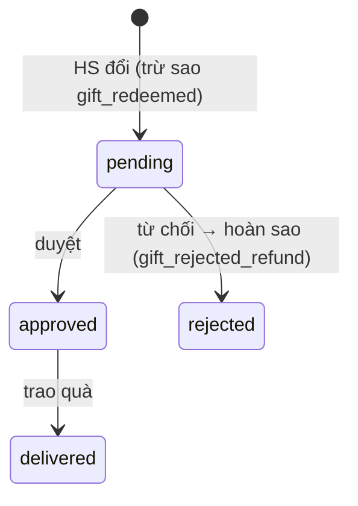
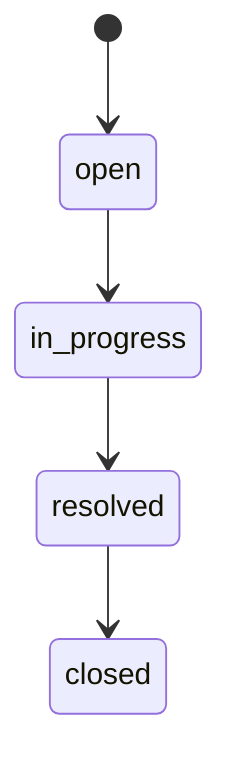

# Tài liệu 28 — Workflow Spec cụm P4 (Đổi quà · Họp PH · After-sale: WF-P4-01…05)

> Cụm P4 — gắn kết & sau bán. Khuôn 12 mục (TL23), gọn. Huy hiệu/bảng xếp hạng đã loại (TL20 §8).
> Hàng Traceability append TL25 → sau cụm này ma trận đóng hoàn toàn.

---

## WF-P4-01 — Đổi quà (Reward)

**Meta:** P4 · P1 · **HITL** (duyệt trao quà). **Actors:** học viên (đổi), nhân viên/GĐ (duyệt).
**Trigger:** HS yêu cầu đổi quà bằng sao. **Precondition:** đủ `starsRequired`, còn `stock`.

**State machine (`RewardStatus`)**

**Happy path:** HS đổi → trừ sao (`StarTransaction gift_redeemed`) → `pending` → duyệt → `delivered`.
**Exceptions & edge:** thiếu sao / hết `stock` (`-1` = vô hạn) → chặn **ngay lập tức** (không xếp
hàng chờ). Đổi đồng thời cùng một `Gift` tuần tự hoá qua khoá giao dịch theo `giftId`; `stock`/số dư
sao đọc lại trong khoá trước khi trừ (TL20 §5). Từ chối → **hoàn sao** (`gift_rejected_refund`). Sao
nguồn từ bài tập `graded` (WF-P2-06).
**Rules/ADR:** TL20 §5 · StarTxnType · RewardStatus. **API:** `rewards.redeem/approve/reject/deliver`.
**UI/URL:** `/admin/engagement/rewards` · LMS `/student/gifts`.
**Traceability:** `học viên/nhân viên → WF-P4-01 → "Đổi quà bằng sao" → rewards.redeem/approve →
/engagement/rewards → apps/api/src/rewards/redeem-refund.test.ts → TL20§5`.
**Acceptance:** thiếu sao/stock chặn ngay; từ chối hoàn sao; trừ/hoàn qua StarTransaction đúng type.

---

## WF-P4-02 — Quản lý danh mục quà (Gift)

**Meta:** P4 · P2 · người (GĐ/quản trị). **Actors:** GĐ. **Trigger:** cấu hình quà. **Precondition:** —

**Happy path:** tạo/sửa `Gift`: `name`, `imageUrl`, `starsRequired`, `stock` (`-1` vô hạn), `isActive`.
**KHÔNG có `minLevel`** — trường này không tồn tại trong schema; mọi bản mô tả trước có nhắc
`minLevel` là doc-drift, đã bỏ (product-decision 2026-07-11, xem TL20 §5).
**Exceptions & edge:** archive thay xoá cứng (`gift.upsert` với `isActive:false`); `stock` giảm khi `delivered`; `isActive=false` ẩn khỏi HS.
**Rules/ADR:** TL20 §5. **API:** `gift.upsert/archive` (GĐ — archiving là `upsert` với `isActive:false`). **UI/URL:** `/admin/engagement/gifts` (riêng trang GiftsPage, không tab).
**Traceability:** `GĐ → WF-P4-02 → "Cấu hình quà đổi sao" → gift.upsert → /engagement/rewards →
apps/api/src/rewards/redeem-refund.test.ts → TL20§5`. **Lưu ý test:** WF-P4-01 và WF-P4-02 dùng
**chung một file test** (`rewards/redeem-refund.test.ts` bao phủ cả redeem lẫn gift.upsert/archive) —
không có file `gift/catalog.spec` riêng.
**Acceptance:** stock `-1` vô hạn; inactive ẩn; archive không xoá cứng.

---

## WF-P4-03 — Họp phụ huynh (ParentMeeting)

**Meta:** P4 · P1 · **HITL** (nhân viên/GV lên lịch). **Actors:** nhân viên/GV, phụ huynh, Communication
agent (nhắc). **Trigger:** lên lịch họp. **Precondition:** có HS/PH.

**State machine (`ParentMeetingStatus`):** `scheduled` → `done` | `cancelled`.
**Happy path:** lên lịch → nhắc PH (agent Communication — TL4) → `done` (ghi kết quả) hoặc `cancelled`.
**Exceptions & edge:** trùng lịch; nhắc qua notif/email (outbox); đổi lịch.
**Rules/ADR:** TL20 §6 · ParentMeetingStatus. **API:** `parentMeeting.schedule/complete/cancel` (implemented).
**UI/URL:** `/crm/post-sale-meeting` (EmptyState stub — API implemented, UI not yet wired).
**Traceability:** `nhân viên → WF-P4-03 → "Lên lịch & nhắc họp PH" → parentMeeting.schedule →
/crm/post-sale-meeting → test/meeting/lifecycle.spec → TL20§6`.
**Acceptance:** vòng đời scheduled→done/cancelled; nhắc qua outbox; ghi kết quả khi done.

---

## WF-P4-04 — Lịch test (TestAppointment)

**Meta:** P4 · P1 · người (sale/GV). **Actors:** sale (test đầu vào), GV (định kỳ). **Trigger:** đặt lịch
test. **Precondition:** có cơ hội (đầu vào ~O3) hoặc HS (định kỳ).

**State machine (`TestStatus`):** `scheduled` → `done` | `no_show`.
**Happy path:** đặt lịch (`TestType` entrance/periodic) → `done` (ghi kết quả) hoặc `no_show`.
**Exceptions & edge:** `no_show` → CRM cập nhật (đầu vào) / nhắc lại. Test đầu vào nối O3 (WF-P1-01).
**Rules/ADR:** TL20 §6 · TestType/TestStatus. **API:** `testAppointment.schedule/complete/noShow`.
**UI/URL:** CRM `/crm/opportunities/:id` (đầu vào) · `/teaching/...` (định kỳ).
**Traceability:** `sale/GV → WF-P4-04 → "Đặt lịch test đầu vào/định kỳ" → testAppointment.schedule →
/crm/opportunities/:id → test/test-appt/lifecycle.spec → TL20§6`.
**Acceptance:** entrance nối O3; no_show xử đúng; kết quả ghi khi done.

---

## WF-P4-05 — After-sale case

**Meta:** P4 · P1 · **HITL**. **Actors:** sale (cskh deferred — ADR-D), GĐ (`setStudentLifecycle`).
**Trigger:** phát sinh ca chăm sóc. **Precondition:** có HS/PH.

**State machine (`CaseStatus`)**

**Happy path:** tạo ca (`CasePriority` low/normal/high) → xử lý → `resolved` → `closed`.
**Exceptions & edge:** ưu tiên `high` đẩy lên đầu hàng đợi. **`setStudentLifecycle` chỉ giám đốc** (sale
không tự đổi vòng đời HS — QĐ 0027). SLA theo priority.
**Rules/ADR:** TL20 §7 · CaseStatus/Priority · QĐ 0027. **API:** `afterSale.create/advance/resolve`
(sale) · `student.setLifecycle` (GĐ — implemented). **UI/URL:** `/crm/aftersale` (EmptyState stub — API implemented, UI not yet wired).
**Traceability:** `sale/GĐ → WF-P4-05 → "Chăm sóc sau bán" → afterSale.advance → /crm/aftersale →
test/aftersale/case.spec → TL20§7, QĐ0027`.
**Acceptance:** vòng đời open→closed; high ưu tiên; đổi lifecycle chỉ GĐ.

---

## Trạng thái P4 & đóng ma trận

5/5 workflow P4. Sau cụm này **mọi ADR/QĐ + procedure đều có WF phủ** → ma trận TL25 **đóng hoàn toàn**
(4 cụm P1–P4, 28 luồng). Còn lại là G4 (Test Plan), G5 (Threat Model), G6 (Phased Build Plan).

> Liên kết: TL20 §5–7 (rule) · TL11 (API) · TL06 (URL) · TL25 (traceability) · TL04 (agent nhắc lịch).
