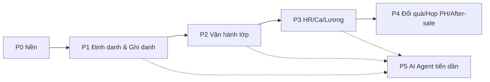

# Tài liệu 31 — Phased Build Plan (G6)

> Trình tự build v2 thành các pha có acceptance đo được. Mỗi pha nêu phạm vi, phụ thuộc, tài liệu/ADR/
> WF cấp nguồn, và tiêu chí "xong". Trả nợ hạ tầng (TL03) lồng vào đúng pha. Đây là G6 — bản đồ thi công.

---

## Tổng quan pha

## P0 — Nền tảng (foundation)

**Phạm vi:** monorepo (pnpm+turbo), TS/ESM; Postgres+Prisma schema + **RLS**; `@cmc/auth` **permission
registry** (`can()`); Vite+React shell + design tokens (`@cmc/ui`); Entra SSO + LMS OTP; **outbox** +
object store; **backup off-box** (trả nợ TL03).
**Nguồn:** TL18 (stack) · TL09 (C4) · TL10 (data model) · TL12 (design) · TL14 (RBAC).
**Acceptance:** đăng nhập staff/PH; RLS chặn chéo cơ sở (test âm tính); nav lọc theo role; backup chạy
off-box; CI pipeline (typecheck+test+verify-RLS) xanh.

## P1 — Định danh & Ghi danh (xương sống)

**Phạm vi:** CRM O1–O5; tạo phiếu từ cơ hội; **cổng tiền GĐKD** (ADR-B); **provisioning atomic/
idempotent** (ADR0041); enrollment `reserved→active` (ADR-A); guardian link; LMS login; huỷ/hoàn tiền;
recon agent (HOTL) — có thể lùi P5.
**Nguồn:** WF-P1-01…09 (TL23/24) · ADR-A/B/0041 · TL19§2 · TL25.
**Acceptance (từ TL25/29):** sale không duyệt được phiếu; provisioning không rollback tiền khi lỗi;
không student mồ côi; `active⇔phiếu approved`; refund ≤ netAmount; PH thấy con chỉ sau approve.

## P2 — Vận hành lớp

**Phạm vi:** tạo lớp **auto sinh buổi**; điểm danh (cổng active/không-cancelled); **mở bài tập theo buổi**
(ADR0038); upload PDF→published; **làm bài PDF (annotation)→nộp**; chấm+sao; **nhận xét agent-draft→GV
chốt**; session-evidence gửi PH.
**Nguồn:** WF-P2-01…08 (TL26) · ADR0038 · TL19§3–6 · TL08§7.
**Acceptance:** buổi auto-sinh; reserved không điểm danh; bài mở khi đã phát `SessionExercise` + `onRoster` (Tier A/B gỡ 2026-08-12); annotation
lưu chồng PDF; sao cộng một lần; nhận xét/ảnh trẻ không auto-publish; internalNote ẩn với PH.

## P3 — HR / Ca / Lương

**Phạm vi:** chấm công **IP WiFi** (ADR0039) + phiếu thủ công; **đăng ký ca sale-vs-GV** (ADR0040) +
duyệt fallback nhóm; lương (phạt post-tax, self-healing); KPI (override cây quyền).
**Nguồn:** WF-P3-01…06 (TL27) · ADR0039/0040/0044 · TL20§1–4.
**Acceptance:** IP khớp→ip/ngoài→manual; không tự duyệt (phiếu/ca); sale SINGLE vs GV MULTIPLE; phạt
post-tax; KPI override audit.

## P4 — Đổi quà / Họp PH / After-sale

**Phạm vi:** đổi quà (sao, hoàn khi từ chối); danh mục quà; họp PH (+nhắc); lịch test; after-sale case.
**Nguồn:** WF-P4-01…05 (TL28) · TL20§5–7.
**Acceptance:** thiếu sao/level/stock chặn; từ chối hoàn sao; vòng đời case/meeting đúng; đổi lifecycle chỉ GĐ.

## P5 — AI Agent tiến dần (song song từ P1)

**Phạm vi:** MCP tool server (bọc tRPC); agent theo **crawl-walk-run**: draft → HITL → auto theo eval.
Recon agent **HOTL** trước; teacher-assist **draft→GV chốt**; admissions/comms draft→auto theo ngưỡng.
**Nguồn:** TL04/13 · TL29§5 (eval) · TL30 (threat: prompt injection, che PII).
**Acceptance:** agent qua MCP chịu gate/RLS/audit; không quyền duyệt tiền; eval đạt ngưỡng mới bật auto;
không gửi PII/ảnh trẻ ra LLM ngoài không kiểm soát.

## Trả nợ hạ tầng (TL03) — lồng vào pha

| Nợ | Pha |
|---|---|
| Backup off-box · object store blob | **P0** |
| Bỏ role-array hardcode (gate server) | **P0** |
| Provisioning tách khỏi transaction tiền (idempotent) | **P1** |
| Mã hoá cột PII | P1 (cùng identity) |
| Dựng CI (typecheck+test+verify-RLS) | **P0** |
| Bồi đáy unit hàm tiền/lương | P1/P3 (cùng module) |

## Nguyên tắc thi công

- **Từng pha có acceptance đo được** (không "xong mơ hồ"); mỗi pha đóng khi test §TL29 xanh + threat cao
  §TL30 có test âm tính.
- **Không big-bang** (TL05 §0): mỗi pha chạy được độc lập, giá trị dùng ngay.
- **Port quyết định, không port code:** đọc ADR/WF/rule của pha trước khi code.

> Liên kết: TL25 (traceability) · TL29 (test/acceptance) · TL30 (threat) · TL22/16 (ADR) · TL03 (nợ) · TL00 (kế hoạch/DoR).
