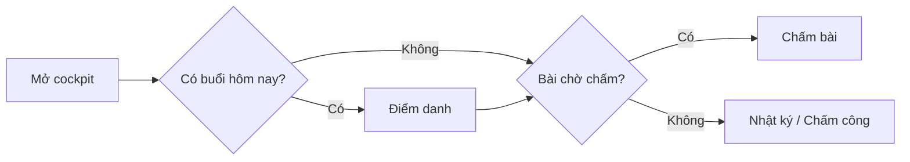
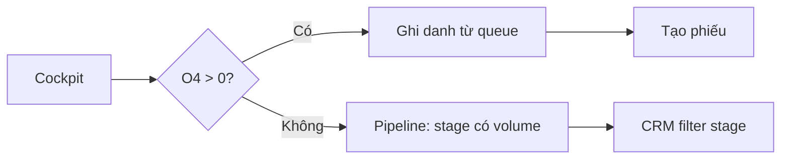
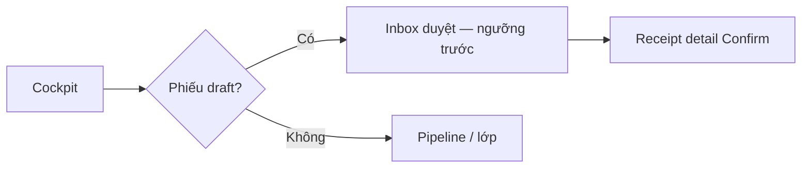

# Research Report: Cockpit components & workflow-first redesign

**Date:** 2026-08-02  
**Scope:** Redesign depth for CMC EDU Admin `/cockpit` — Pipeline O1→O5, Việc cần xử lý, metrics, shortcuts, side panels — **per role**, professional workplace UX.  
**Stack boundary:** Extend `@cmc/ui` (Astryx). Do **not** install shadcn.  
**Related:** `design-system/cmc-edu/PAGE-FRAMES.md`, `DashboardPage`, current `cockpit.tsx`.

---

## Table of contents

1. [Executive Summary](#executive-summary)  
2. [Research Methodology](#research-methodology)  
3. [Key Findings](#key-findings)  
4. [Current CMC gap analysis](#current-cmc-gap-analysis)  
5. [Component redesign specs](#component-redesign-specs)  
6. [Role workflow blueprints](#role-workflow-blueprints)  
7. [Comparative patterns](#comparative-patterns)  
8. [Implementation recommendations](#implementation-recommendations)  
9. [Resources](#resources-references)  
10. [Appendices](#appendices)

---

## Executive Summary

CMC cockpit is correctly typed as an **operational / functional dashboard** (not analytical BI): its job is to answer “what do I do next?” in seconds, then deep-link into a workflow. Industry consensus (Pencil & Paper, Fivecube, Excited, Smashing Mag 2025; NN/g dashboards + empty states) prioritizes: **role-specific purpose → few KPIs → actionable queue → context panel**, with deliberate empty/loading/error states.

Current CMC already has the right **atoms** (`MetricCard`, `TaskRow`, `FunnelBar`, `Panel`, `DashboardPage`, `ShortcutChip`) and role branching. Gaps vs professional ops tools are **depth of components**, not layout chrome:

1. **Pipeline O1→O5** is a static proportional bar list — no stage click, no conversion insight, no “bottleneck” emphasis, weak when most stages are 0.  
2. **Việc cần bạn xử lý** is a flat list of links — no urgency sort, no time/age, truncated IDs for teachers, no bulk “clear my queue” mental model, no section headers by urgency.  
3. **Metric cards** lack delta/context (“vs yesterday”, threshold) and all zeros feel inert.  
4. **Shortcuts** are good but not wired to live counts.  
5. **Teacher schedule** shows batch codes, not “next session + time + action”.

**Recommendation:** Keep `DashboardPage` frame. Redesign **three composite modules** as first-class products: `WorkInbox` (queue), `StageFunnel` (pipeline), `OpsMetric` (KPI+spark/delta optional). Specialize content per role (Sale/GĐ vs Giáo viên), not a different shell. Ship in 2–3 phases; measure time-to-first-action after login.

---

## Research Methodology

| Item | Detail |
|------|--------|
| Sources | ~18 web results + NN/g classics + CMC code/screenshots |
| Date range | 2021 (NN/g empty) – 2026 (dashboard trends) |
| Search terms | operational dashboard task queue; CRM pipeline funnel UX; teacher admin dashboard; NN/g empty states KPI |
| Tool limit | 4 web searches + codebase scout |
| Evaluation criteria | Actionability, scan time, role fit, implementability on CMC tokens |

---

## Key Findings

### 1. Dashboard typology (pick type first)

| Type | Question answered | CMC cockpit? |
|------|-------------------|--------------|
| **Operational** | What is happening *now* / what do I do? | **Yes — primary** |
| Analytical | Why did it change? | No (reports later) |
| Strategic | How are we doing this quarter? | Partial metrics only |

Implications (Fivecube, Excited 2025):

- Put **most important data top-left / F-pattern**.  
- Prefer **tasks + alerts** over decorative charts.  
- Avoid over-detailed views on home (drill-down on click).

Pencil & Paper: “Functional and integrated” dashboards **guide focus** (e.g. at-risk queue) — weaker than pure monitoring, stronger than static reporting. CMC should lean **functional** (queue-first).

### 2. Work inbox / task queue patterns

Industry patterns (support/ops/PM tools):

| Pattern | Behavior | When |
|---------|----------|------|
| **Priority inbox** | Sort: overdue → due soon → rest; color only as secondary cue | Director approve, grading |
| **Grouped sections** | “Khẩn · Hôm nay · Sau” | Mixed queues |
| **Rich row** | Avatar/title · entity · amount/time · primary action | Finance/CRM |
| **Inline primary action** | “Duyệt” / “Chấm” without only navigating away | High frequency |
| **Count in header** | “Việc cần xử lý (7)” | Always |

NN/g empty: empty container is not neutral — status + teach + **direct path**. CMC already has EmptyState+CTA; elevate with role-specific next step (not generic).

### 3. Pipeline / funnel patterns (CRM)

Professional CRM home (Salesforce-style discipline, not skin):

| Pattern | Purpose |
|---------|---------|
| **Stage counts + bar or mini columns** | Snapshot of funnel health |
| **Click stage → filtered list** | Primary interaction |
| **Conversion % between stages** | Optional analytical lite |
| **Highlight bottleneck** | Stage with highest count pre-close, or worst conversion |
| **“Needs attention” strip** | O4 ready to enroll, stalled O3 |
| **Hide or collapse zero stages** | Reduce noise when empty demo |

Anti-pattern: five gray zero-bars + one blue bar with no link (current CMC when sparse data).

### 4. KPI cards

Best practice 2025–26:

- Label + big number + **context** (what to do) — CMC has this.  
- Optional: **delta** (↑↓), sparkline, threshold badge.  
- Max **5–7** KPIs (NN/g cognitive load); CMC 1–4 is correct.  
- Card **is** a button to filtered work list.  
- Zero values: still useful if context is “all clear” vs “not loaded” (error distinct).

### 5. Education / teacher workflows

EdTech admin UX (Cleveroad-type guidance + ops practice):

- Teacher home = **today’s classes → attendance → grading → notes**, not finance.  
- Prefer **time-ordered session cards** (08:00 · Lớp A · Điểm danh) over generic batch code list.  
- Touch density for tablet still matters on attendance deep-link.

### 6. Style for “professional work UI”

Consensus (not consumer flash):

- Calm surfaces, one accent, clear hierarchy (matches CMC tokens).  
- **Density with clarity** for ops; generous only on empty states.  
- Micro-interaction: hover row, press 100ms, loading skeletons (CMC partially there).  
- Avoid: glassmorphism, multi-color chart junk, emoji icons.

---

## Current CMC gap analysis

### Component inventory (as-built)

| Module | Implementation | Strength | Gap vs professional ops |
|--------|----------------|----------|-------------------------|
| Frame | `DashboardPage` | Shared shell | — |
| Shortcuts | `ShortcutChip` | Consistent chips | No live badge counts |
| Metrics | `MetricCard` | Clean, linkable | No delta; zero-state flat |
| Work queue | `Panel` + `TaskRow` | Clear list | Flat; teacher shows truncated UUIDs; no age/urgency |
| Pipeline | `FunnelBar` × 5 | Simple | Not clickable; no bottleneck; zeros noisy |
| Schedule | Custom rows | Shows active batches | Not session-time oriented; weak action |
| Empty | `EmptyState` + CTA | Good baseline | Copy can be more workflow-specific |

### Workflow fit score (subjective)

| Role | Fit today | Main friction |
|------|-----------|---------------|
| GĐ | 6/10 | Queue empty feels dead; pipeline not actionable |
| Sale | 6.5/10 | Pipeline OK idea; O4 card good; need “today calls” feel |
| Giáo viên | 5.5/10 | IDs not names; schedule not “next class” |
| Super admin | 5/10 | Director layout without admin-specific ops |

---

## Component redesign specs

### A. `WorkInbox` (nâng cấp “Việc cần bạn xử lý”)

**Job:** Process my queue in priority order with one click into the right screen.

```text
┌─ Việc cần bạn xử lý · 7 ───────────────────── Xem tất cả → ┐
│ ⚠ KHẨN                                                        │
│ ● Duyệt SO00012 — Nguyễn A     25.000.000 đ · 2 ngày   [→]   │
│                                                               │
│ HÔM NAY                                                       │
│ ● Ghi danh — Chị Hoa           0912…                   [→]   │
│ ● Chấm bài — HS Minh           Unit 3 Writing          [→]   │
└───────────────────────────────────────────────────────────────┘
```

| Element | Spec |
|---------|------|
| Header | Title + **count badge** + optional “Xem tất cả” → filtered list |
| Sections | Optional: Khẩn / Hôm nay / Khác (by rules) |
| Row | Dot tone · **primary title (human name)** · meta (money / phone / time) · chevron |
| Teacher row | `studentFullName` (API already has for grading list) — never bare UUID |
| Director row | code + student + amount + over-threshold tag |
| Empty | Role CTA (already) + secondary tip |
| Loading | 3 skeleton rows (already) |
| Interaction | Whole row clickable; optional secondary icon button later |

**Data rules (examples):**

- Director: draft receipts, sort by `netAmount` desc or oldest first.  
- Sale: open O4 opportunities, sort by updatedAt.  
- Teacher: submitted submissions, sort by submittedAt asc (oldest first).

### B. `StageFunnel` (nâng cấp “Pipeline O1 → O5”)

**Job:** See funnel health and **jump into a stage**.

```text
┌─ Pipeline ghi danh ─────────────── Mở CRM → ┐
│  O1  Tiếp cận          ░░░░░░░░░░░  0        │  ← muted if 0, not prominent
│  O2  Đã liên hệ        ░░░░░░░░░░░  0        │
│  O3  Đặt lịch KT      ████░░░░░░░  2  →     │  ← clickable
│  O4  Đã kiểm tra ★     ██████░░░░  3  →     │  ← “action stage” highlight
│  O5  Đã ghi danh       ████████░░  5  →     │
│  ─────────────────────────────────────────  │
│  Sẵn sàng ghi danh: 3 ·  [Xử lý O4]         │  ← summary CTA
└─────────────────────────────────────────────┘
```

| Element | Spec |
|---------|------|
| Stage row | Label · bar · count · chevron if `value > 0` |
| Click | Navigate `/crm?stage=O4_TESTED` (deep-link filter; add if missing) |
| Zero stages | Lower opacity, no chevron, optional collapse “Ẩn stage trống” |
| O4 emphasis | Star/attention when count > 0 (Sale conversion moment) |
| Footer | One-line insight: “3 cơ hội chờ ghi danh” + button |
| Empty all-zero | Single empty: “Chưa có cơ hội — Tạo lead” not five empty bars |

**Do not** add pie/donut (NN/g preattentive: length/position better for ops).

### C. `OpsMetric` (nâng cấp MetricCard — optional v2)

Keep current MetricCard API; add optional props later:

```ts
delta?: { value: number; label: string }; // e.g. +2 hôm nay
hint?: string; // "Cần xử lý trong ngày"
```

Visual: small muted delta under value; attention dot unchanged.

### D. `SessionAgenda` (thay “Lịch dạy hôm nay” code list)

```text
┌─ Hôm nay · 2 buổi ────────────── Lịch đầy đủ → ┐
│  14:00–15:30  CG-ENG-A1     [Điểm danh] [Nhật ký] │
│  16:00–17:30  CG-MATH-B2    [Điểm danh]           │
└───────────────────────────────────────────────────┘
```

Needs session-level API if only batch list exists today — **phase dependency**: if no session times, show batch + link “Mở lịch” until data path ready.

### E. Shortcut strip with badges

Wire counts into chips:

- Giáo viên: Chấm bài `(n)` from same query as metric.  
- GĐ: Phiếu thu `(draft total)`.  
- Sale: CRM `(O4 count)`.

### F. Header “work mode”

```text
Tổng quan
Xin chào · Giáo viên · Cơ sở Cầu Giấy   [optional facility]
Cập nhật lúc 14:32
```

Facility name if `session.me` exposes it later.

---

## Role workflow blueprints

### Giáo viên — 30-second loop



**UI priority order:** Shortcuts → Metric chấm bài → WorkInbox → SessionAgenda.

### Sale — 30-second loop



**UI priority:** Metric O4 + Inbox O4 → StageFunnel → Shortcuts CRM.

### GĐKD / GĐĐT — 30-second loop



**UI priority:** Metrics draft + threshold → Inbox sorted by amount/age → Funnel.

### Super admin

Same GĐ frame + optional third metric “Users active / facilities” later — YAGNI until API cheap.

---

## Comparative Analysis

| Approach | Pros | Cons | CMC choice |
|----------|------|------|------------|
| **A. Polish only copy/CSS** | Fast | Still non-actionable pipeline | Insufficient |
| **B. Redesign 3 modules + deep links** | Workflow fit, keep frame | Needs CRM query params, name fields | **Recommended** |
| **C. Full custom per-role pages** | Max fit | Breaks PAGE-FRAMES sync | Reject |
| **D. Heavy analytics charts** | Looks “modern” | Wrong dashboard type | Reject |

---

## Implementation Recommendations

### Phase R1 — WorkInbox v2 (highest ROI)

1. Extend `TaskRow` or add `WorkInboxRow`: `title`, `meta`, `href`, `tone`, optional `tag`, `timestamp`.  
2. Grouping optional prop `sections?: { id, label, items }[]`.  
3. Teacher: pass `studentFullName` from `listForGrading`.  
4. Panel header count.  
5. Tests: sort order, empty, name display.

### Phase R2 — StageFunnel v2

1. `StageFunnel` composite: stages config, `onStageClick` / `hrefForStage`.  
2. CRM list accept `?stage=` filter (if missing, implement).  
3. Zero-stage visual mute; footer CTA for O4.  
4. Empty all-zero single EmptyState.

### Phase R3 — Agenda + shortcut badges

1. Prefer `classSession` list “today” if available; else keep batch with honest label.  
2. ShortcutChip `badge` prop already exists — wire counts.  
3. Metric optional delta only if cheap query.

### Quick visual checklist (no new stack)

- Pipeline rows: `cursor:pointer` when count > 0; hover = canvas.  
- Inbox: section label uppercase 11px muted (match MetricCard label).  
- One accent blue; urgency = warning/danger dots only.  
- Skeleton parity for funnel + inbox.

### Common pitfalls

| Pitfall | Avoid |
|---------|--------|
| Five empty funnel stages as “design” | Collapse / mute zeros |
| UUID as human title | Join student name |
| Chart for vanity | Queue > chart on ops home |
| Different layout per role | Same DashboardPage slots |
| Confirm on every queue click | Only on irreversible target screens |

### Success metrics

- Time from login to first meaningful navigation (target ↓).  
- % sessions that click inbox or stage within 30s.  
- Teacher: % grading clicks from cockpit vs deep nav.  
- Empty-state CTA click-through.

---

## Resources & References

### Authority / patterns

- Nielsen Norman Group — Dashboards (preattentive), Empty states  
  https://www.nngroup.com/articles/dashboards-preattentive/  
  https://www.nngroup.com/articles/empty-state-interface-design/  
- Pencil & Paper — Dashboard UX pattern analysis  
  https://www.pencilandpaper.io/articles/ux-pattern-analysis-data-dashboards  
- Smashing Magazine — Real-time dashboard UX (2025)  
  https://www.smashingmagazine.com/2025/09/ux-strategies-real-time-dashboards/  
- Fivecube / Excited — Dashboard types & layout (2025)  
- Carbon Design — Empty states pattern  

### Internal

- `apps/admin/src/pages/cockpit.tsx`  
- `packages/ui` — `dashboard-page`, `metric-card`, `task-row`, `funnel-bar`, `shortcut-chip`  
- `design-system/cmc-edu/PAGE-FRAMES.md`  
- Prior: `plans/260802-research-ui-ux-product-eval/reports/*`

---

## Appendices

### A. Glossary

| Term | Meaning |
|------|---------|
| Operational dashboard | Day-to-day action surface |
| Work inbox | Prioritized task list with deep links |
| Stage funnel | CRM stage distribution + navigation |
| Attention dot | Status cue without recoloring KPI number |
| Bottleneck stage | Stage with worst flow or highest pre-conversion pile-up |

### B. Wireframe inventory (for design/gen)

1. GĐ cockpit — inbox with SO amounts + funnel footer CTA  
2. Sale cockpit — O4 metric + stage click + O4 section  
3. GV cockpit — grading names + session agenda  
4. All-zero sale funnel empty state  
5. Loading skeletons full dash  

### C. Unresolved questions

1. Does CRM list support `stage` query param today? If not, R2 blocked on small filter work.  
2. Session start/end times available for teacher agenda without new API?  
3. Facility display name on `session.me`?  
4. Product: should O3 stalled > N days appear in GĐ inbox?

### D. Next steps

1. Product accept **Approach B** (module redesign, same frame).  
2. `/ak:plan` phases R1→R3.  
3. Implement WorkInbox first (teacher names + director amounts + counts).  
4. Then StageFunnel + CRM deep link.  
5. Visual QA per role on http://127.0.0.1:5173/cockpit.

---

*Report path: `plans/260802-research-cockpit-workflow-ux/reports/research-cockpit-components-workflow-ux.md`*
