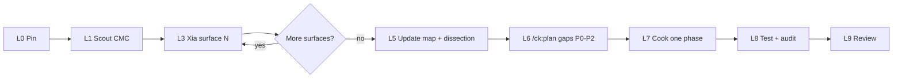

# Agent command map — Odoo UI dissection (anti-sprawl)

**Purpose:** Odoo monorepo is huge. Only research **layout grammar** for CMC admin design3.  
**Authority pin:** `/home/manhquy/Downloads/odoo-src` @ `7de220c9` (`19.0`)  
**Brainstorm:** `plans/reports/brainstorm-260806-odoo-ui-dissection-refresh.md`  
**Do not:** clone OWL, XML arch, Bootstrap wholesale, chat/mail, website/frontend.

---

## 1. Hard scope boundary (only these trees)

```text
ALLOWLIST — addons/web/static/src/
├── webclient/          # shell, navbar, settings_form_view, loading
├── search/             # layout.xml, control_panel/
├── views/list/         # list controller + renderer
├── views/form/         # form sheet, statusbar, button_box
├── views/kanban/       # board geometry only
├── core/{dialog,dropdown,notifications,commands,pager}/  # float + pager
└── scss/primary_variables.scss (+ related token SCSS if needed)

DENY by default
├── addons/* except web (no account, crm, …)
├── website / portal / mail chatter product
├── OWL services, registries, RPC, view compilers (read classes only)
└── Bootstrap source trees (mirror density tokens already in odoo.css)
```

If a task needs a path outside ALLOWLIST → **stop and ask**. Do not “just browse”.

---

## 2. Work lanes × `ak`/`ck` commands × agents

| Lane | Goal | Command / agent | Input (narrow) | Output |
|------|------|-----------------|----------------|--------|
| **L0 Pin** | Refresh SHA | shell `refresh-odoo-pin.sh` / plan Step 0 | `odoo-src` fetch 19.0 | `ODOO_PIN.txt` |
| **L1 Scout local** | Where CMC analogues live | `/ck:scout` `odoo shell ControlBar form-sheet` | `packages/ui`, `apps/admin/src/shell` | file map |
| **L2 Scout source** | File inventory inside ALLOWLIST | Explore/Task `explore` **or** `/ck:scout` on `odoo-src/.../ALLOW` | one surface at a time | path list |
| **L3 Xia compare** | Side-by-side grammar | `/ak:xia <odoo-src> "<surface>" --compare` | **one** of: shell \| CP \| list \| form \| kanban | `plans/reports/xia-…md` |
| **L4 Research tokens** | SCSS variables → token table | `/ck:research` or `researcher` agent | `navbar.variables.scss`, form/list SCSS | token delta |
| **L5 Design authority** | Evergreen map/grammar | `/ck:docs` or docs-manager (edit only map/VIEW-GRAMMAR) | xia + dissection | `ODOO-COMPONENT-MAP.md` |
| **L6 Plan cook** | Cookable phases | `/ck:plan` (pass brainstorm + xia paths) | ranked P0–P2 gaps only | `plans/<ts>-…/plan.md` |
| **L7 Cook** | Implement gap | `/ak:cook` / `/ck:cook` | **one** phase file | code + tests |
| **L8 Test** | Prove density/stacking | `/ck:test` + unit `odoo-*.test.ts` + `design3-frontend-audit.mjs` | changed surface | green evidence |
| **L9 Review** | Before merge | `/ck:code-review` or bugbot | PR diff | findings |
| **L10 Design smell** | Visual UX only if stuck | `/ck:ui-ux-pro-max` or `ui-ux-designer` | screenshots / audit | recommendations |

**Never invent a parallel process** outside this table for Odoo UI work.

---

## 3. Xia: split into **surface packages** (never whole Odoo)

Run **one command per surface**. Stop after each report before the next.

```text
# 1 Shell OS
/ak:xia /home/manhquy/Downloads/odoo-src \
  "webclient shell navbar scroll-owner stacking z-index" --compare

# 2 Control panel
/ak:xia /home/manhquy/Downloads/odoo-src \
  "search control_panel LEFT CENTER RIGHT selection-swap sticky" --compare

# 3 List
/ak:xia /home/manhquy/Downloads/odoo-src \
  "list_renderer sticky thead density cell padding" --compare

# 4 Form sheet
/ak:xia /home/manhquy/Downloads/odoo-src \
  "form_sheet_bg form_sheet statusbar sticky notebook button_box" --compare

# 5 Kanban geometry
/ak:xia /home/manhquy/Downloads/odoo-src \
  "kanban column card color bar gutter (no quick-create)" --compare
```

**Repomix / include hint per run** (pass to xia recon):

| Surface | Include globs under `addons/web/static/src/` |
|---------|-----------------------------------------------|
| Shell | `webclient/webclient*`, `webclient/navbar/**` |
| CP | `search/layout.xml`, `search/control_panel/**` |
| List | `views/list/**` |
| Form | `views/form/form_controller.*`, `form.variables.scss`, `button_box/**`, `status_bar_buttons/**`, `form_status_indicator/**` |
| Kanban | `views/kanban/**` |
| Float | `core/dialog/**`, `core/notifications/**`, `core/commands/**` |

Local compare always includes: `packages/ui/src/odoo.css`, matching `components/*`, `docs/design-system-odoo.md`.

Mode default: **`--compare`** until human approves a port/cook plan. Do **not** start with `--copy` / `--port` on Odoo webclient.

---

## 4. Sequencing (recommended pipeline)



**Parallel OK:** L3 shell + L3 form only if two agents and **disjoint** write targets (both write separate report files).  
**Serial required:** L6→L7→L8 for the same gap.

---

## 5. Agent ↔ job fit (quick)

| Job nature | Use | Avoid |
|------------|-----|--------|
| “Where are files?” | scout / explore | xia, research |
| “How does Odoo vs CMC differ?” | **xia --compare** | cook |
| “Industry / token best practice” | research | xia (wrong tool) |
| “What should we build next?” | brainstorm (done) → **plan** | cook early |
| “Ship CSS/React” | cook + test | another dissection |
| “Does stacking break?” | debugger / e2e audit script | re-reading all Odoo |
| “Looks unprofessional?” | ui-ux after grammar gaps known | first tool |

Subagents (Task tool): `explore`, `researcher`, `planner`, `docs-manager`, `tester`, `code-reviewer`, `ui-ux-designer` — same scopes as above.

---

## 6. Completion gates (stop conditions)

Stop researching when:

1. Wireframe ASCII + slot names captured for that surface  
2. Matrix row statuses updated (S/P/M/K)  
3. At most **3** cookable gaps remain for that surface  
4. Xia report exists under `plans/reports/` with pin SHA  

Do **not** continue into adjacent Odoo apps “for completeness”.

---

## 7. First action this week

1. `/ak:xia` **shell** package (smallest, validates pipeline)  
2. `/ak:xia` **form** package (sheet already shipped — compare fidelity)  
3. `/ak:xia` **control_panel** package (biggest remaining grammar gap)  
4. Only then `/ck:plan` for: brand=module name, CP densify, statusbar md+ sticky  

Reference seed status: `reports/odoo-19-source-dissection.md` + `delta-260806-refresh.md`.
