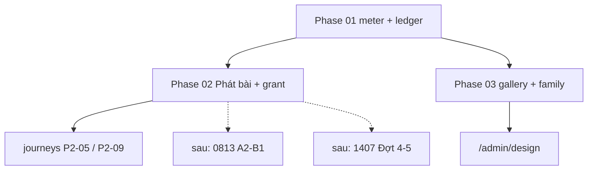

# Hoàn thiện sản phẩm — meter và điểm nghẽn

**Mode:** ak:plan `--hard` · **HEAD đo:** local `bc3f473` (#131); ledger CI `origin/develop@7227676` (#134)  
**Brainstorm:** [`plans/reports/brainstorm-260813-1156-system-truth.md`](../reports/brainstorm-260813-1156-system-truth.md)  
**Research (đo code/CI, không đo markdown):**

- [sản phẩm](../reports/research-260813-1204-product-bottlenecks.md) — [researcher](239842fa-fab4-4b76-81a1-e046dccef5cf)
- [design system](../reports/research-260813-1204-ds-remain.md) — [researcher](8f273b8d-3cbc-4596-8160-26127b75827b)
- [CI + plan chồng](../reports/research-260813-1204-ci-plans.md) — [researcher](54333b86-1a55-47f4-b485-1a1d1bc67ac3)

**Đây không phải plan sản phẩm thứ bảy.** Ba phase dưới là việc **chưa có plan con đúng**. Việc còn lại trỏ sang plan đang sống.

## Overview

Merge xanh (`typecheck-and-test` + `ui-e2e`) không phải sản phẩm xong. Operator không tin docs vì YAML `pending` còn sót trên code đã merge. Worker **đã** phát bài sau `endTime` (`deliverDueExercises`). Điểm nghẽn còn lại: không đo được trạng thái từ một lệnh; staff break-glass + grant ops thiếu UI/cổng quyền; ledger `no-ui-path` vừa thiếu vừa thừa; shared UI không một họ.

## Quyết định đã chốt (không hỏi lại)

| # | Quyết định | Nguồn |
|---|---|---|
| D1 | Ledger of record = artifact `ui-e2e`, không phải `acceptance-report/verification.json` local | CI research; `ui-e2e.yml:202-206` |
| D2 | Happy-path phát bài = worker `drainOnce` → `deliverDueExercises` sau `endTime`. Nút **Phát bài** = break-glass GĐĐT + journey xác định (không chờ clock). **Không** tắt worker. Comment `router.ts:674` không phải bằng chứng | `worker/index.ts:129-132`; `exercise-delivery.ts:209-245` |
| D3 | LMS đóng khi chưa có `EnrollmentUnitRange`. Happy-path = receipt approve (`grant-units.ts`). Grant UI = break-glass GĐĐT (`enrollment.grantUnits` only), confirm + audit; **không** nhét range vào `student.get`. Cắt range = `revokeFromNext`, **không** `archiveEnrollment`. Reserved/unpaid vẫn 400 | `open-tier.ts:6-8`; `enrollment/router.ts:4-8`; `auth/index.ts:97` |
| D4 | LMS **không** nạp `console.css`. Family merge chỉ admin | DS research; `apps/lms/src/main.tsx` |
| D5 | Không rename 17 biến `--font-size-*` trùng tên | Red-team 0120; A đã pin |
| D6 | Parent `requestLink` / tài khoản gia đình = plan `260813-0813` B1, **không** cook trong plan này | CI overlap |
| D7 | Cook từ `origin/develop` (gồm #134). Local `bc3f473` thiếu DataTable keyboard | CI research |

## Điểm nghẽn — blocker vs defer vs plan khác

| Hạng | Việc | Xử lý |
|---|---|---|
| 1 | Không tin số / ledger `no-ui-path` nói dối | **Phase 01** |
| 2 | Không có break-glass Phát bài (GĐĐT); P2-05 hiện seed `SessionExercise` | **Phase 02** |
| 3 | Grant/cắt range không có UI; tab lớp student-detail stub; không có `enrollmentId` | **Phase 02** |
| 4 | Shared composites không một họ + showcase cắt cụt | **Phase 03** |
| 5 | P2-09 chưa có journey (UI đã có) | **Phase 02** |
| — | Vòng đời lớp/buổi A2–A5, family login B1 | **trỏ** `260813-0813` |
| — | Đợt 4 gói bán, Đợt 5 import | **trỏ** `260812-1407` |
| — | Promote API `e2e`, main, UAT người | **trỏ** `260812-1145` P1b/P4/P5 |
| — | `:focus-visible` unpushed | **trỏ** đóng `260813-0120` |
| DEFER | Sửa lịch chạy (`schedule.*Slot`), leaderboard, OTP mail, `ClassBatch.status` | không cook |

**Stale — không làm lại:** `260813-0053` (#123 library), DS A/B/C/keyboard (#124–#128, #134), unique session #131, protect develop (đã `enforce_admins:true`).

## Goals

| # | Goal | Priority |
|---|------|----------|
| 1 | Một lệnh in scorecard gắn SHA; markdown không phải bằng chứng | P1 |
| 2 | GĐĐT break-glass phát bài (`exercise.manage`); GĐĐT grant range (`enrollment.grantUnits`); journey P2-05 không seed `SessionExercise` | P1 |
| 3 | Gallery sống + bốn họ (filter/card/badge/empty) cùng chrome admin | P1 |
| 4 | Operator biết việc còn lại nằm ở 0813 / 1407 / 1145 | P2 |

## Phases

| # | Phase | Status | Cook? |
|---|-------|--------|-------|
| 1 | [Trust meter + ledger thật](./phase-01-start.md) | completed | yes |
| 2 | [Teaching loop — Phát bài và cấp unit](./phase-02-teaching-loop-phat-bai-va-cap-unit.md) | in-progress (P2-05 student path deferred) | yes |
| 3 | [DS gallery và family merge](./phase-03-design-system-gallery-va-family-merge.md) | completed | yes |

Phase 01 → 02 (ledger labels đổi khi có màn). Phase 03 song song với 02 (file ownership: `@cmc/ui` + showcase vs `session-detail` / `student-detail` / e2e).



## Architecture (meter)

`pnpm verify:system` bọc lệnh đã có. Mỗi dòng: claim, command, SHA, proof class (`behavior` \| `source-string` \| `ci-artifact` \| `unmeasured`). Cấm class `docs`.

```
L0 typecheck/lint     BLOCK behavior
L1 unit tests         BLOCK behavior
L2 frames/ratchet/a11y/doc-authority  BLOCK source-string
L3 ui-e2e artifact    so SHA `journeys.json` vs `git rev-parse HEAD`; mismatch/`unmeasured`
L4 business:verify    BLOCK chỉ trên job ui-e2e `--strict`; meter **không** gọi `--strict` local
L5 DS inventory       ADVISORY đến khi gallery có
L6 trivy / matrix / API e2e  ADVISORY (ci.yml continue-on-error)
```

Không invent scanner mới trừ inventory composite (đọc export `@cmc/ui`).

## CI truth (đo 2026-08-13)

Required trên **main và develop**: `typecheck-and-test`, `ui-e2e`. `strict` + `enforce_admins: true`.

- `acceptance:report` trong `ci.yml:140-142` = **advisory**
- cùng lệnh trong `ui-e2e.yml:197-200` + `business:verify --strict` = **BLOCK**
- API job `e2e` `ci.yml:150-152` = **advisory** (P1b, chưa đủ 1 tuần xanh để lật)

Ledger CI run [31668483286](https://github.com/manhquydev/cmc_edu/actions/runs/31668483286): 60/60 specs, SHA `7227676`. Manifest 43 flows / 36 journeys. Trần journey = 36 đến khi P2-09 có spec và `no-ui-path` được đo lại.

## Success Criteria

- [ ] `pnpm verify:system` chạy trên HEAD, JSON+HTML không nhúng số từ markdown
- [ ] Session hub: Phát bài trên EntityHeader mọi tab; chỉ `canDo('exercise','manage')`; `{ delivered: false }` = Banner lỗi
- [ ] Journey P2-05 không seed `SessionExercise`; range = receipt; `grantPast` không OR vào success
- [ ] Grant/cắt range: `listEnrollmentsForStudent` + `revokeFromNext`; `sale` không thấy form; `student.get` không thêm ranges; reserved 400
- [ ] `/admin/design` bốn họ; StatCard `--static` không `fontSize: 24`; FilterBar pin gallery + một ListPage
- [ ] 0053 / 1018 / waves DS đã ship được ghi completed/superseded trên YAML — không xóa folder
- [ ] Không phase nào “done” khi `typecheck-and-test` hoặc `ui-e2e` đỏ

## Risks

| Risk | Mitigation |
|---|---|
| Cook trên `bc3f473` làm lại #134 | Fast-forward `develop` trước cook |
| Grant UI bị hiểu là mở LMS chưa thu | D3: `canDo` + confirm; test reserved 400; không dựa copy |
| Cook tắt `deliverDueExercises` để “làm D2 cũ” | Cấm. Worker giữ. Nút là break-glass |
| Xóa `DOCUMENTED_GAPS` trước khi claim `expected.trpc` | Phase 01: claim rồi mới xóa; 0 untriaged orphans |
| Meter tin `verification.json.commit` / `--strict` local stale | So `journeys.json` SHA; không `--strict` trong meter |
| Meter thành dashboard mới | Bọc script có sẵn |
| Agent đọc plan 0053 pending rồi làm lại library | Phase 01 sửa YAML |

## Out of scope

UAT người; Entra SSO; rewrite TL corpus; Storybook; console.css trên LMS; **tắt** `deliverDueExercises`; nới `exercise.manage` cho giáo viên; gói bán Đợt 4.

## Cook

```bash
# fast-forward trước
git fetch origin && git merge --ff-only origin/develop
/ak:cook plans/260813-1211-hoan-thien-san-pham-meter-va-diem-nghen/plan.md
```

Phase 02 và 03 `--parallel` trên TSX khác nhau. CSS EmptyState ops (03) có thể đổi visual stub tab lớp (02) — chấp nhận; không sửa cùng file TSX.

## Red Team Review

Ba lens: [Security](69ea8981-b890-47df-b514-ad204305bf3f) · [Assumption Destroyer](100e0b75-b969-4103-8207-c1ae062ef919) · [Failure Mode](1a569f66-4abf-4245-a31e-7f5f5c3a0782).

### Security (vòng 1) — Accept 8/8

| # | Finding | Sev | Disposition |
|---|---|---|---|
| 1 | Goal 2 “GV phát bài”; `exercise.manage` = GĐĐT-only | Critical | **Accept** |
| 2 | Grant UI trên `student.lookup`; không list-ranges API | Critical | **Accept** |
| 3 | D2 sai — worker đã `deliverDueExercises` | Critical | **Accept** |
| 4 | D3 cite `enrollInput`; grant không gắn receipt | High | **Accept** |
| 5 | Disable list thiếu `endTime` + unit stamp | High | **Accept** |
| 6 | Phase 01 giặt P2-03 bằng staff `assignUnit` | High | **Accept** |
| 7 | “DTO grant-units.ts” không tồn tại | High | **Accept** |
| 8 | Success = `rg` mutation name | Medium | **Accept** |

### Assumption Destroyer + Failure Mode (vòng 2)

| # | Finding | Sev | Disposition | Vá vào |
|---|---|---|---|---|
| AD1 | Tab lớp stub; không `enrollmentId` | Critical | **Accept** | phase-02 `listEnrollmentsForStudent` |
| AD2 | “Archive range” ≠ `archiveEnrollment` | Critical | **Accept** | D3 + `revokeFromNext` |
| AD3 | P2-03 vs `assignUnit` | High | **Accept** (đã vòng 1) | phase-01 giữ `no-ui-path` |
| AD4 | `{ delivered: false }` silent 200; hub thiếu query | High | **Accept** | Banner lỗi + query sequence/delivery |
| AD5/FM2 | Xóa GAPS không claim → orphan ratchet | Critical | **Accept** | phase-01 claim rồi xóa |
| AD6 | FilterBar 21 trang | High | **Accept** | phase-03 pin ListPage |
| AD7 | EmptyState 23 trang / palette không EmptyState | High | **Accept** | class ops tường minh |
| AD8 | StatCard trên `.console-mc` = link chết | Medium | **Accept** | `--static` |
| AD9 | Pin badge **md** (41/23) | Medium | **Accept** | phase-03 |
| AD10/FM5 | P2-05 chưa từng chạy; timeout; seed | High | **Accept** | split journey; không `--strict` |
| FM1 | Hai writer worker vs nút | Critical | **Accept** (D2) | giữ worker; journey click hoặc `deliverDueExercises` harness |
| FM4 | Disable thiếu next-position / `{delivered:false}` | High | **Accept** | phase-02 |
| FM6 | `addWithUnits` reject past; OR `grantPast` mở LMS chưa thu | High | **Accept** | P2-05 = receipt; backfill spec riêng |
| FM7 | Meter SHA = `verification.json.commit` luôn khớp | High | **Accept** | so `journeys.json`; không `--strict` local |
| FM8 | Nút trên hub default `attendance`; GĐĐT-only | High | **Accept** | EntityHeader mọi tab |
| FM9 | `journey:` trước file `test(` | Medium | **Accept** | cùng commit |

Reject: không. Defer: `unarchiveEnrollment` UI.

### Whole-Plan Consistency Sweep (vòng 2 — xong)

- Files reread: `plan.md`, `phase-01-start.md`, `phase-02-teaching-loop-phat-bai-va-cap-unit.md`, `phase-03-design-system-gallery-va-family-merge.md`
- Decision deltas checked: 16 (D2 worker; D3 revokeFromNext; SHA=`journeys.json`; no `--strict` local; claim-then-delete GAPS; P2-01 `createClassWithUnits`; P2-03 keep `no-ui-path`; EntityHeader; `{delivered:false}`; listEnrollments; receipt ≠ grantPast; spec+manifest same commit; StatCard `--static`; FilterBar 21p; EmptyState ops class; badge md)
- Reconciled stale references: 1 (hạng 2 “P2-05 seed delivery” → mô tả bottleneck hiện tại)
- Unresolved contradictions: 0

## Validation Log

### Session 1 — 2026-08-13
**Trigger:** `/ak:plan validate` trước cook (pipeline user: plan → red-team → validate → cook → test → review → ship)
**Questions asked:** 0

#### Verification Results
- Claims checked: 10
- Verified: 10 | Failed: 0 | Unverified: 0
- Tier: Standard (Fact Checker + Contract Verifier; Red Team Review đã có evidence → không interview lại D1–D7)
- Failures: none
- Sample: `worker/index.ts:132` deliverDueExercises; `auth/index.ts:97,124` GĐĐT-only; `verify.ts:419-426` orphan ratchet; `student-detail.tsx:210-214` tab lớp stub; `session-detail.tsx:62` default attendance; `ui-e2e.yml:199-200` `--strict` BLOCK; `classes/index.tsx:260` createClassWithUnits; `courses/index.tsx:95` course.create; `schedule-fc-events.ts:106` attendance deep-link; `lms-ops.int.test.ts:327` addWithUnits starts_in_past
- `[UNVERIFIED]` tags: 0
- Quyết định còn mở: không (D1–D7 + user ra lệnh cook)

#### Questions & Answers
Không hỏi — red-team đã chốt contract; user chỉ thị chạy tiếp cook.

#### Confirmed Decisions
- Cook từ `origin/develop` (HEAD đo lúc validate: local `bc3f473`, remote `2a6f666` #135 — leftover `:focus-visible` đã ship)
- Không `--strict` trong meter
- Claim `expected.trpc` rồi mới xóa GAPS

#### Action Items
- [x] Ghi log này
- [ ] Cook phase 01 trên branch từ `origin/develop`

#### Impact on Phases
- Phase 01: 0120 leftover focus-visible **đã merge #135** — không mở lại; plan 0120 untracked nên không commit folder đó
- Phase 02/03: không đổi

### Whole-Plan Consistency Sweep
- Files reread: plan.md + 3 phase files
- Decision deltas checked: 0 mới sau validate
- Reconciled stale references: 0
- Unresolved contradictions: 0

<!-- slug: hoan-thien-san-pham-meter-va-diem-nghen -->
