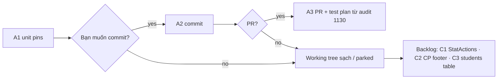

# Brainstorm — đóng sạch phiên OpenEduCat soft-square / form sheet

**Date:** 2026-08-14  
**Skill:** `ak:brainstorm`  
**Scope:** phần việc còn lại để **đóng phiên này**, không mở lại epic clone 36 PNG.

---

## Contract (phiên)

| Field | Content |
|-------|---------|
| **Outcome** | Diff UI phiên này đã pin bằng test, đã chứng minh live (local-sim), và sẵn sàng commit/PR hoặc được ghi rõ “parked”; không còn hạng mục CSS nửa-dở trong working tree. |
| **Constraints** | Chỉ admin `.o_web_client`; authority = pack + `OPENEDUCAT-VISUAL-CONTRACT`; không port OWL; không đổi nghiệp vụ students search-gate; không commit khi chưa được hỏi. |
| **Non-goals** | SIS photo kanban (02); bảng students thay search-gate (03 product); Chatter Send (P2); StatActions → CP phải (phase-03 residual, session riêng); website 31–33; LMS radius. |
| **Acceptance** | (1) Unit pins soft-square + DetailPage summary-in-sheet xanh. (2) Live measure: sheet pad 24×32, radius 4, summaryInsideSheet=true, highlight flat — đã có trong `live-ui-audit-260814-1130`. (3) Working tree chỉ còn file thuộc phiên (+ report); không sửa dở. (4) Nếu ship: branch + PR với test plan trích từ audit. |

---

## Đã xong trong phiên (không làm lại)

- Soft-square tokens / sheet pad / avatar / systray plain text  
- Summary **trong** sheet + flatten HighlightStrip  
- Rebuild local-sim ×2 + crop pack 03/14  
- Reports: `advise-260814-openeducat-soft-square.md`, `live-ui-audit-260814-1130/`

Working tree hiện tại (~7 files + 2 report dirs):

`shell.tsx` · `console.css` · `detail-page.tsx`+test · `console-cp-sheet.test.ts` · `console-tokens.test.ts` · `OPENEDUCAT-VISUAL-CONTRACT.md` · reports

---

## Còn lại — xếp theo “đóng phiên sạch”

### A. Bắt buộc để đóng phiên (session close-out)

| # | Việc | Effort | Evidence |
|---|------|--------|----------|
| A1 | Chạy lại unit gói: `console-tokens` · `console-cp-sheet` · `detail-page` · `shell` | ~2 phút | xanh trước commit |
| A2 | Commit (khi bạn bảo) — message tập trung soft-square + summary-in-sheet | ~5 phút | `git status` sạch file phiên |
| A3 | (Tuỳ chọn cùng lúc) PR develop + test plan trích `live-ui-audit-260814-1130/report.md` | ~10 phút | URL PR |

### B. Nên làm nếu còn 15–30 phút (cùng PR, không mở epic)

| # | Việc | Vì sao | Không làm nếu… |
|---|------|--------|----------------|
| B1 | Spot-check live 1 form sau rebuild cuối: opportunity crop “arm’s length” vs pack 14 | Xác nhận không regression layout entity/tabs | Đã tin measure JSON |
| B2 | Quét CTA còn `#0071E3` trên 3 form đã đo (audit sáng còn liệt kê) | Contract P0 primary tím | Re-measure 11:21 đã 0 blue trên smoke — chỉ verify form body |
| B3 | Ghi 1 dòng vào `plans/260813-2038-openeducat-visual-clone/plan.md` phase-03: “summary-in-sheet DONE; StatActions CP vẫn mở” | Handoff plan epic | Không đụng plan file |

### C. Cắt khỏi phiên (backlog / session sau)

| # | Việc | Class |
|---|------|--------|
| C1 | StatActions lên CP phải (pack 14 Applications) | P1 layout — cần API slot ControlBar |
| C2 | CP footer BulkActionBar không phá one-row / search pill trên users/classes/payroll | P1 measure residual |
| C3 | Students list = bảng + New (bỏ/đổi search-gate) | **PRODUCT** — không CSS |
| C4 | SIS kanban ảnh 3 cột | PRODUCT / phase-03 residual |
| C5 | Nested SectionBlock cards trong form body (còn “card trong sheet”) | polish density — sau StatActions |

---

## Approaches để đóng phiên

| | Approach | Pros | Cons |
|---|----------|------|------|
| **1** | **Ship tối thiểu** — A1 → commit/PR; B/C = backlog | Đóng nhanh, diff nhỏ, đã có live proof | StatActions/CP footer chưa đẹp hơn |
| **2** | **Ship + B2** — thêm quét blue trên 3 form, fix nếu còn | Siết P0 màu trong cùng PR | Có thể lan thêm file page |
| **3** | **Ở lại implement C1 StatActions** | Sát pack 14 hơn | Phá “đóng phiên”; dễ kéo ControlBar API |

**Khuyến nghị: Approach 1.**  
Outcome phiên = soft-square + summary-in-sheet đã chứng minh live. C1–C5 thuộc plan epic hoặc product — đưa vào session sau, không trộn.

---

## Delivery flow (đóng phiên)

---

## Unresolved (cần bạn chọn 1)

1. **Commit + PR ngay** (Approach 1), hay chỉ giữ working tree?  
2. Có muốn nhét **B2 quét blue form** vào cùng PR không?

Không hỏi thêm nếu chọn 1 = commit/PR tối thiểu.
