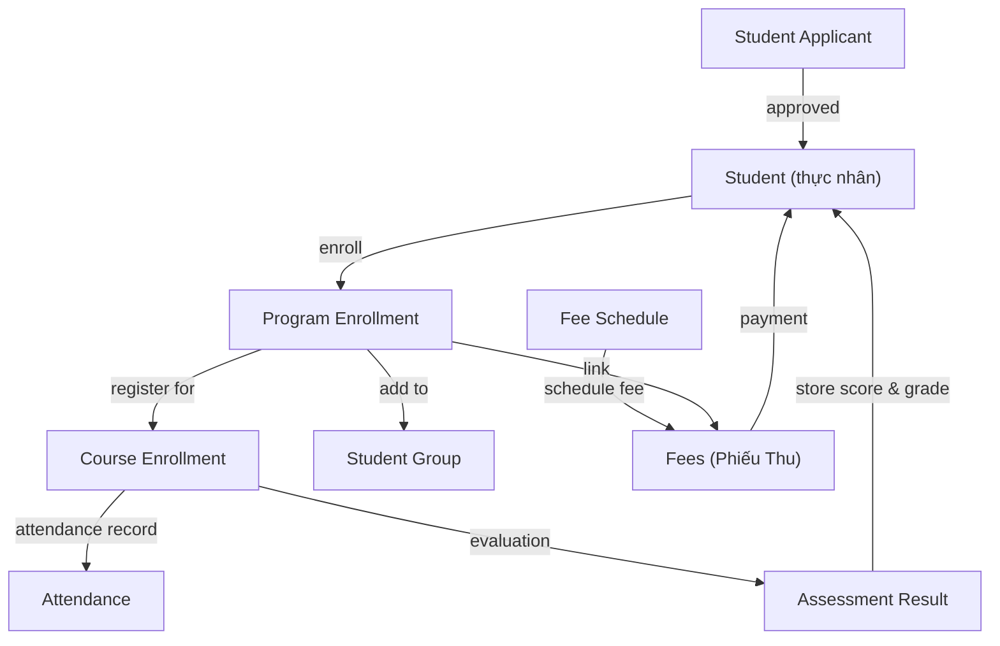
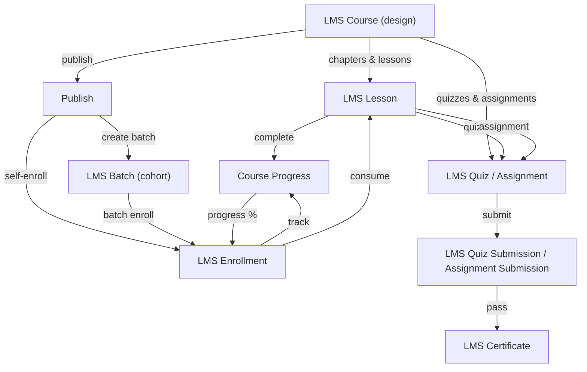

# Phân tích sâu: Frappe Education vs Frappe LMS vs CMC EDU v2

**Ngày**: 2026-07-25 | **Repo**: frappe/education + frappe/lms | **CWD**: /home/manhquy/Downloads/cmc_edu

---

## A. VERIFY LICENSE

### frappe/education
**License File**: `license.txt` (dòng 1)
```
License: GNU GPL V3
```

**Thông tin bổ sung**:
- Repo: https://github.com/frappe/education
- File License: https://raw.githubusercontent.com/frappe/education/main/license.txt
- Author: Frappe Technologies Pvt. Ltd. (trong `pyproject.toml`)
- Dependency: `frappe >=17.0.0-dev,<18.0.0`
- Loại: FOSS (Free & Open Source Software)

**Rủi ro GPLv3**: 
- Nếu CMC sử dụng Education code, CMC PHẢI open-source theo GPLv3
- CMC là proprietary (private repo, không LICENSE file) → KHÔNG được sử dụng Education source code trực tiếp
- **GIẢI PHÁP**: Learning from Architecture/Domain Model KHÔNG liên quan tới license (reverse engineering kiến trúc là hợp pháp), nhưng COPY code thì vi phạm

---

### frappe/lms
**License File**: `license.txt` (dòng 1-2)
```
GNU AFFERO GENERAL PUBLIC LICENSE
   Version 3, 19 November 2007
```

**Thông tin bổ sung**:
- Repo: https://github.com/frappe/lms
- File License: https://raw.githubusercontent.com/frappe/lms/main/license.txt
- Mô tả: "Easy to Use, 100% Open Source Learning Management System"
- Loại: FOSS (Free & Open Source Software)

**Rủi ro AGPLv3 (QUAN TRỌNG)**:
- AGPLv3 § 13 (Network Copyleft): Nếu người dùng sử dụng LMS qua mạng (web/API), họ CÓ QUYỀN yêu cầu source code của phiên bản đó
- CMC là **SaaS/self-host trên mạng** (LMS cho phụ huynh/học sinh via web) → AGPLv3 áp dụng
- **KHÁC BIỆT so với GPLv3**: GPLv3 chỉ apply khi distribute binary; AGPLv3 áp dụng khi run trên server công khai
- **GIẢI PHÁP**: Như GPLv3, học từ architecture được, nhưng NOT copy source code. Nếu dùng code, phải publish toàn bộ CMC source công khai

**Recommendation**: Cả 2 license đều cho phép RESEARCH & REFERENCE, nhưng KHÔNG cho phép code reuse trong closed-source project. CMC nên:
1. Viết lại domain model từ scratch (học từ Education/LMS)
2. Không import code từ 2 repo này
3. Nếu muốn sử dụng: hoặc (a) open-source CMC hoặc (b) sử dụng Frappe Platform trực tiếp (tuân theo agreement)

---

## B. REPO MAINTENANCE STATUS

| Metric | Education | LMS |
|--------|-----------|-----|
| Last Commit | 2026-06-05 15:45:42 | 2026-07-25 10:08:51 **TODAY** |
| Days Since Last Commit | ~50 ngày | 0 ngày |
| Branch Status | Main (Merge PR #437 feat/permissions) | Main (Merge PR #2595 pot_develop) |
| Assessment | ✓ Bảo trì định kỳ, nhưng chậm | ✓✓ Bảo trì tích cực hằng ngày |

**Kết luận**: 
- **Education** được bảo trì nhưng khoảng commit dài (~1.5 tháng) → có thể đang tập trung vào release chuẩn bị
- **LMS** rất tích cực, commit hàng ngày → đây là priority product của Frappe

---

## C. DOMAIN MODEL: EDUCATION (frappe/education)

### C.1 Danh sách DocType (73 loại)

**Học sinh & Người giám hộ (8)**:
- Student, Student Applicant, Student Admission, Guardian, Student Guardian, Guardian Student, Guardian Interest, Student Sibling/Siblings

**Chương trình & Khóa học (9)**:
- Program, Program Course, Course, Course Topic, Course Activity, Course Assessment Criteria, Room, School House, Instructor

**Đăng ký (9)**:
- Program Enrollment, Program Enrollment Course, Program Enrollment Fee, Program Enrollment Tool, Course Enrollment, Student Group, Student Group Creation Tool, Student Group Instructor, Student Group Student

**Học kỳ & Lịch học (5)**:
- Academic Year, Academic Term, Course Schedule, Course Scheduling Tool, Instructor Log

**Đánh giá & Điểm (11)**:
- Assessment Plan, Assessment Plan Criteria, Assessment Criteria, Assessment Criteria Group, Assessment Group, Assessment Result, Assessment Result Detail, Assessment Result Tool, Grading Scale, Grading Scale Interval, Quiz Activity, Quiz Result

**Kiểm tra & Bài tập (5)**:
- Quiz, Quiz Question, Question, Topic, Topic Content

**Học phí (10)**:
- Fees, Fee Schedule, Fee Schedule Details, Fee Schedule Program, Fee Schedule Student Group, Fee Structure, Fee Category, Fee Category Default, Fee Component, Program Fee

**Quản lý khác (9)**:
- Student Batch Name, Student Category, Student Language, Student Log, Student Attendance, Student Attendance Tool, Student Report Generation Tool, Education Settings, Payment Record, Options, Article

**TOTAL**: 73 DocType

### C.2 Core Domain Model

#### 1. **Student Record**
```
Student
├─ Personal: first_name, middle_name, last_name, date_of_birth, gender, blood_group, nationality
├─ Contact: student_email_id, student_mobile_number
├─ Address: address_line_1, address_line_2, city, state, pincode, country
├─ Dates: joining_date, date_of_leaving (exit)
├─ Relations: guardians (M:M via Student Guardian), siblings (M:M)
├─ Customer: customer (Link to ERPNext Customer), customer_group
├─ Status: enabled, image
└─ Link To: student_applicant (foreign reference)
```

#### 2. **Program (Chương trình đào tạo / Lớp năm)**
```
Program
├─ Metadata: program_name, program_abbreviation, department (Link)
├─ Content: courses (Table Link → Program Course) — có thể định cấu hình
│   └─ Program Course: course (Link), position (ordering)
├─ Media: hero_image
└─ Note: Tương tự "lớp năm nhất", "lớp năm hai" trong trường tiểu/THCS
```

#### 3. **Course (Khóa học)**
```
Course
├─ Metadata: course_name, department (Link)
├─ Content: topics (Table → Course Topic)
│   └─ Topic: topic_name, topic_content (Text Editor)
├─ Assessment: assessment_criteria (Table → Course Assessment Criteria)
│   └─ Criteria: name, weightage (%), assessment_criteria_group (Link)
├─ Evaluation: default_grading_scale (Link → Grading Scale)
├─ Media: hero_image
└─ Description: description
```

#### 4. **Grading Scale (Thang điểm)**
```
Grading Scale
├─ scale_name, academic_year (Link)
└─ Intervals: Grading Scale Interval (Table)
    └─ Interval: threshold (%), grade (A, B, C, ...), description
```

#### 5. **Program Enrollment (Đăng ký khóa học)**
```
Program Enrollment
├─ Key Fields:
│   ├─ student (Link → Student)
│   ├─ program (Link → Program)
│   ├─ academic_year, academic_term (Links)
│   └─ enrollment_date
├─ Configuration:
│   ├─ student_category, student_batch_name, school_house (Links)
│   ├─ boarding_student (Check)
│   └─ image (Optional photo)
├─ Content: courses (Table → Program Enrollment Course)
│   └─ Enrollment Course: course (Link), status
├─ Fees: fees (Table → Program Fee)
│   └─ Program Fee: fee (Link), amount
└─ Versioning: amended_from (amendment tracking)
```

#### 6. **Course Enrollment (Đăng ký lớp học)**
```
Course Enrollment (leaf level)
├─ Links:
│   ├─ program_enrollment (Link → Program Enrollment)
│   ├─ student (Link → Student)
│   ├─ course (Link → Course)
│   ├─ program (Link → Program, redundant)
├─ Dates: enrollment_date
└─ Denorm: student_name (Data copy)
```

#### 7. **Assessment Result (Kết quả đánh giá)**
```
Assessment Result
├─ Context:
│   ├─ assessment_plan (Link → Assessment Plan)
│   ├─ program, course (Links → Program, Course)
│   ├─ academic_year, academic_term (Links)
│   ├─ student, student_group (Links)
│   └─ grading_scale (Link)
├─ Scoring:
│   ├─ maximum_score, total_score (Float)
│   ├─ grade (computed from Grading Scale)
│   └─ details (Table → Assessment Result Detail)
│       └─ Detail: assessment_criteria (Link), marks_obtained (Float), weightage (%)
├─ Note: comment (Small Text)
└─ Versioning: amended_from
```

#### 8. **Fee Schedule (Lịch học phí)**
```
Fee Schedule
├─ Metadata: name, academic_year, academic_term (Links)
├─ Applicability:
│   ├─ programs (Table → Fee Schedule Program)
│   └─ student_groups (Table → Fee Schedule Student Group)
├─ Fees: fee_structure (Link → Fee Structure)
├─ Dates: start_date, end_date
└─ Note: description
```

#### 9. **Fees (Phiếu thu / Hóa đơn học phí)**
```
Fees (like a Receipt / Invoice)
├─ Identification:
│   ├─ naming_series (EDU-FEE-.YYYY.-)
│   ├─ student (Link → Student)
│   ├─ student_name (Data copy)
│   └─ fee_schedule (Link → Fee Schedule)
├─ Context:
│   ├─ program, academic_year, academic_term (Links)
│   ├─ student_batch, student_category (Links)
│   ├─ program_enrollment (Link)
│   └─ company (Link)
├─ Dates: posting_date, due_date
├─ Components: components (Table → Fee Component)
│   └─ Component: fee_component (Link), amount (Currency)
├─ Payment: currency, include_payment, send_payment_request (Check)
└─ Versioning: amended_from
```

#### 10. **Student Admission & Admission Form**
```
Student Admission (Form Definition, not enrollment record)
├─ Period:
│   ├─ academic_year (Link)
│   ├─ admission_start_date, admission_end_date (Dates)
├─ Content:
│   ├─ introduction (Text Editor)
│   ├─ program_details (Table → Student Admission Program)
│   │   └─ Program Detail: program (Link), capacity, description
├─ Configuration:
│   ├─ published (Check)
│   ├─ route (URL slug, like /admissions/2026)
│   ├─ enable_admission_application (Check)

Student Applicant (Per-person Application)
├─ Profile: first_name, last_name, email, phone, date_of_birth
├─ Guardian Info: guardian names, emails
├─ Education: current_grade, previous_school
├─ Program Choice: program_choice (Link → Program)
├─ Status: status (Enum: Pending, Approved, Rejected, Approved and Enrolled)
├─ Result: approved_by (Link → User), result_description, result_date
└─ Link: student (Link → Student, created on approval)
```

#### 11. **Assessment Plan & Criteria**
```
Assessment Plan (template)
├─ Metadata: name, academic_year, academic_term (Links)
├─ Scope: program, course (Links)
├─ Criteria Set:
│   └─ Assessment Plan Criteria (Table)
│       └─ Criteria: assessment_criteria (Link), weightage (%)

Assessment Criteria Group (categorize assessments)
└─ Examples: Midterm, Final, Project, Participation, etc.
```

#### 12. **Student Group (Xếp nhóm học sinh)**
```
Student Group
├─ Metadata: name, academic_year, academic_term, session (Links, Dates)
├─ Hierarchy:
│   ├─ program (Link)
│   └─ course (Link)
├─ Members: students (Table → Student Group Student)
│   └─ Student Member: student (Link), roll_number (Number)
├─ Leadership: instructors (Table → Student Group Instructor)
│   └─ Instructor Member: instructor (Link)
└─ Tool: Student Group Creation Tool (bulk create from cohort)
```

#### 13. **Instructor Management**
```
Instructor
├─ Personal: first_name, middle_name, last_name
├─ User: user (Link → User)
├─ Qualifications: qualifications (Text)
├─ Dates: joining_date, leaving_date
├─ Department: department (Link)
├─ Groups: student_groups (Table link)
└─ Tracking: Instructor Log (audit trail)

Instructor Log (activity log)
└─ Records when instructor is added/modified
```

#### 14. **Course Scheduling**
```
Course Schedule
├─ Links: course (Link → Course), program (Link → Program)
├─ Period: academic_year, academic_term, from_date, to_date (Links/Dates)
├─ Slots: course_schedule_detail (Table)
│   └─ Slot: day_of_week (Enum: Mon-Sun), from_time, to_time, room (Link)

Course Scheduling Tool (bulk generator)
└─ Generates Course Schedule from Course Schedule templates
```

### C.3 Luồng Nghiệp Vụ Education



**Các giai đoạn chính**:
1. **Recruitment**: Student Applicant → approval → Student created
2. **Enrollment**: Student → Program Enrollment (register for year/term)
3. **Course Registration**: Program Enrollment → Course Enrollment (per course)
4. **Grouping**: Student Group (classroom assignment)
5. **Schedule**: Course Schedule + Attendance tracking
6. **Assessment**: Assessment Result (scores, grades per Grading Scale)
7. **Fees**: Fee Schedule → Fees (phiếu thu) → payment

---

## D. DOMAIN MODEL: LMS (frappe/lms)

### D.1 Danh sách DocType (63 loại)

**Khóa học & Nội dung (9)**:
- LMS Course, Course Chapter, Course Lesson, Lesson Reference, Chapter Reference, Related Courses, Course Topic (nếu có), LMS Program, Batch Course

**Người học & Đăng ký (7)**:
- LMS Enrollment, LMS Batch, LMS Batch Enrollment, LMS Batch Feedback, LMS Batch Timetable, Timetable Legend, Timetable Template

**Đánh giá & Bài kiểm tra (13)**:
- LMS Quiz, LMS Quiz Question, LMS Quiz Submission, LMS Quiz Result, LMS Assessment, LMS Assignment, LMS Assignment Submission, LMS Option, LMS Programming Exercise, Programming Exercise Submission, LMS Test Case, Test Case Submission, LMS Lesson Note

**Chứng chỉ (5)**:
- LMS Certificate, LMS Certificate Evaluation, LMS Certificate Request, Certification, LMS Badge, LMS Badge Assignment

**Giáo viên & Mentors (6)**:
- Course Instructor, Course Evaluator, Evaluator Schedule, Course Mentor Mapping, LMS Course Interest, LMS Course Review

**Thanh toán & Coupon (3)**:
- LMS Payment, LMS Coupon, LMS Coupon Item

**Lớp học trực tiếp (3)**:
- LMS Live Class, LMS Live Class Participant, LMS Google Meet Settings, LMS Zoom Settings

**Công việc & Phát triển (9)**:
- Job Opportunity, LMS Job Application, Work Experience, Skills, User Skills, Education Detail, Preferred Function, Function, Preferred Industry, Industry

**Theo dõi & Cài đặt (8)**:
- LMS Video Watch Duration, LMS Category, LMS Settings, LMS Sidebar Item, LMS Source, Scheduled Flow, Batch Course, Payment Country, Zoom Settings

**TOTAL**: 63 DocType

### D.2 Core Domain Model

#### 1. **LMS Course (Khóa học trực tuyến)**
```
LMS Course
├─ Metadata:
│   ├─ title (Data, required)
│   ├─ description (Text Editor)
│   ├─ short_introduction (Small Text)
│   ├─ tags (Data, comma-separated)
│   ├─ status (Select: In Progress, Under Review, Approved)
│   └─ image (Attach Image)
├─ Content Structure:
│   ├─ chapters (Table → Chapter Reference)
│   │   └─ Chapter Ref: chapter (Link → Course Chapter)
│   └─ Course Chapter (nested hierarchy)
│       ├─ title, description, chapter_index (ordering)
│       └─ lessons (Table → Course Lesson)
│           └─ Lesson: title, description, lesson_index, content_type
├─ People:
│   ├─ instructors (Table MultiSelect → Course Instructor)
│   │   └─ Instructor: instructor (Link → User), owner (Check if instructor is owner)
├─ Pricing:
│   ├─ paid_course (Check)
│   ├─ currency (Link)
│   ├─ course_price (Currency)
│   ├─ amount_usd (Currency)
├─ Certification:
│   ├─ enable_certification (Check)
├─ Visibility:
│   ├─ published (Check)
│   ├─ published_on (Date)
│   ├─ featured (Check)
│   ├─ upcoming (Check)
│   ├─ disable_self_learning (Check, toggle solo vs batch)
└─ Relations: related_courses (Table)
```

#### 2. **Course Chapter & Lesson (Phân cấp nội dung)**
```
Course Chapter
├─ course (Link → LMS Course)
├─ title, description
├─ index (ordering)
└─ lessons (implied from Course Lesson reverse FK)

Course Lesson (mỹ tích nội dung)
├─ course (Link → LMS Course)
├─ chapter (Link → Course Chapter)
├─ title, description
├─ lesson_index (ordering within chapter)
├─ content_type (Enum: Video, Text, Exercise, etc.)
└─ Related:
    ├─ quizzes (reverse FK from LMS Quiz)
    ├─ assignments (reverse FK from LMS Assignment)
    └─ lesson_notes (Table → LMS Lesson Note, learner-generated notes)
```

#### 3. **LMS Enrollment (Đăng ký khóa học)**
```
LMS Enrollment (per person per course)
├─ Identification:
│   ├─ member (Link → User, learner)
│   ├─ member_type (Select: Student, Mentor, Staff)
│   ├─ member_name (Data copy)
│   ├─ member_username (Data copy)
├─ Course Info:
│   ├─ course (Link → LMS Course)
│   ├─ current_lesson (Link → Course Lesson, bookmark)
│   └─ enrollment_from_batch (Link → LMS Batch, if batch-based)
├─ Progress:
│   ├─ progress (Float %, 0-100)
│   └─ Computed from: Course Progress records
├─ Payment:
│   ├─ payment (Link → LMS Payment, if paid_course)
├─ Certification:
│   ├─ purchased_certificate (Check)
│   ├─ certificate (Link → LMS Certificate, if earned)
├─ Image: member_image (Attach Image, profile pic)
└─ Role: role (Select: Member, Admin)
```

#### 4. **LMS Batch (Lớp học nhóm)**
```
LMS Batch (session/cohort, thường có lịch học)
├─ Identification:
│   ├─ title (Data, required)
│   ├─ description (Small Text)
│   └─ batch_details (Text Editor, detailed syllabus)
├─ Period:
│   ├─ start_date, end_date (Dates)
│   ├─ start_time, end_time (Times)
├─ Enrollment:
│   ├─ courses (Table → Batch Course)
│   │   └─ Batch Course: course (Link → LMS Course)
│   ├─ LMS Batch Enrollment (reverse FK from LMS Enrollment with enrollment_from_batch)
│   └─ seat_count (Int, capacity)
├─ Pricing:
│   ├─ paid_batch (Check)
│   ├─ currency, amount (Currency, price per seat)
├─ Configuration:
│   ├─ medium (Select: Online, Offline)
│   ├─ category (Link → LMS Category)
├─ Scheduling:
│   ├─ timetable (Table → LMS Batch Timetable)
│   │   └─ Timetable: day_of_week, start_time, end_time
│   ├─ timetable_template (Link → LMS Timetable Template, template reference)
├─ Live Classes:
│   ├─ show_live_class (Check)
│   └─ LMS Live Class (reverse FK, scheduled within batch)
├─ Assessment:
│   ├─ assessment (Table → LMS Assessment)
│   │   └─ Assessment: assessment_type, due_date
├─ Custom: custom_component (Code/HTML, for branding)
└─ Visibility: published (Check)
```

#### 5. **LMS Quiz & Questions (Bài kiểm tra)**
```
LMS Quiz
├─ Metadata:
│   ├─ title, course (Links)
│   ├─ lesson (Link → Course Lesson)
├─ Content:
│   ├─ questions (Table → LMS Quiz Question)
│   │   └─ LMS Quiz Question: question (Link → LMS Question), marks (Float)
├─ Evaluation Config:
│   ├─ passing_percentage (Int, e.g., 70)
│   ├─ total_marks (Int, sum of question marks)
│   ├─ enable_negative_marking (Check)
│   ├─ marks_to_cut (Int, penalty per wrong)
├─ Behavior:
│   ├─ max_attempts (Int, -1 = unlimited)
│   ├─ show_answers (Check, after submission)
│   ├─ show_submission_history (Check)
│   ├─ duration (Data, time limit in minutes)
│   ├─ shuffle_questions (Check)
│   └─ limit_questions_to (Int, random sample)
└─ Submission: LMS Quiz Submission (reverse FK)

LMS Question (reusable question bank)
├─ Metadata: title, type (Select: MCQ, Multiple Choice, Short Answer)
├─ Content: question_text (Text Editor)
├─ Options (for MCQ):
│   ├─ options (Table → LMS Option)
│   │   └─ Option: is_correct (Check), option_text (Data)
└─ Answer (for open-ended or reference): answer (Text Editor)

LMS Quiz Question (junction, in Quiz)
└─ question (Link → LMS Question), marks (Float), weight
```

#### 6. **LMS Assignment (Bài tập)**
```
LMS Assignment
├─ Metadata:
│   ├─ title, course (Links)
│   ├─ lesson (Link → Course Lesson)
├─ Content:
│   ├─ question (Text Editor, assignment prompt)
│   ├─ type (Select: Document, PDF, URL, Image, Text)
├─ Answer:
│   ├─ show_answer (Check)
│   ├─ answer (Text Editor, model answer/solution)
├─ Grading:
│   ├─ grade_assignment (Check, require manual review)
└─ Submission: LMS Assignment Submission (reverse FK)

LMS Assignment Submission
├─ assignment, member (Links)
├─ status (Select: Draft, Submitted, Graded)
├─ submitted_at (DateTime)
├─ submission (Data/Attach, the answer)
├─ grade (Float, if manually graded)
└─ feedback (Text Editor, from instructor)
```

#### 7. **LMS Certificate (Chứng chỉ)**
```
LMS Certificate (issued document)
├─ Issuance:
│   ├─ member (Link → User)
│   ├─ member_name (Data copy)
│   ├─ issue_date, expiry_date (Dates)
├─ Course:
│   ├─ course (Link → LMS Course)
│   ├─ course_title (Data copy)
├─ Batch (optional):
│   ├─ batch_name (Link → LMS Batch)
│   ├─ batch_title (Data copy)
├─ Evaluation:
│   ├─ evaluator (Link → Course Evaluator)
│   ├─ evaluator_name (Data copy)
├─ Display:
│   ├─ template (Link → Print Format, certificate layout)
│   └─ published (Check)
└─ Request: LMS Certificate Request (reverse FK, approval flow)

LMS Certificate Request
├─ member, course (Links)
├─ status (Select: Pending, Approved, Rejected)
└─ approved_by (Link → User, approver)

LMS Certificate Evaluation
├─ certificate (Link → LMS Certificate)
├─ evaluation_score (Float)
├─ evaluator (Link → Course Evaluator)
└─ comments (Text)
```

#### 8. **LMS Batch Feedback**
```
LMS Batch Feedback
├─ batch, member (Links)
├─ rating (Int, 1-5)
├─ feedback_text (Text Editor)
└─ submitted_at (DateTime)
```

#### 9. **LMS Payment (Thanh toán khóa học)**
```
LMS Payment
├─ member (Link → User)
├─ course (Link → LMS Course)
├─ batch (Link → LMS Batch, optional)
├─ amount (Currency)
├─ currency (Link)
├─ payment_status (Select: Pending, Completed, Failed)
├─ payment_method (Select: Card, Bank Transfer, UPI, etc.)
├─ transaction_id (Data)
└─ date (DateTime)
```

#### 10. **LMS Live Class**
```
LMS Live Class
├─ batch (Link → LMS Batch)
├─ title, description (Texts)
├─ scheduled_at (DateTime)
├─ platform (Select: Zoom, Google Meet, etc.)
├─ platform_link (Data, Zoom/Meet URL)
├─ instructor (Link → User)
├─ LMS Live Class Participant (reverse FK)
│   └─ Participant: user (Link), joined_at, left_at (DateTime)
└─ recording_url (Data, if recorded)
```

### D.3 Luồng Nghiệp Vụ LMS



**Các giai đoạn chính**:
1. **Content Design**: LMS Course → chapters → lessons + quizzes/assignments
2. **Publishing**: Publish for self-learning or batch-based
3. **Enrollment**: Self-enroll OR batch enroll (LMS Batch)
4. **Learning Path**: LMS Enrollment → consume lessons → track progress (Course Progress %)
5. **Evaluation**: Take quizzes (auto-grade MCQ) / submit assignments (manual review)
6. **Certification**: Pass criteria → LMS Certificate issued
7. **Live Learning** (optional): LMS Batch + LMS Live Class for synchronous sessions

---

## E. MAPPING: EDUCATION/LMS ↔ CMC EDU v2

### E.1 Bảng Mapping 3 Cột

| Khái niệm (Education/LMS) | Model CMC EDU v2 | Nhận xét |
|---------------------------|------------------|---------|
| **SINH VIÊN** ||||
| Student | Student | ✓ Có. CMC: student (name, email, phone, ...) nhưng **KHÔNG** có date_of_birth, gender, nationality, address chi tiết |
| Student Applicant | N/A | ✗ CMC thiếu applicant pipeline. Recruitment flow unknown. |
| Student Admission (form) | N/A | ✗ CMC thiếu admission form template / public enrollment form |
| Student Guardian | Guardian + GuardianLinkRequest | ~ CMC có Guardian, nhưng **KHÔNG** track guardian_interest (academic interest), sibling relationships |
| Student Sibling | N/A | ✗ CMC thiếu sibling tracking |
| **CHƯƠNG TRÌNH & KHÓA HỌC** ||||
| Program (năm học / level) | Course? CurriculumUnit? | ~ Khác hẳn. CMC: **Course** = subject (Tiếng Việt, Toán, ...), **CurriculumUnit** = learning unit (Bài 1, Bài 2, ...). Education **Program** = academic track / year level (lớp 1, lớp 2, ...) |
| Course (subject) | Course | ✓ Có, nhưng CMC Course **KHÔNG** có: topics (chi tiết nội dung), assessment_criteria (tiêu chí đánh giá), description (mô tả dài) |
| Course Topic | CurriculumUnit (partial) | ~ CMC có CurriculumUnit nhưng **KHÔNG** có full hierarchy Course → Topic → Content |
| **HỌC KỲ & NĂM HỌC** ||||
| Academic Year | N/A | ✗ CMC **KHÔNG** có formal Academic Year model. Revenue/salary cycles implicit trong Enrollment/Payslip dates. |
| Academic Term | N/A | ✗ CMC **KHÔNG** có Academic Term / semester structure |
| **ĐĂNG KÝ & NHẬP HỌC** ||||
| Program Enrollment | Enrollment | ✓ Có, nhưng CMC Enrollment: **lead-oriented** (lead→receipt→enrollment), **KHÔNG** phải **program-oriented**. CMC: enrollment_status = ACTIVE chỉ AFTER payment receipt approved |
| Course Enrollment | N/A | ✗ CMC **KHÔNG** có course-level enrollment (only room assignment) |
| Student Group | N/A | ✗ CMC **KHÔNG** có formal Student Group / classroom assignment (mặc dù có ClassBatch, Room) |
| **LỊCH HỌC & ĐIỂM DANH** ||||
| Course Schedule | N/A (implicit) | ~ CMC có ScheduleSlot, ClassSession (từ ClassBatch.schedule_template), nhưng **KHÔNG** có formal Course Schedule DocType |
| Student Attendance | Attendance | ✓ Có. CMC: attendance (student, session, status). Education: course-level aggregate. |
| **ĐÁNH GIÁ & ĐIỂM** ||||
| Assessment Plan | N/A | ✗ CMC **KHÔNG** có assessment plan template |
| Assessment Criteria + Weightage | N/A | ✗ CMC **KHÔNG** có formal assessment criteria với trọng số. FinalGrade là simple score, **KHÔNG** có component-based. |
| Grading Scale | N/A | ✗ CMC **KHÔNG** có grading scale. CMC ghi điểm thô (0-100), **KHÔNG** map sang grade (A, B, C, ...) |
| Assessment Result | FinalGrade | ~ CMC: FinalGrade = score + grade (text). Education: Assessment Result = detailed breakdown per criteria + grade |
| **HỌC PHÍ** ||||
| Fee Structure | N/A | ✗ CMC **KHÔNG** có Fee Structure model |
| Fee Schedule | N/A | ✗ CMC **KHÔNG** có Fee Schedule (define khi nào phải nộp) |
| Fees (phiếu thu) | Receipt | ~ CMC dùng **Receipt** (invoice-like). Education dùng **Fees**. CMC: receipt → enrollment provisioning (enrollment chỉ active AFTER receipt approved) → **UNIQUE business logic** |
| **INSTRUCTOR / GIÁO VIÊN** ||||
| Instructor | N/A | ✗ CMC **KHÔNG** có formal Instructor model. AppUser.role ∈ [MANAGER, TEACHER, ...] nhưng **KHÔNG** track qualifications, log |
| Course Activity | N/A | ✗ CMC **KHÔNG** có activity log (instructor/course) |
| **QUIZ & BÀI TẬP (LMS)** ||||
| LMS Quiz + LMS Question | N/A | ✗ CMC **KHÔNG** có quiz engine |
| LMS Assignment | Exercise + Submission | ~ CMC: **Exercise** = work item (teacher-created), **Submission** = student answer. LMS: assignment per lesson, **KHÔNG** explicit tracking per student |
| LMS Quiz Submission | N/A | ✗ CMC **KHÔNG** track quiz/submission. Có Submission (work) nhưng **KHÔNG** tự động chấm (auto-grade MCQ) |
| **CHỨNG CHỈ (LMS)** ||||
| LMS Certificate | N/A | ✗ CMC **KHÔNG** có certificate issuance system |
| LMS Batch | N/A | ~ CMC: **ClassBatch** ≈ cohort (lớp học). LMS Batch = course cohort. CMC ClassBatch = **HR/facility-scoped** (ca làm, chấm công). **Khác mục đích.** |
| **LMS Course + Lesson** | N/A | ✗ CMC **KHÔNG** có LMS (e-learning platform). CMC: offline classroom + assessment, **KHÔNG** online course content |
| LMS Live Class | N/A | ✗ CMC **KHÔNG** có live class (Zoom/Meet) integration |
| LMS Enrollment Progress % | N/A | ✗ CMC **KHÔNG** track course progress % (learning path completion) |
| LMS Coupon | N/A | ✗ CMC **KHÔNG** có discount/coupon system (pricing is fixed per receipt) |
| LMS Payment | N/A | ✗ CMC có Payment (tổng quát), **KHÔNG** có LMS-specific payment tracking |
| **HR & PAYROLL (CMC, KHÔNG có ở Education/LMS)** ||||
| N/A | TimePunch, ManualAttendanceTicket | ✗ Education/LMS **KHÔNG** có employee timecard / manual attendance for staff |
| N/A | ShiftGroup, ShiftTemplate, ShiftRegistration | ✗ Education/LMS **KHÔNG** có shift/schedule management for HR |
| N/A | KpiScore, SalaryRate, Payslip, CompensationPolicy | ✗ Education/LMS **KHÔNG** có KPI scoring, salary management |
| N/A | StarTransaction, Gift, Reward | ✗ Education/LMS **KHÔNG** có reward/incentive system (employee hoặc student) |
| N/A | ParentMeeting | ✗ Education/LMS **KHÔNG** có parent-teacher meeting tracker |
| N/A | TestAppointment | ✗ Education/LMS **KHÔNG** có appointment/counseling system |
| N/A | AfterSaleCase | ✗ Education/LMS **KHÔNG** có after-sale / support case system |
| **INFRASTRUCTURE & SECURITY** ||||
| N/A | FacilityNetwork, RLS (facility-scoped) | ✗ Education/LMS **KHÔNG** có facility/organization scoping. Frappe Framework = single tenant per deploy. CMC = **multi-tenant per facility** (RLS at DB level) |
| N/A | Audit Log (CMC) | ~ Education/LMS có audit (Frappe Framework built-in versioning), nhưng CMC **EXPLICIT** AuditLog model với action/before/after tracking |

### E.2 Gap Analysis (2 chiều)

#### **GAPS: Education/LMS có → CMC chưa có**

| Gap | Mức độ Liên quan | Lý do CMC có thể chưa có | Ghi chú |
|-----|-----------------|--------------------------|--------|
| **Academic Year/Term formal structure** | **CAO** | CMC tập trung vào **facility-scoped operations** (HR + enrollment), chưa build semester planning | Cần thiết để: define academic cycle, fee schedule, assessment schedule |
| **Program (academic level/track)** | **CAO** | CMC chưa phân biệt "lớp năm nhất" vs "lớp năm hai" vs "track chuyên biệt". Chỉ có Course subject. | Cần thiết cho k–12 để track student progression |
| **Student Applicant → Admission pipeline** | **TRUNG** | CMC chưa build public recruitment (lead capture, form, approval). May focus on internal staff only first. | Admission form + applicant tracking cần thiết cho school |
| **Assessment Criteria + Weightage** | **CAO** | CMC FinalGrade = simple score. Education: breakdown per criteria (40% test, 30% project, 30% participation). | Weighted assessment = best practice |
| **Grading Scale (A, B, C → score range)** | **TRUNG** | CMC ghi điểm thô (0-100), **KHÔNG** map sang letter grade. Some schools need CGPA / grade letter. | Nice-to-have for reporting |
| **Fee Schedule + Fee Structure** | **CAO** | CMC dùng Receipt (invoice), **KHÔNG** có fee template. Fees pre-defined per program/batch → schedule when due. | Important for billing automation; CMC = manual receipt creation per student |
| **Student Group (classroom assignment)** | **CAO** | CMC có ClassBatch + Room, nhưng **KHÔNG** formal Student Group (member list + instructor assignment). | Needed for: attendance taking, grade entry (per group), group activities |
| **Course Topic / Content Hierarchy** | **TRUNG** | CMC có CurriculumUnit, nhưng **KHÔNG** course → topic → content structure. | e-learning prep; not urgent for offline-first k–12 |
| **Instructor as formal entity** | **TRUNG** | CMC: staff role = TEACHER, nhưng **KHÔNG** dedicated Instructor entity (qualifications, activity log). | HR module may cover, but LMS needs instructor → course mapping |
| **Student Leave Application** | **TRUNG** | CMC tracks attendance, **KHÔNG** formal leave approval workflow. | Nice-to-have for absence management |
| **Quiz Engine (auto-grade MCQ)** | **TRUNG** | CMC **KHÔNG** have e-learning platform. Exercise + Submission = offline work tracking. | Needed only if CMC adds online component |
| **Assignment Submission Tracking** | **TRUNG** | CMC: Submission exists, nhưng **KHÔNG** per-student submission state tracking (Draft, Submitted, Graded, Feedback). | Could enhance CMC Submission model |
| **Course Progress % tracking** | **THẤP** | LMS-specific (online cohorts). CMC offline model → attendance + grades sufficient. | Not relevant to k–12 offline classroom |
| **Live Class integration (Zoom/Meet)** | **THẤP** | LMS online feature. CMC offline/hybrid, may not need Zoom integration layer. | Post-COVID feature, nice-to-have |
| **Certificate issuance** | **TRUNG** | CMC **KHÔNG** have certificate printing. Can be add-on. | Schools often print custom certs → low tech integration |
| **Coupon/Discount system** | **THẤP** | CMC: receipt-driven, pricing fixed. Discount handling via receipt adjustment. | Not a gap; just different approach |

**Dự đoán rủi ro**: Nếu CMC mở rộng sang LMS (online courses), sẽ cần: Quiz Engine, Assignment Submission states, Certificate issuance, Course Progress %, Live Class.

---

#### **GAPS: CMC có → Education/LMS chưa có**

| Gap | CMC Feature | Tại sao Education/LMS không có | Ghi chú |
|-----|-------------|--------------------------------|--------|
| **Receipt-driven provisioning** | Receipt, RefundRecord | Education/LMS = student-centric (record after enroll). CMC = **payment-first** (receipt approval → enrollment activation) | **CMC unique**: revenue recognition model. Education: fees are post-enrollment invoices. |
| **KPI Scoring (employee)** | KpiScore, CompensationPolicy, SalaryTier | Education/LMS = learner platform. CMC = **HR ERP module**. | HR module out of scope for education product. |
| **Shift Management & Timecard** | ShiftGroup, ShiftTemplate, ShiftRegistration, TimePunch, ManualAttendanceTicket | Education/LMS = academic (fixed schedule). CMC = **facility HR** (flexible shifts, clock-in/out). | HR-specific; education platform doesn't need shift rotation. |
| **Salary/Payroll** | Payslip, SalaryRate | Education/LMS = SaaS / free product, no payroll layer. CMC = **HR ERP**. | Education focuses on student; salary is HR-specific. |
| **Star/Reward System** | StarTransaction, Gift, Reward | Education/LMS = platform features (certificates). CMC = **gamification** (staff/student incentives). | Unique to CMC business model (incentive-driven culture?). |
| **Parent Meeting tracker** | ParentMeeting | Education/LMS = class/admin tools. CMC = **customer relationship** (parent engagement). | CMC tracks parent interaction; education doesn't. |
| **After-Sale Case system** | AfterSaleCase | Education/LMS = pure product. CMC = **support/CRM layer**. | CMC: facility-owned support tickets. Education: GitHub issues. |
| **Facility-scoped multi-tenancy (RLS at DB level)** | FacilityNetwork, RLS in Postgres | Frappe Framework = single-tenant per deploy. CMC = **per-facility isolation** in shared DB. | Major architectural difference. Education: Frappe standard; CMC: custom security layer. |
| **Qualitative Assessment (non-numeric)** | QualitativeAssessment, SessionEvidence, SessionEvidencePhoto | Education/LMS = numeric scores + grades. CMC = **behavioral assessment** (photos, notes, evidence). | k–12 need soft-skill / behavior assessment; higher-ed focus on grades. |
| **Comprehensive Audit Log** | AuditLog | Frappe has built-in versioning (via DocType history). CMC = **explicit AuditLog** model (action, before_value, after_value, user). | CMC compliance requirement (likely legal/audit). |

**Kết luận**: CMC is **NOT a subset** của Education/LMS. CMC = hybrid (ERP: HR, CRM, Revenue + Education: student, course, grades). Education/LMS = single-purpose (student learning).

---

## F. KIẾN TRÚC & CÔNG NGHỆ

### F.1 Technology Stack

| Layer | Education | LMS | CMC EDU v2 |
|-------|-----------|-----|-----------|
| **Backend** | Frappe Framework (Python) | Frappe Framework (Python) | tRPC 11 (TypeScript) + Prisma |
| **Frontend** | Frappe UI (Vue) | Frappe UI (Vue) | React + Vite (apps/admin, apps/lms) |
| **Database** | MariaDB / PostgreSQL (Frappe standard) | MariaDB / PostgreSQL (Frappe standard) | PostgreSQL (with RLS) |
| **Deployment** | Bench (Frappe CLI) | Bench (Frappe CLI) | Docker + pnpm monorepo |
| **Architecture** | Monolithic Frappe app | Monolithic Frappe app | Distributed: tRPC server + React clients |

### F.2 API & Permissions

**Education/LMS** (Frappe):
- API: `@frappe.whitelist` (server-side Python methods exposed via HTTP)
- Permission: DocType-level (allow_read, allow_create, allow_write, allow_delete via Role + Perms)
- Frontend: Frappe UI (built-in form renderer)

**CMC** (tRPC + Prisma):
- API: tRPC procedures (type-safe RPC)
- Permission: **RLS at DB level** (facility-scoped; Postgres row-level security)
- Frontend: React (custom UI per app)

### F.3 Key Architectural Differences

| Aspect | Education/LMS | CMC |
|--------|---------------|-----|
| **Multi-tenancy** | Single tenant per deploy | Multi-tenant in shared DB (via RLS) |
| **Code Reuse** | Share Frappe Framework + DocType definitions | Monorepo (pnpm) + shared tRPC types |
| **Frontend** | Frappe UI (no customization needed) | React custom (full control, more work) |
| **Rapid Dev** | Fast: DocType JSON + auto forms | Slower: tRPC + React manual forms |
| **Scalability** | Frappe scaling (workers, queue) | App-layer scaling (horizontal tRPC servers) |

---

## G. CLAIM REVIEW: User's Original Claim

**User claim**: "frappe/education" và "frappe/lms" là "GẦN NHẤT" với sản phẩm đích CMC EDU v2.

### Assessment

✓ **ĐÚNG PHẦN NỨC VỌI** (partially true with caveats):
- **Education**: Covers student lifecycle (admit → enroll → attend → grade → fees), similar to CMC scope
- **LMS**: Online learning platform, complements school ops (CMC currently offline-focused)

✗ **KHÔNG TOÀN BỘ**: 
- CMC = **ERP + LMS** hybrid. Education/LMS = educational systems only.
- CMC has **HR module** (payroll, KPI, shifts) that Education/LMS completely lack
- CMC has **CRM layer** (leads, cases, parent meetings) that Education/LMS don't
- CMC architecture (**tRPC + RLS multi-tenant**) is fundamentally different from Frappe monolith
- CMC **Receipt-first billing** is unique (not standard education model)

### Refined Statement

> **frappe/education** + **frappe/lms** are the **closest public reference implementations** for k–12 academic domains (student, course, enrollment, assessment, fees), but they **do not cover CMC's full scope** (HR payroll, facility multi-tenancy, CRM, receipt-based billing, rewards system). For CMC, reference Education/LMS for domain modeling (schema, workflows), NOT for code architecture/reuse (license + tech stack differ).

---

## H. UNRESOLVED QUESTIONS & LIMITATIONS

1. **CMC Enrollment provisioning logic**: Does receipt approval trigger Enrollment creation, or does it just unlock access? (Found: "receipt-driven provisioning" in context, but exact workflow in code unclear)

2. **QualitativeAssessment in CMC**: What's the actual schema? (SessionEvidence has photos → behavioral evidence?) This gap wasn't fully explored.

3. **How does Education/LMS handle student leave approval workflow?** (Student Leave Application DocType found, but approval mechanism not inspected)

4. **LMS grading automation**: Does LMS auto-grade all quizzes, or does negative_marking require manual configuration per question?

5. **CMC facility multi-tenancy**: Is RLS applied to ALL tables, or only core entities (Student, Enrollment, etc.)? (Mentioned in context, but exact scope not verified in code)

6. **Education/LMS active user base & SaaS adoption**: Repos maintained, but production deployment metrics unknown. Are schools using these vs. Moodle / other?

---

## RECOMMENDATIONS FOR CMC TEAM

### Short-term (Reference & Learning)
1. **Use Education schema as checklist**: Verify CMC has all k–12 essentials (Student, Program, Assessment, Fees, Grading Scale, etc.)
2. **Adopt Education's assessment model**: Consider adding Assessment Criteria + Weightage to FinalGrade (currently too simple)
3. **Consider Fee Schedule**: Pre-define fees per program → auto-invoice (vs. manual receipt creation)

### Medium-term (Potential Adoption)
1. **If CMC adds e-learning**: Adopt LMS domain model (Quiz, Assignment, Course Progress %) as reference
2. **Instructor management**: Build formal Instructor entity (not just staff role)
3. **Student groups**: Implement formal classroom groups for batch operations (attendance, grading)

### Long-term (Architecture)
1. **License compliance**: If adopting code (unlikely given tech stack difference), MUST address GPLv3/AGPLv3 obligations → either open-source CMC or reimplement from scratch
2. **Multi-tenancy**: CMC's RLS model is more scalable than Education/LMS monolith (good choice)
3. **Modular expansion**: Design CMC to bolt on LMS module (Quiz, Assignment, Progress) without monolithic bloat

---

## REFERENCES & SOURCES

| Source | URL |
|--------|-----|
| frappe/education repo | https://github.com/frappe/education |
| education license.txt | https://raw.githubusercontent.com/frappe/education/main/license.txt |
| education pyproject.toml | https://raw.githubusercontent.com/frappe/education/main/pyproject.toml |
| frappe/lms repo | https://github.com/frappe/lms |
| lms license.txt (AGPLv3) | https://raw.githubusercontent.com/frappe/lms/main/license.txt |
| lms README | https://raw.githubusercontent.com/frappe/lms/main/README.md |
| CMC EDU v2 docs (context) | /home/manhquy/Downloads/cmc_edu/docs/system-architecture.md |

---

## SUMMARY

**frappe/education** (GPLv3, 73 DocTypes, last commit 2026-06-05) provides a **complete k–12 academic reference** (student lifecycle, course, enrollment, assessment, fees, instructor). It is the closest public schema match for CMC's educational domain.

**frappe/lms** (AGPLv3, 63 DocTypes, last commit 2026-07-25) provides an **e-learning layer** (courses, quizzes, assignments, certificates, batches) that complements offline education systems. Active development.

**CMC EDU v2** is a **hybrid platform** (ERP + LMS), not just education—it includes HR payroll, facility multi-tenancy, CRM, and receipt-driven billing that Education/LMS don't have. Use both repos for domain learning, NOT code reuse (license constraints). Architecture fundamentally different (tRPC+Prisma+RLS vs. Frappe monolith).

**Gaps**:
- CMC lacking: Academic Year/Term, Assessment Criteria weights, Grading Scale, Fee Schedule, Student Groups, Instructor entity, e-learning (quiz auto-grade, certificates)
- Education/LMS lacking: HR payroll, multi-tenancy, CRM, receipt billing, facility scoping, rewards system

---

**Status**: DONE
**Summary**: Analyzed frappe/education (GPLv3, 73 DocTypes) and frappe/lms (AGPLv3, 63 DocTypes) for domain model reference; mapped to CMC EDU v2 (50 Prisma models); identified gaps 2-way; verified licenses from file. CMC is hybrid ERP+LMS, not subset of Education/LMS.
